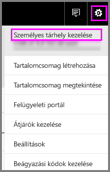
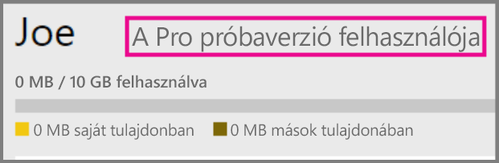
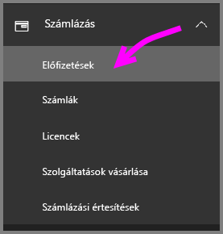
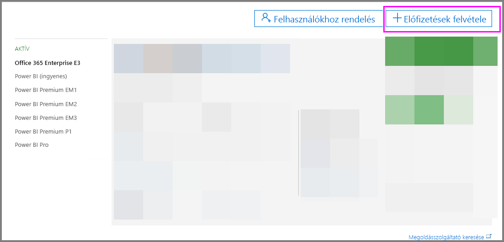
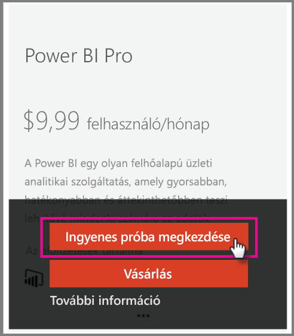

# A Power BI Pro használata a szervezetben

A Power BI Pro egy fizetett licenc, amely több funkciót tesz elérhetővé. A Power BI Pro licencet olyan csapatoknak szánjuk, akik adatalapú döntéseket szeretnének meghozni másokkal együttműködve.  Power BI Pro licenc szükséges minden olyan csapattag számára, aki létre szeretne hozni vagy meg szeretne tekinteni megosztott Power BI-tartalmakat, kivéve, ha ezek a tartalmak egy Power BI Premium dedikált kapacitás részei.

Az alábbi funkciókhoz van szükség Power BI Pro licencre:

* **Adatok elemzése az Excelben és a Power BI Desktopban** – Az Excelben vagy a Power BI Desktopban megtekintheti a Power BI-ban közzétett adatkészleteket, és dolgozhat velük. További információ: [Elemzés az Excelben](service-analyze-in-excel.md).

* **Irányítópultok megosztása és együttműködés munkaterületekkel** – A Power BI-munkaterületekkel könnyebben működhet együtt a munkatársaival az irányítópultokon, a jelentéseken és az adatkészleteken. További információ: [Együttműködés a Power BI-alkalmazás-munkaterületen](service-collaborate-power-bi-workspace.md).

* **Megosztott tartalom megtekintése** – A Pro felhasználói megtekinthetik a velük megosztott irányítópultokat és jelentéseket, dolgozhatnak velük, és újra megoszthatják őket (ha ez a funkció engedélyezve van). Azonban nem szerkeszthetik ezeket a jelentéseket és irányítópultokat. További információ: [Power BI-irányítópult és -jelentés megosztása munkatársakkal és másokkal](service-share-dashboards.md).

* **Tartalmak integrálása a Microsoft Teamsbe** – A Microsoft Teams-csatornához egy Power BI-lapot adhat hozzá. Az MS Teams automatikusan észleli a munkaterületen található összes jelentést. További információ: [A Power BI és a Microsoft Teams együttműködése](https://powerbi.microsoft.com/en-us/blog/power-bi-teams-up-with-microsoft-teams/). 

## A Power BI Pro 60 napos próbaverziója egyéni felhasználók számára

Miután regisztrált az ingyenes fiókra, lehetősége van ingyen kipróbálni a Pro verziót 60 napig. A próbaidőszak alatt a Pro verzió összes funkciójához hozzáférést kap . A Power BI Pro a Power BI ingyenes verziójának összes funkciójával rendelkezik, valamint további megosztási és együttműködési funkciókat is nyújt. További információkat a [Power BI díjszabásának oldalán](https://powerbi.microsoft.com/en-us/pricing/) találhat. A Power BI 60 napos ingyenes próbaverziójának aktiválásához jelentkezzen be a Power BI-ba, és próbálja ki az alábbi Power BI-funkciók egyikét.

* [Munkaterület létrehozása](consumer/end-user-create-apps.md)
* [Irányítópult megosztása](service-share-dashboards.md)

E funkciók bármelyikének kipróbálásakor a rendszer kérni fogja az ingyenes próba megkezdését. Az ingyenes próbaverziót a fogaskerék ikonra kattintva, majd a Személyes tárhely kezelése lehetőséget választva is aktiválhatja. Itt kattintson a Pro kiadás ingyenes kipróbálása lehetőségre a jobb oldalon.

   
    
   

Ezután kattintson a Próbaverzió indítása elemre.

   

> [!NOTE]
> Az Office 365 Felügyeleti portálján a szolgáltatáson belüli ingyenes Power BI Pro próbaverziót használó felhasználók nem Power BI Pro próbaverziós felhasználókként, hanem ingyenes Power BI-felhasználókként jelennek meg. A Power BI Tárhely kezelése lapján azonban Power BI Pro próbaverziós felhasználókként láthatja őket.
>

> [!NOTE]
> Ha informatikai rendszergazdaként anélkül szeretné beszerezni és üzembe helyezni a Power BI próbaverziójának licenceit több felhasználó számára a cégnél, hogy az egyes felhasználóknak el kellene fogadniuk a próbaverziós feltételeket, regisztrálhat a Power BI Pro próbaverziós előfizetésére. Ha rendszergazdai próbaverzióra szeretne regisztrálni, az Office 365 globális vagy számlázási rendszergazdájának kell lennie, vagy új bérlőt kell létrehoznia. További információkért lásd: [A Power BI Pro megvásárlása](service-admin-purchasing-power-bi-pro.md).
>

A szolgáltatáson belül úgy ellenőrizheti, hogy Pro-próbaverziós fiókja van-e, hogy a fogaskerék ikonra kattint, majd a Személyes tárhely kezelése lehetőséget választja.

   

## Próbaverziós előfizetés az Office 365-ben

A Power BI Pro próbaverzióját beszerezheti a cége számára. Ha már rendelkezik előfizetéssel, hozzárendelheti a Power BI Pro-licenceket a felhasználókhoz. További információ a licenc-hozzárendelésről: [Licencek hozzárendelése a felhasználókhoz az Office 365 szolgáltatásban](https://support.office.com/en-us/article/assign-licenses-to-users-in-office-365-for-business-997596b5-4173-4627-b915-36abac6786dc?ui=en-US&rs=en-US&ad=US).

> [!NOTE]
> A céges próbaverziók száma bérlőnként csak egy lehet. Ez azt jelenti, hogy ha valaki már alkalmazta a Power BI Pro próbaverzióját a bérlőn, Ön nem teheti meg ugyanezt. Ha ezzel kapcsolatban segítségre van szüksége, lépjen kapcsolatba az [Office 365 Számlázási támogatással](https://support.office.microsoft.com/en-us/article/contact-support-for-business-products-admin-help-32a17ca7-6fa0-4870-8a8d-e25ba4ccfd4b?CorrelationId=552bbf37-214f-4202-80cb-b94240dcd671&ui=en-US&rs=en-US&ad=US).
>

Office 365-próbaverziós előfizetés igényléséhez kövesse az alábbi lépéseket:

1. Keresse fel az [Office 365 Felügyeleti központot](https://portal.office.com/adminportal/home#/homepage).
2. A bal oldali navigációs panelen válassza a Számlázás, majd az Előfizetések lehetőséget.

   

3. Kattintson a jobb oldalon található Előfizetések hozzáadása + elemre.

   

4. Az Other Plans (Egyéb csomagok) területen mutasson a három pontra (...), válassza ki a Power BI Pro elemet, és kattintson az Ingyenes kipróbálás megkezdése lehetőségre.

    

5. A megerősítő képernyőn kattintson a Kipróbálás elemre.
6. A rendelési visszaigazoláson kattintson a Folytatás elemre.

## A Power BI Pro megvásárlása

A Power BI Prót a Microsoft Office 365-ön vagy egy hitelesített Microsoft-partnertől vásárolhatja meg. További információ a Power BI Pro megvásárlásáról: [A Power BI Pro megvásárlása](service-admin-purchasing-power-bi-pro.md).

## Következő lépések
[Önkiszolgáló regisztráció a Power BI-ra](service-admin-signing-up-for-power-bi-with-a-new-office-365-trial.md)
 
[A Power BI (ingyenes) a vállalatában](service-admin-service-free-in-your-organization.md)
 
[A Power BI Pro megvásárlása](service-admin-purchasing-power-bi-pro.md)
 
[A Pro meghosszabbított próbaverziójának aktiválása](service-extended-pro-trial.md)
 
[Power BI Pro-licencek felhasználókhoz rendelése](service-admin-assigning-power-bi-pro-licenses.md)
 
[Power BI Premium – pontosan mi is ez?](service-admin-premium-manage.md)
 
[A Power BI Premium megvásárlása](service-admin-premium-purchase.md)
 
[Power BI Premium-tanulmány](https://aka.ms/pbipremiumwhitepaper)

További kérdései vannak? [Kérdezze meg a Power BI közösségét](https://community.powerbi.com/)