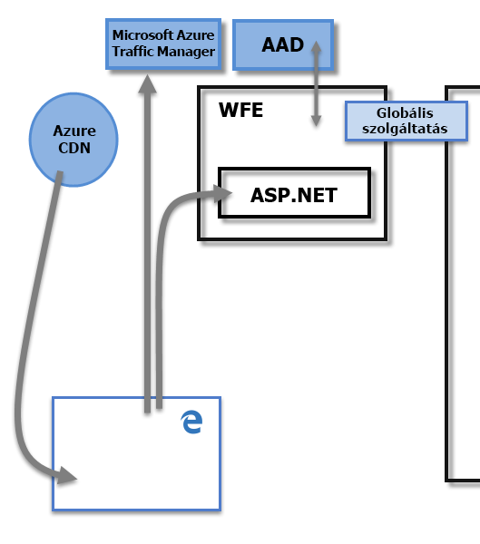
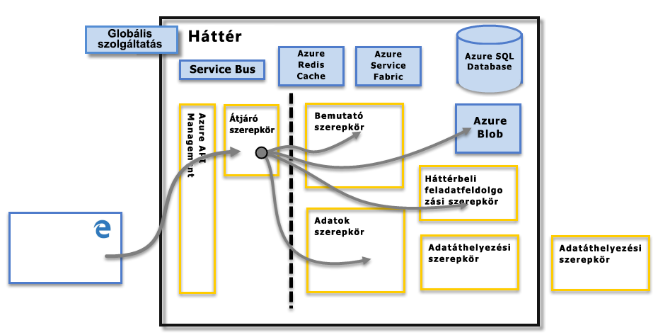

# A Power BI és a biztonság
A Power BI biztonsági jellemzőinek részletesebb leírását a [letölthető Power BI-biztonsági tanulmány](http://go.microsoft.com/fwlink/?LinkId=829185) tartalmazza:

A Power BI szolgáltatás az **Azure**-ra épül, amely a Microsoft felhőalapú számítástechnikai infrastruktúrája és platformja. A Power BI szolgáltatás architektúrája két fürtre, a Web Front End-fürtre (**WFE**) és a **Back End**-fürtre épül. A WFE-fürt feladata a kezdeti kapcsolódás és a Power BI szolgáltatásba történő hitelesítés, hitelesítés után pedig a Back End kezeli a további felhasználói tevékenységeket. A Power BI az Azure Active Directory (AAD) használatával tárolja és kezeli a felhasználói identitásokat, valamint kezeli az adatoknak és metaadatoknak az Azure BLOB és az Azure SQL Database használatával történő tárolását.

## A Power BI-architektúra
Minden Power BI példány két fürtből áll: egy Web Front End- (**WFE**) és egy **Back End**-fürtből áll.

A **WFE**-fürt kezeli a kezdeti kapcsolódást és a Power BI hitelesítési folyamatát az AAD-val hitelesítve a felhasználókat, és hozzáférési jogkivonatokat ad ki a Power BI szolgáltatással való további felhasználói kapcsolatokhoz. A Power BI az **Azure Traffic Managert** (ATM) is használja arra, hogy a felhasználói forgalmat – a kapcsolódást megkísérlő ügyfél DNS-rekordja alapján – a legközelebbi adatközponthoz irányítsa a hitelesítési elvégzéséhez és statikus tartalom és fájlok letöltéséhez. A Power BI a szükséges statikus tartalmat és fájlokat az **Azure Content Delivery Network** (CDN) használatával osztja el hatékonyan a felhasználók között a földrajzi helyzet alapján.

A hitelesített ügyfelek a **Back End**-fürt által lépnek kapcsolatba a Power BI szolgáltatással. A **Back End**-fürt kezeli a vizualizációkat, a felhasználói irányítópultokat, adatkészleteket, jelentéseket, adattárolókat, adatkapcsolatokat, adatfrissítéseket és sok mást, ami együtt jár a Power BI szolgáltatás használatával. Az **átjárói szerepkör** átjáróként szolgál a felhasználói kérelmek és a Power BI szolgáltatás között. A felhasználók nem kerülnek közvetlen kapcsolatba más szerepkörrel, csak az **átjárói szerepkörrel**. Az **átjárói szerepkört** végső soron az **Azure API Management** kezeli.

> [!IMPORTANT]
> Fontos tisztában lenni azzal, hogy a nyilvános interneten keresztül csak az **Azure API Management** (APIM) és az **Átjáró** (GW) szerepkörök érhetők el. Ezek biztosítják a hitelesítést, az engedélyezést, a DDoS-védelmet, a szabályozást, a terheléselosztást, az útválasztást és más funkciókat.
> 
> 

## Adattárolók biztonsága
A Power BI két elsődleges adattárat használ adatok tárolására és kezelésére: A felhasználóktól feltöltött adatokat általában **Azure BLOB**-tárolóra küldi, a metaadatokat és magának a rendszernek az összetevőit **Azure SQL Database**-ben tárolja.

A **Back End**-fürt fenti ábráján szaggatott vonal választja el a felhasználók által elérhető két összetevőt (a szaggatott vonaltól balra) a csak a rendszer által elérhető szerepköröktől. Amikor egy hitelesített felhasználó a Power BI szolgáltatáshoz kapcsolódik, akkor a kapcsolatot és az ügyfél minden kérelmét az **átjárói szerepkör** fogadja és kezeli (és végül az **Azure API Management** kezeli), amely aztán a felhasználó nevében használja a Power BI szolgáltatás többi elemét. Amikor egy ügyfél például egy irányítópultot próbál megtekinteni, az **átjárói szerepkör** fogadja a kérelmet, majd külön kérelmet küld a **bemutatási szerepkörnek**, hogy lekérje az adatokat, amelyekre a böngészőnek az irányítópult megjelenítéséhez szüksége van.

## Felhasználók hitelesítése
A Power BI az Azure Active Directory ([AAD](http://azure.microsoft.com/services/active-directory/)) használatával hitelesíti a Power BI szolgáltatásba bejelentkező felhasználókat, ugyanakkor a Power BI bejelentkezési információit használja, ha a felhasználó hitelesítést megkövetelő forráshoz kísérel meg hozzáférni. A felhasználók a Power BI-fiókjuk létrehozásakor megadott e-mail-címükkel jelentkeznek be a Power BI szolgáltatásba. A Power BI ezt az e-mail-címet használja *érvényes felhasználónévként*, amelyet átad az erőforrásoknak, amikor a felhasználó adatokhoz próbál kapcsolódni. Az *érvényes felhasználónév* hozzárendelődik az *egyszerű felhasználónévhez* ([UPN](https://msdn.microsoft.com/library/windows/desktop/aa380525\(v=vs.85\).aspx)), és a hozzá társított Windows-tartományi fiókká oldódik fel, amelyen megtörténik a hitelesítés.

Az olyan szervezeteknél, ahol vállalati e-mail-címeket használnak a Power BI-bejelentkezéshez (például <em>david@contoso.com</em>) az *érvényes felhasználónév* magától értetődően rendelődik hozzá az egyszerű névhez. Az olyan szervezeteknél, ahol nem vállalati e-mail-címeket használnak a Power BI-bejelentkezéshez (például <em>david@contoso.onmicrosoft.com</em>), az AAD és a helyszíni hitelesítő adatok egymáshoz rendelésének helyes működése [címtár-szinkronizálást](https://technet.microsoft.com/library/jj573653.aspx) kíván.

A Power BI platform-szintű biztonsága magában foglalja a több-bérlős környezet biztonságát, a hálózati biztonságot és további AAD-alapú biztonsági elemek hozzáadásának lehetőségét.

## Az adatok és a szolgáltatás biztonsága
Ha további tájékoztatást szeretne, keresse fel a [Microsoft Adatvédelmi központot](https://www.microsoft.com/trustcenter).

Ebben a cikkben már volt szó arról, hogy a helyszíni Active Directory-kiszolgálók felhasználják a felhasználó Power BI-bejelentkezési információit az egyszerű felhasználónév és a hitelesítő adatok egymáshoz rendeléséhez. **Fontos** ugyanakkor, hogy a megosztott adatokért a felhasználók felelnek: ha egy felhasználó a saját hitelesítő adataival kapcsolódik adatforrásokhoz, majd megoszt egy, ezekre az adatokra épülő jelentést (vagy irányítópultot vagy adatkészletet), akkor azok, akikkel az irányítópultot megosztotta, hozzáférnek a jelentéshez, bár nincs jogosultságuk az eredeti adatforráshoz.

Kivételt képez az **SQL Server Analysis Services**hez való kapcsolódás a **Helyszíni adatátjáró** használatával. Az irányítópultok a Power BI gyorsítótárába kerülnek, de az alapul szolgáló jelentések vagy adatkészletek elérése a jelentést (vagy adatkészletet) elérni próbáló felhasználó hitelesítését váltja ki, és a felhasználó csak a megfelelő hitelesítési adatok birtokában férhet hozzá az adatokhoz. További információ: [Helyszíni adatátjáró részletesen](service-gateway-onprem-indepth.md).

