# Kapacitáskezelés a Power BI Premium és a Power BI Embedded szolgáltatással
Megtudhatja, hogyan kezelheti a Power BI Premium és a Power BI Embedded kapacitásait, amelyek dedikált erőforrásokat nyújtanak az Ön tartalmai számára.

A kapacitás a Power BI Premium és a Power BI Embedded ajánlatainak központja.

## Mi az a kapacitás?
Kapacitásnak az olyan erőforráskészleteket nevezzük, amelyek kizárólag az Ön számára vannak fenntartva. A kapacitással irányítópultokat, jelentéseket és adatkészleteket tehet közzé a cég felhasználói számára anélkül, hogy licenceket vásárolna nekik. Emellett megbízható és következetes teljesítményt biztosít a kapacitásban tárolt tartalmaknak.

A kapacitás teljes mértékben áttekinthető a végfelhasználók számára. Ők továbbra is a Power BI-t vagy az Ön alkalmazását használják, nem feltétlenül szükséges tudniuk arról, hogy a tartalom egy része (vagy egésze) az Ön dedikált kapacitásán van tárolva. A felhasználók számára semmi nem változik.

[!INCLUDE [powerbi-premium-illustration](./includes/powerbi-premium-illustration.md)]

További információ: [A Power BI Premium bemutatása](service-premium.md).

## Kapacitás vásárlása
A dedikált kapacitás kihasználásához egy Power BI Premium-előfizetést kell vásárolnia az Office 365 Felügyeleti központban, vagy létre kell hoznia egy Power BI Embedded-erőforrást a Microsoft Azure Portalon. További információkat a következő cikkekben talál:

* **Power BI Premium:** [A Power BI Premium megvásárlása](service-admin-premium-purchase.md)
* **Power BI Embedded:** [Power BI Embedded-kapacitás létrehozása az Azure Portalon](https://docs.microsoft.com/en-us/azure/power-bi-embedded/create-capacity)

A Power BI Premium SKU-k vásárlásakor a bérlő a vásárlásnak megfelelő számú virtuális magot kap, amelyet a futó kapacitásokban használhat. Például a Power BI Premium P3 SKU megvásárlásakor a bérlő 32 virtuális magot kap.

> [!NOTE]
> Az előfizetés vége után 30 napig teljes hozzáférése lesz, de az után a tartalom visszaáll megosztott kapacitásra. Szokásos megosztott licenccel az 1 GB feletti modellek nem lesznek támogatva.
>

## Kapacitás-rendszergazdák
> [!NOTE]
> A Power BI Embedded kapacitás-rendszergazdái a Microsoft Azure Portalon adhatók meg.
> 
> 

Ha Ön egy kapacitás rendszergazdája lesz, teljes vezérlést kap a kapacitás és annak rendszergazdai funkciói felett. A Power BI felügyeleti portálon további kapacitás-rendszergazdákat adhat hozzá (csak a Power BI Premium esetében), vagy kapacitás-hozzárendelési engedélyt adhat a felhasználóknak. Egy kapacitáshoz tömegesen rendelhet hozzá munkaterületeket, és megtekintheti a kapacitás használati metrikáit.

Minden kapacitás saját rendszergazdával rendelkezik. Egy kapacitás-rendszergazda megadása nem ad neki hozzáférést a cég többi kapacitásához. A kapacitás-rendszergazdák nem férhetnek hozzá alapértelmezés szerint a Power BI minden rendszergazdai felületéhez, így például a használati metrikákhoz, a naplókhoz és a bérlőbeállításokhoz. A kapacitás-rendszergazdák emellett nem állíthatnak be új kapacitásokat, és nem módosíthatják a meglévő kapacitások SKU-ját. Csak a globális rendszergazdák vagy a Power BI szolgáltatás-rendszergazdái férhetnek hozzá ezekhez az elemekhez.

Az Office 365 globális rendszergazdái és a Power BI-rendszergazdák egyben a Power BI Premium-kapacitás és a Power BI Embedded-kapacitás rendszergazdái is.

## Kapacitáskezelés
Miután megvásárolta a kapacitás-csomópontokat az Office 365-ben, egy új kapacitást kell beállítania. Ezt a [Power BI felügyeleti portálján](service-admin-portal.md) teheti meg. A felügyeleti portálon egy **Kapacitásbeállítások** szakaszt láthat. Itt kezelheti a cég Power BI Premium-kapacitásait.

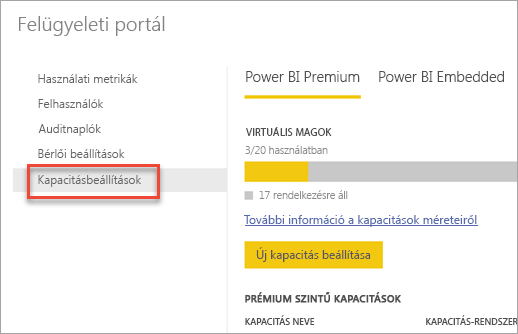

A **Kapacitásbeállítások** lehetőségre kattintva a Power BI Premium alapértelmezett kapacitáskezelő képernyőjére léphet.

### Új kapacitás beállítása (Power BI Premium)
A virtuális magok száma a kapacitáslétrehozáshoz használt és elérhető mennyiséget tükrözi. A cég számára elérhető virtuális magok száma a megvásárolt Premium SKU-k számától függ. Például egy P3 vagy egy P2 vásárlásával 48 magot kaphat – 32-t a P3-hoz és 16-ot a P2-höz.

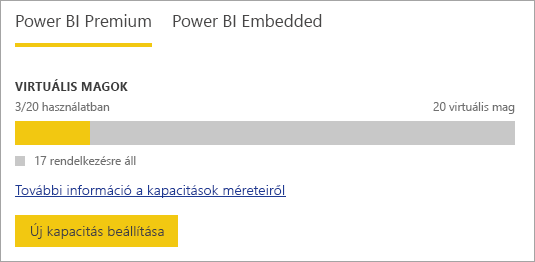

Ha rendelkezik elérhető virtuális magokkal, az új kapacitást az alábbi módon állíthatja be:

1. Válassza az **Új kapacitás beállítása** lehetőséget.
2. Adjon egy **nevet** a kapacitásnak.
3. Adjon meg egy rendszergazdát a kapacitásnak.
   
    A kapacitás-rendszergazdáknak nem kell Power BI-rendszergazdának vagy Office 365 globális rendszergazdának lenniük. További információ: [A Power BI Premium kapacitás-rendszergazdái](#capacity-admins).
4. Válassza ki a kapacitás méretét. Az elérhető lehetőségek attól függnek, hogy mennyi virtuális maggal rendelkezik. Olyan lehetőséget nem választhat, amely nagyobb az elérhető virtuális magok számánál.
   
    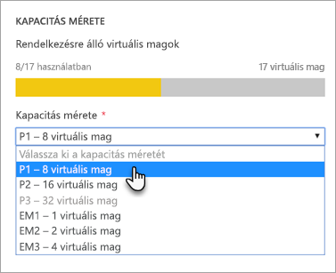
5. Válassza a **Beállítás** lehetőséget.

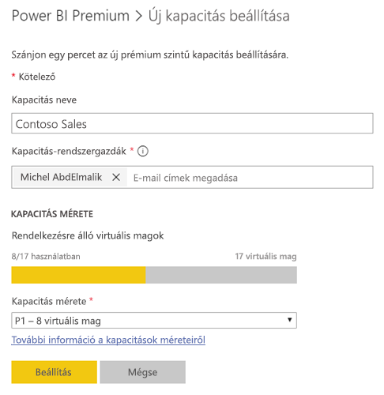

A kapacitás-rendszergazdák, a Power BI-rendszergazdák és az Office 365 globális rendszergazdái számára ekkor megjelenik a kapacitás a felügyeleti portálon.

### Kapacitásbeállítások
A prémium szintű kapacitás felügyeleti képernyőjén kattintson a Műveletek terület **fogaskerék ikonjára (beállítások)**. Itt átnevezheti vagy törölheti a kapacitást, valamint megtekintheti a szolgáltatás-rendszergazdákat, a kapacitás SKU-ját, méretét és régióját.

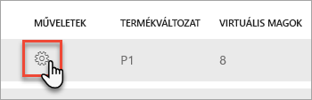

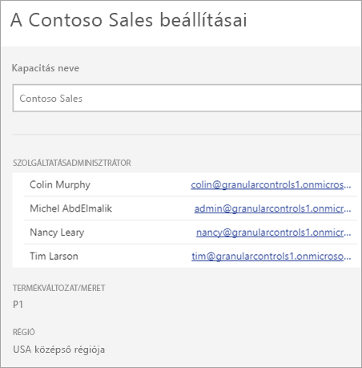

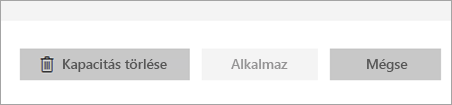

> [!NOTE]
> A Power BI Embedded kapacitásbeállítása a Microsoft Azure Portalon kezelhető.
> 
> 

### Kapacitásméret módosítása (Power BI Premium)
A Power BI-rendszergazdák és az Office 365 globális rendszergazdái a **Kapacitás méretének módosítása** lehetőséggel módosíthatják a prémium szintű kapacitás méretét. Az olyan kapacitás-rendszergazdák, akik nem Power BI-rendszergazdák vagy nem az Office 365 globális rendszergazdái, nem végezhetik el ezt a műveletet.

A **Kapacitás méretének módosítása** képernyőn – amennyiben rendelkezik a megfelelő erőforrásokkal – bármelyik irányba változtathatja a kapacitás méretét. A rendszergazdák szabadon hozhatnak létre, méretezhetnek át és törölhetnek csomópontokat, amennyiben rendelkeznek a megfelelő számú virtuális maggal. 

A P SKU-k nem válthatók vissza EM SKU-kra. A letiltott lehetőségek fölé helyezve az egeret további magyarázatot olvashat.

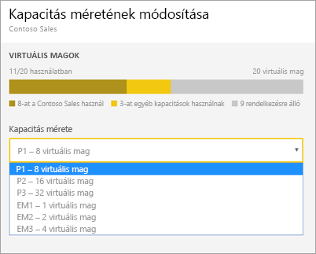

### Kapacitás-hozzárendelés
A kapacitásokat azok nevének kijelölésével kezelheti. Ekkor a kapacitáskezelő képernyőre ugrik.

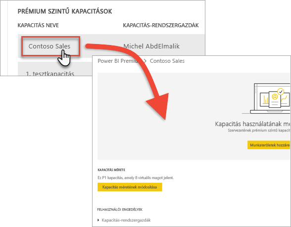

Ha nincs munkaterület rendelve a kapacitáshoz, megjelenik egy üzenet, **amellyel ezt megteheti**.

#### Felhasználói engedélyek
A Power BI Premium kapacitásaihoz további **kapacitás-rendszergazdákat** rendelhet hozzá, valamint egyes felhasználóknak **kapacitás-hozzárendelési engedélyt** adhat. A hozzárendelési engedéllyel rendelkező felhasználók hozzárendelhetnek egy alkalmazás-munkaterületet egy kapacitáshoz, ha ők a munkaterület rendszergazdái. Emellett a *saját munkaterületüket* is hozzárendelhetik a kapacitáshoz. A hozzárendelési engedéllyel rendelkező felhasználók nem férhetnek hozzá a felügyeleti portálhoz.

> [!NOTE]
> A Power BI Embedded kapacitás-rendszergazdái a Microsoft Azure Portalon rendelhetők hozzá.
> 
> 

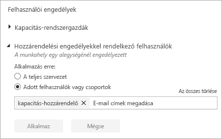

## Használati mértékek (Power BI Premium)
Minden kapacitáshoz használhatja a processzor, a memória és a Direct Query használati mértékeit. Minden KPI három jelzéssel bír: **Jó (zöld)**, **Csekély (sárga)** és **Kritikus (piros)**. Célszerű figyelemmel kísérni ezeket a mértékeket, így gondoskodhat arról, hogy a felhasználók jó teljesítményt érjenek el a Premium tartalmainak használatakor.

**A Power BI Embedded kapacitáshasználatát az Azure Portalon követheti.**

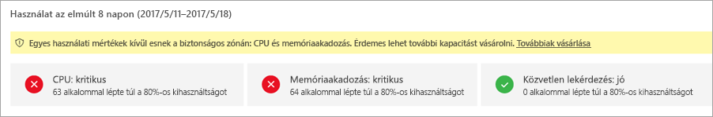

| Mérték | Leírás |
| --- | --- |
| Processzor |A magok processzorhasználata. |
| Memória |A háttérrendszerbeli magok memóriája. Egészen pontosan ez azt jelzi, hogy a modellek milyen gyakran ürülnek ki a memóriából a több modell használata miatti memóriaterhelés következtében. |
| DQ/másodperc |* A DirectQuery és élő kapcsolatos lekérdezések másodpercenkénti maximális száma korlátozott. * A korlátok a következők: P1 esetében 30/másodperc, P2 esetében 60/másodperc, P3 esetében pedig 120/másodperc. * A DirectQuery és az élő kapcsolatos lekérdezések egyenrangúnak számítanak a fenti szabályozásban. Ha például 15 DirectQueryvel és 15 élő kapcsolattal rendelkezik egy adott másodpercben, elérte a korlátot. * Ez mind a helyszíni, mind a felhőkapcsolatokra vonatkozik. |

Amikor ezek a mértékek csekélyek vagy kritikusak, a felhasználók csökkenést tapasztalhatnak a jelentések és a frissítések teljesítményében, különösen a csúcsterhelések idején.

A mértékek az elmúlt egy hét használati adatait tükrözik, és segítségükkel a kapacitástúlterhelések számát határozhatja meg, amelyek az optimálisnál alacsonyabb teljesítményt eredményeznek a felhasználók számára.

Minden olyan eset, ahol a *használat 80% fölötti*, potenciális teljesítménycsökkenésre utalhat. Ha túl sok az ilyen eset, az azt jelenti, hogy a felhasználók jelentős teljesítménybeli problémákat észlelnek.

## Munkaterület hozzárendelése kapacitáshoz
A kapacitásokhoz többféleképpen is hozzárendelhet munkaterületeket.

### Kapacitáskezelés a felügyeleti portálon
A kapacitás-rendszergazdák, a Power BI-rendszergazdák és az Office 365 globális rendszergazdái tömegesen hozzárendelhetnek munkaterületeket a felügyeleti portál prémium szintű kapacitáskezelési területén. Ha Ön kezeli a kapacitást, a **Munkaterületek** területen rendelhet hozzá munkaterületeket.

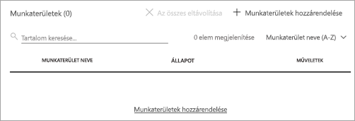

1. Válassza a **Munkaterületek hozzárendelése** lehetőséget. Ez több helyen is szerepel, de ugyanarra a műveletre utal.
2. Válassza **A teljes cég munkaterületei** vagy a **Felhasználónként megadott munkaterületek** lehetőséget.
   
   | Kijelölés | Leírás |
   | --- | --- |
   | **A teljes cég munkaterületei** |Ha a prémium szintű kapacitáshoz a teljes cég munkaterületeit hozzárendeli, azzal a cég minden alkalmazás-munkaterületét és saját munkaterületét ehhez a prémium szintű kapacitáshoz rendeli. Emellett minden jelenlegi és jövőbeli felhasználó engedélyt kap az egyéni munkaterületek ehhez a kapacitáshoz való újbóli hozzárendelésére. |
   | **Felhasználónként megadott munkaterületek** |Ha felhasználó vagy csoport alapján rendel hozzá munkaterületet, a megadott felhasználók tulajdonában lévő minden munkaterület a prémium szintű kapacitáshoz lesz rendelve, beleértve a felhasználó saját munkaterületét. Az érintett felhasználók automatikusan munkaterület-hozzárendelési engedélyt is kapnak, amely a más kapacitásokhoz rendelt munkaterületekre is érvényes. |
3. Kattintson az **Alkalmazás** lehetőségre.

Ezzel a lehetőséggel nem rendelhet adott munkaterületeket egy kapacitáshoz.

### Alkalmazás-munkaterület beállításai
Az alkalmazás-munkaterületeket a munkaterület beállításaiban is hozzárendelheti egy prémium szintű kapacitáshoz. Ehhez végezze el az alábbi műveleteket.

Ha egy munkaterületet egy kapacitásba szeretne áthelyezni, ahhoz rendszergazdai és kapacitás-hozzárendelési engedéllyel kell rendelkeznie a munkaterületen. Tartsa észben, hogy a munkaterületek rendszergazdái bármikor eltávolíthatnak munkaterületeket a prémium szintű kapacitásból.

1. Az alkalmazás-munkaterület szerkesztéséhez kattintson a **három pontra (…)** , majd válassza a **Munkaterület szerkesztése** lehetőséget.
   
    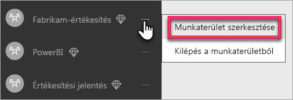
2. A **Munkaterület szerkesztése** területen bontsa ki a **Speciális** lehetőséget.
3. Ha rendelkezik kapacitás-hozzárendelési engedéllyel valamelyik kapacitáshoz, bekapcsolhatja a **prémium** szintet ehhez a munkaterülethez.
4. Válassza ki azt a kapacitást, amelyhez hozzá szeretné rendelni az alkalmazás-munkaterületet.
   
    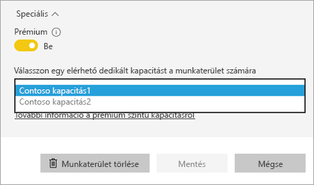
5. Kattintson a **Mentés** gombra.

A mentés után a munkaterület és annak minden tartalma a prémium szintű kapacitásba kerül. A felhasználók számára ez semmilyen megszakítással nem jár.

## A prémium szintű kapacitás a végfelhasználók szemével
Az esetek többségében a felhasználók nem is tudnak róla, hogy prémium szintű kapacitásban vannak. Az irányítópultjaik és jelentéseik ugyanúgy működnek. A prémium kapacitásban lévő munkaterületeket egy gyémánt ikon jelzi. 

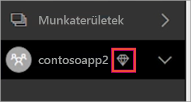

## Power BI jelentéskészítő kiszolgáló termékkulcsa
A Power BI jelentéskészítő kiszolgáló termékkulcsát a Power BI felügyeleti portáljának **Kapacitásbeállítások** lapján érheti el. Ezt csak a globális rendszergazdák vagy a Power BI szolgáltatás-rendszergazdai szerepéhez rendelt felhasználók érhetik el, ha vásároltak egy Power BI Premium SKU-t.

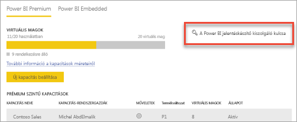

A **Power BI jelentéskészítő kiszolgáló kulcsának** kiválasztásakor megjelenik a termékkulcsot tartalmazó párbeszédpanel. Ezt másolhatja és használhatja a telepítéshez.

További információt [a Power BI jelentéskészítő kiszolgáló telepítését](report-server/install-report-server.md) ismertető témakörben találhat.

## További lépések
A közzétett alkalmazásokat megoszthatja az ingyenes felhasználókkal, ha a munkaterületet egy prémium szintű kapacitáshoz rendeli. További információ: [Alkalmazások létrehozása és terjesztése a Power BI-ban](service-create-distribute-apps.md).

További kérdései vannak? [Kérdezze meg a Power BI közösségét](http://community.powerbi.com/)

