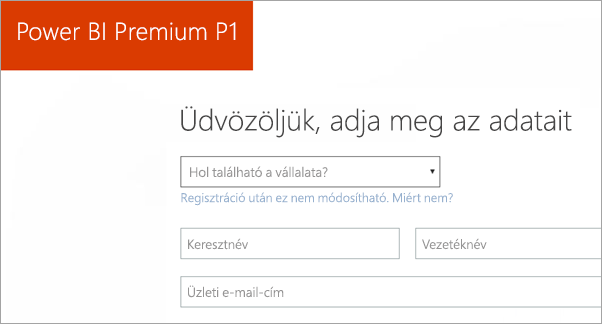
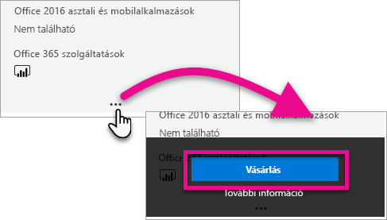
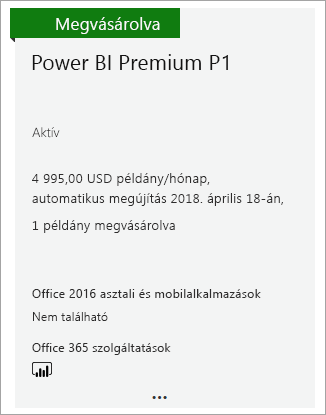
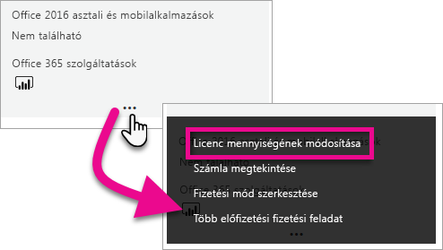
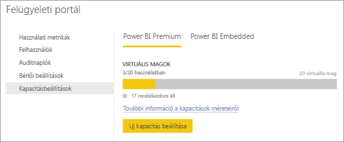
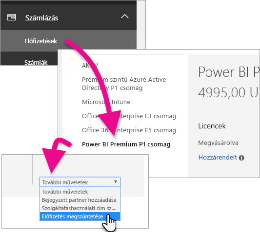
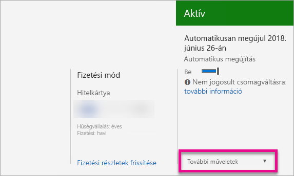

# A Power BI Premium megvásárlása
Megtudhatja, hogyan vásárolhat Power BI Premium-kapacitást a szervezete számára.

<iframe width="640" height="360" src="https://www.youtube.com/embed/NkvYs5Qp4iA?rel=0&amp;showinfo=0" frameborder="0" allowfullscreen></iframe>

Kapacitás-csomópontot a Power BI Premiumhoz az Office 365 Felügyeleti központban vásárolhat. Emellett a szervezetében a Premium kapacitás-termékváltozatok (P1-től P3-ig) bármilyen együttesét használhatja. Ezek különböző erőforrás-funkciókat nyújtanak.

További információ Power BI Premiumról: [Power BI Premium – mi ez?](service-premium.md). A Power BI jelenlegi díjszabását a [Power BI díjszabásának oldalán](https://powerbi.microsoft.com/pricing/) tekintheti meg. A Power BI Premium költségeit megtervezheti a [Power BI Premium díjszámítójával](https://powerbi.microsoft.com/calculator/).

> [!IMPORTANT]
> A tartalmak szerzőinek továbbra is Power BI Pro-licencre lesz szükségük, akkor is, ha Ön megvásárolja a Power BI Premiumot.
> 
> 

## Új bérlő létrehozása a Power BI Premium P1 csomaggal
Ha nem rendelkezik meglévő bérlővel, és létre szeretne hozni egyet, ezzel egy időben megvásárolhatja a Power BI Premiumot. Az alábbi hivatkozás végigvezeti az Office 365-höz használandó új bérlő létrehozásának lépésein, és ezen keresztül megvásárolhatja a Power BI Premiumot is. A bérlő létrehozása után egy Power BI Pro-licencet kell vásárolnia egy felhasználónak. A bérlő létrehozásakor automatikusan Ön lesz a globális rendszergazdája.

A vásárlásról további információt itt találhat: [Power BI Premium P1-ajánlat](https://signup.microsoft.com/Signup?OfferId=b3ec5615-cc11-48de-967d-8d79f7cb0af1).

## Power BI Premium-kapacitás vásárlása meglévő szervezet számára
Ha egy meglévő szervezet tagja, globális vagy számlázási rendszergazdának kell lennie az előfizetések és licencek vásárlásához. További információ: [Az Office 365 rendszergazdai szerepkörei](https://support.office.com/article/About-Office-365-admin-roles-da585eea-f576-4f55-a1e0-87090b6aaa9d).

Prémium-kapacitás vásárlásához az alábbi lépéseket kell elvégeznie.

1. A Power BI szolgáltatásban válassza az **Office 365-alkalmazásválasztó** > **Felügyelet** lehetőséget. Másik lehetőségként megnyithatja az Office 365 Felügyeleti központját. Ehhez nyissa meg a(z) https://portal.office.com oldalt, majd válassza a **Felügyelet** lehetőséget.
   
    
2. Válassza a **Számlázás** > **Szolgáltatások vásárlása** lehetőséget.
3. Az **Egyéb csomagok** területen keresse meg a Power BI Premium ajánlatait. Itt az alábbi lehetőségek közül választhat: P1-től P3-ig, valamint EM3 és P1 (havonta megújuló).
4. Helyezze a kurzort a **három pont(…)**  fölé, majd válassza a **Vásárlás** lehetőséget.
   
    
5. A vásárlás megerősítéséhez kövesse a lépéseket.

Az alábbi hivatkozásokkal közvetlenül az egyes elemek vásárlási oldalára kerülhet. További információ a termékváltozatokról: [Power BI Premium – mi ez?](service-premium.md#premiumskus).

A Power BI Premium termékváltozatainak megvásárlásához ***globális vagy számlázási rendszergazdának kell lennie*** a bérlőben. Ha Ön nem rendszergazda, az alábbi hivatkozásokra kattintva hibaüzenet jelenik meg.

| Közvetlen vásárlási hivatkozások |
| --- |
| [EM3 (havonta megújuló) SKU](https://portal.office.com/commerce/completeorder.aspx?OfferId=4004702D-749C-4F74-BF47-3048F1833780&adminportal=1) |
| [P1 SKU](https://portal.office.com/commerce/completeorder.aspx?OfferId=b3ec5615-cc11-48de-967d-8d79f7cb0af1&adminportal=1) |
| [P1 (havonta megújuló) SKU](https://portal.office.com/commerce/completeorder.aspx?OfferId=E4C8EDD3-74A1-4D42-A738-C647972FBE81&adminportal=1) |
| [P2 SKU](https://portal.office.com/commerce/completeorder.aspx?OfferId=062F2AA7-B4BC-4B0E-980F-2072102D8605&adminportal=1) |
| [P3 SKU](https://portal.office.com/commerce/completeorder.aspx?OfferId=40c7d673-375c-42a1-84ca-f993a524fed0&adminportal=1) |

A vásárlás befejezése után a Szolgáltatások vásárlása képernyőn megvásároltként és aktívan jelenik meg az elem.

Ezt a kapacitást a Power BI felügyeleti központban kezelheti. További információ: [A Power BI Premium kezelése](service-admin-premium-manage.md).

## További kapacitások vásárlása
A Power BI felügyeleti portálja **Prémium szintű beállítások** szakaszában – amennyiben Ön rendszergazda – megjelenik a **Továbbiak vásárlása** gomb. Erre a gombra kattintva visszatér az Office 365 portálra. Az Office 365 Felügyeleti központjában az alábbi műveletet végezheti el.

1. Válassza a **Számlázás** > **Szolgáltatások vásárlása** lehetőséget.
2. Keresse meg azt a Power BI Premium-elemet, amelyből további példányokat szeretne vásárolni az **Egyéb csomagok** területen.
3. Helyezze a kurzort a **három pont(…)**  fölé, majd válassza a **Licencmennyiség módosítása** lehetőséget.
   
    
4. Adja meg az elemhez használni kívánt példányok számát. Ha kész, válassza a **Küldés** lehetőséget.
   
   > [!IMPORTANT]
   > A **Küldés** lehetőségre kattintva megterheljük a fájlhoz tartozó bankkártyát.
   > 
   > 

A **Szolgáltatások vásárlása** lapon ekkor megjelenik a példányok száma. A Power BI felügyeleti portáljának **Kapacitásbeállítások** területén az elérhető virtuális magok megjelenítik az új kapacitást.

Ezt a kapacitást a Power BI felügyeleti központban kezelheti. További információ: [A Power BI Premium kezelése](service-admin-premium-manage.md).

## Az előfizetés megszüntetése
Az előfizetést az Office 365 Felügyeleti központjában szüntetheti meg. A Premium-előfizetés megszüntetéséhez végezze el az alábbi műveleteket.

1. Nyissa meg az Office 365 Felügyeleti központot.
2. Válassza a **Számlázás** > **Előfizetések** lehetőséget.
3. Válassza ki a listából a Power BI Premium-előfizetését.
4. A **További műveletek** legördülő menüben válassza az **Előfizetés megszüntetése** lehetőséget.
   
    
5. Az **Előfizetés megszüntetése** lapon tájékoztatást kap arról, hogy kell-e [idő előtti megszüntetésért felszámolt díjat](https://support.office.com/article/early-termination-fees-6487d4de-401a-466f-8bc3-c0beb5cc40d3) fizetnie. Ezen a lapon azt is megtudhatja, hogy mikor törlődnek az előfizetés adatai.
6. Olvassa végig az adatokat, és ha folytatni kívánja, válassza az **Előfizetés megszüntetése** lehetőséget.

## Következő lépések
[A Power BI díjszabási oldala](https://powerbi.microsoft.com/pricing/)  
[Power BI Premium díjszámító](https://powerbi.microsoft.com/calculator/)  
[Power BI Premium – mi ez?](service-premium.md)  
[A Power BI Premium kezelése](service-admin-premium-manage.md)  
[Power BI Premium – gyakori kérdések](service-premium-faq.md)  
[A Power BI Premium kiadási megjegyzései](service-premium-release-notes.md)  
[Microsoft Power BI Premium-tanulmány](https://aka.ms/pbipremiumwhitepaper)  
[Egy Power BI vállalati bevezetését ismertető tanulmány tervezése](https://aka.ms/pbienterprisedeploy)  
[Power BI felügyeleti portál](service-admin-portal.md)  
[A Power BI felügyelete a szervezetnél](service-admin-administering-power-bi-in-your-organization.md)  

További kérdései vannak? [Kérdezze meg a Power BI közösségét](http://community.powerbi.com/)

