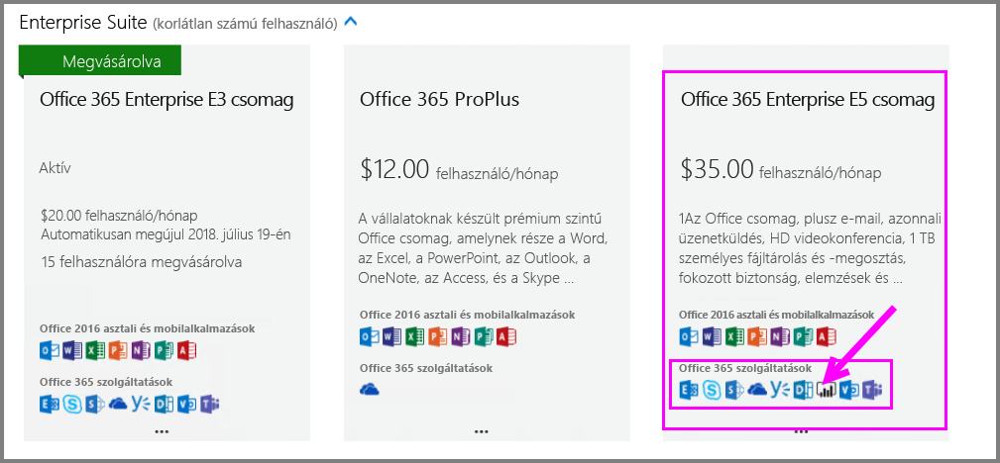
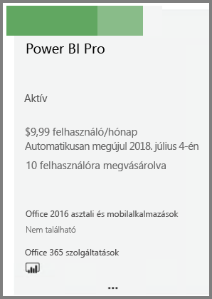
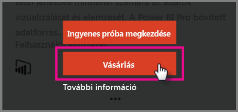
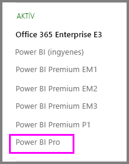

# Gyorsútmutató: Power BI Pro-licencek vásárlása

A Power BI Pro egyéni licenc, amely hozzáférést biztosít a Power BI szolgáltatásban minden tartalomhoz és funkcióhoz, többek között megosztható a tartalom, és lehetőség van más Pro-felhasználókkal való együttműködésre is. Csak a Pro szintű felhasználók tehetnek közzé és használhatnak tartalmat alkalmazás-munkaterületeken, oszthatnak meg irányítópultokat, és iratkozhatnak fel irányítópultokra és jelentésekre. Ez a cikk azt ismerteti, hogyan vásárolható Power BI Pro-licenc az Office 365-ben.

## Előfeltételek

Az Office 365-ben [**globális rendszergazdai** vagy **Számlázási rendszergazdai**](https://support.office.com/article/about-office-365-admin-roles-da585eea-f576-4f55-a1e0-87090b6aaa9d?ui=en-US&rs=en-US&ad=US) szerepkörrel kell rendelkeznie. 

## Power BI Pro-licencek vásárlása az Office 365-ben

Kövesse az alábbi lépéseket a Power BI Pro megvásárlásához:

1. Nyissa meg az [Office 365 Felügyeleti központot](https://portal.office.com/adminportal/home#/homepage).

2. A bal oldali navigációs ablaktáblán kattintson a **Számlázás** > **Előfizetések** lehetőségre.

    

3. Az **Előfizetések** lap jobb felső sarkában kattintson az **Előfizetések felvétele** gombra.

    

4. Keresse meg a kívánt előfizetési ajánlatot:

    Válassza a **Nagyvállalati csomag** csoportban az **Office 365 Nagyvállalati E5 csomag** lehetőséget.

    

    Válassza az **Egyéb csomagok** csoportban a **Power BI Pro** lehetőséget.

    

5. Mutasson a kívánt előfizetéshez tartozó három pontra (…), és válassza a **Vásárlás** lehetőséget.

    

6. Válassza a **Fizetés havonta** vagy a **Fizetés egy teljes évre** lehetőséget a számlázási igényeinek megfelelően.

7. A **Hány felhasználóra van szüksége?** területen adja meg a licencek kívánt számát, válassza a **Fizetés most** lehetőséget, majd fejezze be a tranzakciót.

8. Ellenőrizze, hogy a beszerzett előfizetés megjelenik-e az **Előfizetések** lap listájában.

   

9. Ha az eredeti vásárlás után további licenceket szeretne hozzáadni, az **Előfizetések** oldalon válassza a **Power BI Pro** lehetőséget, majd válassza a **Licencek hozzáadása/eltávolítása** elemet.

## Következő lépések

A licencek vásárlása után hozzárendelheti azokat a bérlőn belüli felhasználókhoz.

[Licencek hozzárendelése felhasználókhoz az Office 365-ben](service-admin-assigning-power-bi-pro-licenses.md)

[Licencek hozzárendelése felhasználókhoz az Azure-ban](service-admin-assigning-power-bi-pro-licenses-azure.md)

[A Power BI díjszabása](https://powerbi.microsoft.com/en-us/pricing/)
