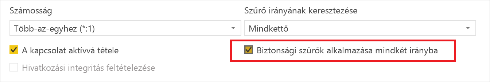
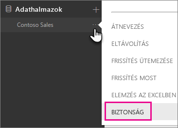
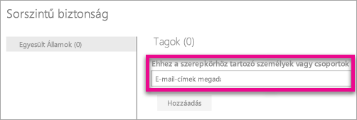
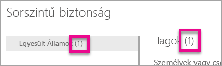
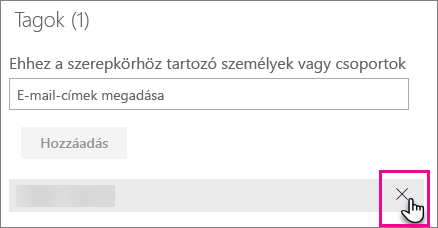
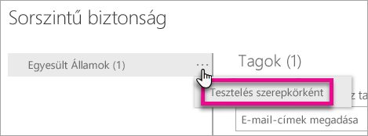
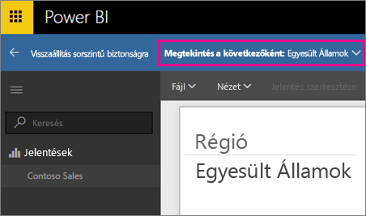
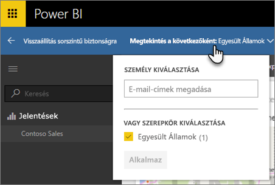
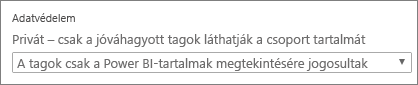

# Sorszintű biztonság (RLS) a Power BI-ban
<iframe width="560" height="315" src="https://www.youtube.com/embed/67fK0GoVQ80?showinfo=0" frameborder="0" allowfullscreen></iframe>

A sorszintű biztonság (RLS) a Power BI-ban az adott felhasználók adatokhoz való hozzáférésének korlátozására használható. A szűrők sorszinten korlátozzák az adatokat. A szűrőket a szerepkörökön belül adhatja meg.

Konfigurálhat RLS-t a Power BI Desktoppal a Power BI-ba importált adatmodellekhez. Ezen kívül konfigurálhat RLS-t a DirectQueryt használó adatkészletekhez, például az SQL Serverhez is. Korábban csak a Power BI szolgáltatáson kívül, a helyszíni Analysis Services-modellekben lehetett RLS-t beállítani. Az Analysis Services élő kapcsolataihoz a helyszíni modellen konfigurálhatja a sorszintű biztonságot. Az élő kapcsolatok adatkészleteinél nem fog megjelenni a biztonsági beállítás.

[!INCLUDE [include-short-name](./includes/rls-desktop-define-roles.md)]

A sorszintű biztonsági szűrés alapbeállítás szerint egyirányú szűrőket alkalmaz, függetlenül attól, hogy a kapcsolatok egy- vagy kétirányúra vannak-e beállítva. A sorszintű biztonsági szűrés kétirányú keresztszűrését manuálisan lehet beállítani. Ehhez válassza ki a kapcsolatot, és jelölje be a **Biztonsági szűrés alkalmazása mindkét irányban** lehetőséget. Ezt a jelölőnégyzetet akkor javasolt bejelölnie, ha [dinamikus sorszintű biztonságot](https://docs.microsoft.com/en-us/sql/analysis-services/supplemental-lesson-implement-dynamic-security-by-using-row-filters) alkalmaz, ahol felhasználónév vagy bejelentkezési azonosító használatával állítja be a sorszintű biztonságot. 

További információt a [Kétirányú keresztszűrés a DirectQuery használatával a Power BI Desktopban](desktop-bidirectional-filtering.md) és [A táblázatos BI szemantikai modell biztonságossá tétele](http://download.microsoft.com/download/D/2/0/D20E1C5F-72EA-4505-9F26-FEF9550EFD44/Securing the Tabular BI Semantic Model.docx) című cikkekben talál.

[!INCLUDE [include-short-name](./includes/rls-desktop-view-as-roles.md)]

## Az adatmodell biztonságának kezelése
Az adatmodell biztonságának kezeléséhez a következő lépéseket hajthatja végre.

1. Az adatmodellnél kattintson a **három pontra (…)**.
2. Válassza a **Biztonság** elemet.
   
   

Ekkor megnyílik az RLS-oldal, ahol hozzárendelheti a tagokat a Power BI Desktopban létrehozott szerepkörökhöz. A Biztonság lehetőség csak az adatkészlet tulajdonosai számára érhető el. Ha az adatkészlet egy Csoporthoz tartozik, akkor a Biztonság lehetőséget csak a csoport rendszergazdái látják. 

Csak a Power BI Desktopon belül hozhat létre és módosíthat szerepköröket.

## Tagok kezelése
### Tagok hozzáadása
A felvenni kívánt felhasználót, biztonsági csoportot vagy terjesztési listát az e-mail-cím vagy a név megadásával adhatja hozzá a szerepkörhöz. Csak cégen belüli tagot vehet fel. Power BI-ban létrehozott Csoportokat nem vehet fel.

A szerepkör neve vagy a Tagok melletti zárójelben a szerepkörhöz tartozó tagok számát is megtekintheti.

### Tagok eltávolítása
A tagokat a nevük mellett látható X elemre kattintva távolíthatja el. 

## Szerepkör ellenőrzése a Power BI szolgáltatásban
Az adott szerepkör megfelelő működését a szerepkör tesztelésével ellenőrizheti. 

1. Kattintson a szerepkör mellett látható **három pontra (...)**.
2. Kattintson az **Adatok tesztelése szerepkörökként** elemre.

Ekkor megjelennek a szerepkör számára elérhető jelentések. Ebben a nézetben nem jelennek meg irányítópultok. A felső kék sávban látható az éppen tesztelt szerepkör.

A **Megtekintés a következőként** elemre kattintva más szerepköröket és szerepkör-kombinációkat is tesztelhet.

Megtekinthet adatokat konkrét személyként, vagy választhatja az elérhető szerepkörök kombinációját a működésük ellenőrzéséhez. 

A **Vissza a sorszintű biztonsághoz** lehetőségre kattintva visszatérhet a normál nézethez.

[!INCLUDE [include-short-name](./includes/rls-usernames.md)]

## Az RLS használata Power BI-beli alkalmazás-munkaterületeken
Ha egy Power BI szolgáltatáson belüli alkalmazás-munkaterületen tesz közzé Power BI Desktop-jelentést, a szerepkörök a csak olvasási jogosultsággal rendelkező tagokra fognak vonatkozni. Jeleznie kell, hogy a tagok csak az alkalmazás-munkaterület beállításain belül láthatják a Power BI-tartalmakat.

> [!WARNING]
> Ha az alkalmazás-munkaterületet úgy konfigurálta, hogy a tagoknak szerkesztési engedélyük legyen, az RLS-szerepkörök nem fognak vonatkozni rájuk. A felhasználók az összes adatot megtekinthetik.
> 
> 

[!INCLUDE [include-short-name](./includes/rls-limitations.md)]

[!INCLUDE [include-short-name](./includes/rls-faq.md)]

## További lépések
[Sorszintű biztonság (RLS) a Power BI Desktoppal](desktop-rls.md)  

További kérdései vannak? [Kérdezze meg a Power BI közösségét](http://community.powerbi.com/)

