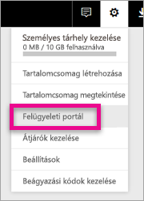
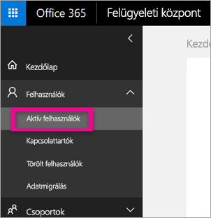
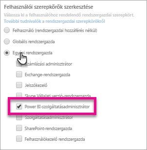

# <a name="understanding-the-power-bi-admin-role"></a>A Power BI rendszergazdai szerepkörének ismertetése
Megismerheti a Power BI rendszergazdai szerepkörének használatát a munkahelyen.

<iframe width="640" height="360" src="https://www.youtube.com/embed/PQRbdJgEm3k?showinfo=0" frameborder="0" allowfullscreen></iframe>

A Power BI szolgáltatásadminisztrátori szerepkörét olyan felhasználókhoz lehet hozzárendelni, akiknek szükségük van a Power BI felügyeleti portáljához való hozzáférésre, de nem kaphatnak egyéb rendszergazdai Office 365-hozzáférést. Például globális rendszergazdai szerepkört. Az ilyen szerepkört azok kapják, akik a Power BI adminisztrátori felügyeletét látják el a munkahelyen.

Az Office 365 felhasználói rendszergazdái az Office 365 felügyeleti központjában vagy egy PowerShell-szkripttel nevezhetnek ki felhasználókat Power BI-adminisztrátorrá. Miután a hozzárendelés megtörténik, a felhasználók képesek hozzáférni a [Power BI felügyeleti portáljához](service-admin-portal.md). A portálon hozzáférhetnek a bérlői szintű használati metrikákhoz, valamint képesek szabályozni a Power BI funkcióinak bérlői szintű használatát.



## <a name="using-the-office-365-admin-center-to-assign-a-role"></a>Az Office 365 felügyeleti központjának használata szerepkörök hozzárendelésére
A Power BI adminisztrátori szerepkörének felhasználókhoz való hozzárendeléséhez végezze el az alábbiakat az Office 365 felügyeleti központjában.

1. Nyissa meg az Office 365 felügyeleti központját, majd válassza a **Felhasználók** > **Aktív felhasználók** elemet.
   
    
2. Válassza ki azt a felhasználót, akihez a szerepkört szeretné hozzárendelni.
3. Válassza ki a szerepkörökhöz tartozó **Szerkesztés** elemet.
   
    
4. Válassza ki a **Személyre szabott adminisztrátor** > **Power Bi-szolgáltatásadminisztrátor** elemet
   
    
5. Válassza a **Mentés** gombot.

Most már láthatja, hogy a **Power BI-szolgáltatásadminisztrátor** megjelölés szerepel az adott felhasználó szerepkörénél. Ezek a felhasználók mostantól hozzáférhetnek a [Power BI felügyeleti portáljához](service-admin-portal.md).


## <a name="using-powershell-to-assign-a-role"></a>A PowerShell használata szerepkörök hozzárendelésére
A PowerShell-parancs futtatásához telepíteni kell az Azure Active Directory PowerShell-modulját.

### <a name="download-azure-ad-powershell-module"></a>Az Azure AD PowerShell-modul letöltése
[Az Azure Active Directory PowerShell 2-es verziójának letöltése](https://github.com/Azure/azure-docs-powershell-azuread/blob/master/Azure%20AD%20Cmdlets/AzureAD/index.md)

[Az Azure Active Directory PowerShell általánosan elérhető 1.1.166.0-s verziójának letöltése](http://connect.microsoft.com/site1164/Downloads/DownloadDetails.aspx?DownloadID=59185)

### <a name="command-to-add-role-to-member"></a>A szerepkör taghoz való hozzárendelésére szolgáló parancs
**Az Azure AD PowerShell 2-es verziójában használható parancs**

Be kell szereznie a **Power BI-szolgáltatásadminisztrátor** szerepkörhöz tartozó **ObjectId** paramétert. Az **ObjectId** beszerzéséhez futtathatja a [Get-AzureADDirectoryRole](https://docs.microsoft.com/powershell/azuread/v2/get-azureaddirectoryrole) parancsot

```
PS C:\Windows\system32> Get-AzureADDirectoryRole

ObjectId                             DisplayName                        Description
--------                             -----------                        -----------
00f79122-c45d-436d-8d4a-2c0c6ca246bf Power BI Service Administrator     Full access in the Power BI Service.
250d1222-4bc0-4b4b-8466-5d5765d14af9 Helpdesk Administrator             Helpdesk Administrator has access to perform..
3ddec257-efdc-423d-9d24-b7cf29e0c86b Directory Synchronization Accounts Directory Synchronization Accounts
50daa576-896c-4bf3-a84e-1d9d1875c7a7 Company Administrator              Company Administrator role has full access t..
6a452384-6eb9-4793-8782-f4e7313b4dfd Device Administrators              Device Administrators
9900b7db-35d9-4e56-a8e3-c5026cac3a11 AdHoc License Administrator        Allows access manage AdHoc license.
a3631cce-16ce-47a3-bbe1-79b9774a0570 Directory Readers                  Allows access to various read only tasks in ..
f727e2f3-0829-41a7-8c5c-5af83c37f57b Email Verified User Creator        Allows creation of new email verified users.
```

Ebben az esetben a szerepkör ObjectId paramétere a következő: 00f79122-c45d-436d-8d4a-2c0c6ca246bf.

Ismernie kell a felhasználók **ObjectId** paraméterét is. Ezt a [Get-AzureADUser](https://docs.microsoft.com/powershell/azuread/v2/get-azureaduser) parancs futtatásával szerezheti be.

```
PS C:\Windows\system32> Get-AzureADUser -SearchString 'tim@contoso.com'

ObjectId                             DisplayName UserPrincipalName      UserType
--------                             ----------- -----------------      --------
6a2bfca2-98ba-413a-be61-6e4bbb8b8a4c Tim         tim@contoso.com        Member
```

A szerepkör taghoz való hozzárendeléséhez futtassa az [Add-AzureADDirectoryRoleMember](https://docs.microsoft.com/powershell/azuread/v2/add-azureaddirectoryrolemember) parancsot.

| Paraméter | Leírás |
| --- | --- |
| ObjectId |A szerepkör objektumazonosítója (ObjectId). |
| RefObjectId |A tag objektumazonosítója (ObjectId). |

```
Add-AzureADDirectoryRoleMember -ObjectId 00f79122-c45d-436d-8d4a-2c0c6ca246bf -RefObjectId 6a2bfca2-98ba-413a-be61-6e4bbb8b8a4c
```

**Az Azure AD PowerShell 1-es verziójában használható parancs**

Ha a szerepkört az Azure AD 1-es verziójú parancsmagjainak használatával rendeli hozzá a taghoz, futtassa az [Add-MsolRoleMember](https://docs.microsoft.com/powershell/msonline/v1/add-msolrolemember) parancsot.

```
Add-MsolRoleMember -RoleMemberEmailAddress "tim@contoso.com" -RoleName "Power BI Service Administrator"
```

## <a name="limitations-and-considerations"></a>Korlátozások és megfontolások
A Power BI-szolgáltatásadminisztrátori szerepkör nem teszi lehetővé az alábbiakat.

* A felhasználók és licencek módosításának képessége az Office 365 felügyeleti központjában
* Hozzáférés az auditnaplókhoz. További információért lásd: [Naplózás használata a munkahelyen](service-admin-auditing.md).

## <a name="next-steps"></a>Következő lépések
[Power BI felügyeleti portál](service-admin-portal.md)  
[Add-AzureADDirectoryRoleMember](https://docs.microsoft.com/powershell/azuread/v2/add-azureaddirectoryrolemember)  
[Add-MsolRoleMember](https://docs.microsoft.com/powershell/msonline/v1/add-msolrolemember)  
[A Power BI-naplózás használata a munkahelyen](service-admin-auditing.md)  
[A Power BI felügyelete a munkahelyen](service-admin-administering-power-bi-in-your-organization.md)  

További kérdései vannak? [Kérdezze a Power BI-közösséget!](http://community.powerbi.com/)

