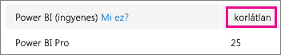
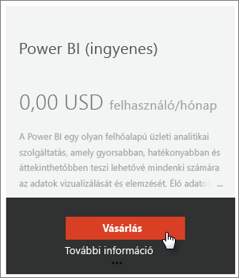
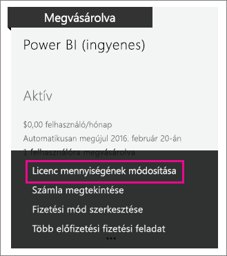

# Power BI (ingyenes) a cégen belül
A témakör azt írja le, hogy miképpen használható fel a Power BI (ingyenes) ajánlata a cégen belül. A cég meghatározása, hogy bérlőt használ, és a bérlőn belül lehetősége van a felhasználók és a szolgáltatások kezelésére. Rendszergazdaként Ön szabályozhatja a licencek hozzárendelését, vagy engedélyezheti az egyéni felhasználók regisztrációját. Az alábbiakban tájékozódhat a Power BI (ingyenes) licencről és az egyéni regisztrációk kezeléséről.

## Az egyéni regisztráció és a licenc-hozzárendelés összevetése
A cégen belüli felhasználók kétféleképpen érhetik el a Power BI rendszerét. Egyénileg regisztrálhatnak a Power BI-ban, vagy Ön rendelhet hozzájuk Power BI-licencet az Office 365 Felügyeleti portálon.

Az egyéni regisztráció engedélyezése megkönnyíti a céges rendszergazda dolgát, mert lehetőséget ad a Power BI iránt érdeklődő felhasználóknak, hogy ők maguk regisztráljanak díjmentesen.

Ha jobban szeretné ellenőrizni a rendszert, letilthatja az egyéni regisztrációt, és személyesen oszthatja ki a Power BI-licenceket az Office 365 Felügyeleti központban. Így megszabhatja, hogy ki milyen szolgáltatásokhoz férhet hozzá a cégen belül. Ez akkor is remek lehetőség, ha naplózás esetén pontosan kell tudnia, hogy ki milyen funkciókat használ.

## Hogyan szerezheti be a korlátlan licencblokkot
A Power BI (ingyenes) korlátlan licenckínálata az Office 365 Felügyeleti központban, a **Számlázás** > **Licencek** területen jelenhet meg.

A licencblokk azután lesz látható, hogy valaki először regisztrált egyénileg a Power BI-ba. A folyamat során a licencblokk a céghez kapcsolódik, és egy licenc rendelődik hozzá az éppen regisztráló felhasználóhoz.

Ha letiltotta az egyéni felhasználók regisztrációját, és senki sem regisztrált még, a licencblokk nem jelenik meg. Ilyenkor engedélyezheti az egyéni felhasználók regisztrációját, és regisztrálhat egy felhasználót, vagy az Office 365-beli előfizetés-hozzáadási folyamatban szerezheti be az ingyenes licenceket (leírás a következő szakaszban).

Miután elérhetővé vált a Power BI (ingyenes) licencblokk, kioszthatja a licenceket a felhasználóknak. További információ a licenc-hozzárendelésről: [Licencek hozzárendelése a felhasználókhoz az Office 365 szolgáltatásban](https://support.office.com/article/Assign-or-unassign-licenses-for-Office-365-for-business-997596b5-4173-4627-b915-36abac6786dc).

## Ingyenes licencek beszerzése az Office 365-beli előfizetés-hozzáadás használatával
1. Keresse fel az [Office 365 Felügyeleti központot](https://portal.office.com/admin/default.aspx).
2. A bal oldali navigációs ablaktáblán kattintson a **Számlázás** > **Előfizetések** lehetőségre.
3. Kattintson az **Előfizetések hozzáadása +** elemre a jobb oldalon.
4. Az Egyéb csomagok területen mutasson a **három pontra (…)**, válassza ki a Power BI (ingyenes) lehetőséget, és kattintson a **Vásárlás** elemre.
   
    
5. Adja meg a hozzáadni kívánt licencek számát, és kattintson a **Fizetés** vagy a **Bevásárlókocsiba** elemre.
   
   > [!NOTE]
   > Igény esetén később további licenceket is hozzáadhat.
   > 
   > 
6. A fizetési folyamat során adja meg a szükséges információkat.

Ennél az ajánlatnál nincs vásárlás annak ellenére, hogy meg kell adnia a hitelkártyája adatait a számlázáshoz, vagy a számla kiküldését kell választania.

Ha később úgy dönt, hogy további licenceket kíván hozzáadni, visszatérhet az **Előfizetések hozzáadása** lapra, és választhatja a **Licencmennyiség módosítása** a Power BI (ingyenes) termékhez lehetőséget.

Most már hozzárendelheti a licenceket a felhasználókhoz. További információ a licenc-hozzárendelésről: [Licencek hozzárendelése a felhasználókhoz az Office 365 szolgáltatásban](https://support.office.com/article/Assign-or-unassign-licenses-for-Office-365-for-business-997596b5-4173-4627-b915-36abac6786dc).

## Egyéni felhasználó regisztrációjának engedélyezése és letiltása az Azure Active Directoryban
Rendszergazdaként engedélyezheti vagy letilthatja az egyéni felhasználók regisztrációját az Azure Active Directoryban (AAD). Ha ismeri az AAD PowerShell-parancsok használatát, az alkalmi előfizetéseket manuálisan engedélyezheti vagy tilthatja le. [További információk](https://technet.microsoft.com/library/jj151815.aspx)

A jelen **AllowAdHocSubscriptions** paramétert vezérlő AAD-beállítás. A legtöbb bérlő esetén ez a beállítás igaz értékre van állítva, vagyis engedélyezett. Ha a Power BI-t partneren keresztül szerezte be, a beállítás alapértelmezett értéke hamis is lehet, tehát le lehet tiltva.

1. Először jelentkezzen be az Azure Active Directoryba az Office 365 hitelesítő adataival. Az első sor bekéri a hitelesítő adatokat. A második sor csatlakozik az Azure Active Directoryhoz.
   
     $msolcred = get-credential   connect-msolservice -credential $msolcred
   
   
2. Miután bejelentkezett, a következő parancs kiadásával láthatja, hogy jelenleg mihez van konfigurálva a bérlő.
   
     Get-MsolCompanyInformation | fl AllowAdHocSubscriptions
3. Ezzel a paranccsal engedélyezheti ($true) vagy letilthatja ($false) az AllowAdHocSubscriptions paramétert.
   
     Set-MsolCompanySettings -AllowAdHocSubscriptions $true

> [!NOTE]
> Ez a letiltás megakadályozza a cégen belüli felhasználók regisztrációját a Power BI-ra. Azok a felhasználók, akik az új céges regisztrációk letiltása előtt regisztráltak a Power BI-ra, továbbra is megtartják a licencüket.
> 
> 

## Következő lépések
[Önkiszolgáló regisztráció a Power BI-ra](service-self-service-signup-for-power-bi.md)  
[A Power BI Pro megvásárlása](service-admin-purchasing-power-bi-pro.md)  
[Regisztráció az (ingyenes) Power BI-ra egyéni Azure Active Directory-bérlővel](developer/create-an-azure-active-directory-tenant.md)  
[Mit jelent a Power BI Premium?](service-premium.md)  
[Power BI Premium-tanulmány](https://aka.ms/pbipremiumwhitepaper)  

További kérdései vannak? [Kérdezze meg a Power BI közösségét](http://community.powerbi.com/)

