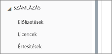
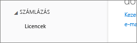
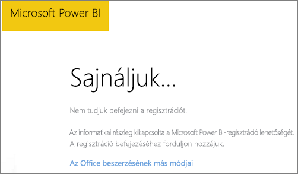
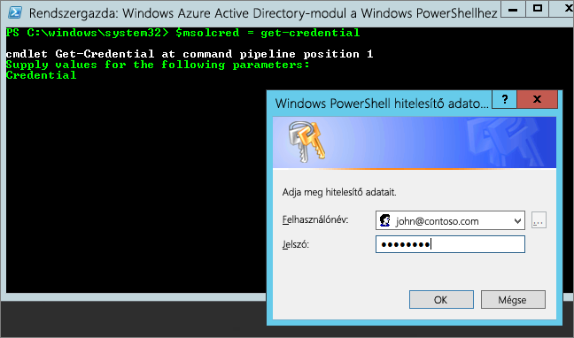

# Nem sikerült hozzáadni a Power BI-t az Office 365 típusú partneri előfizetéshez
Az Office 365 lehetővé teszi a cégeknek az Office 365 saját megoldásokkal integrált, csomagalapú továbbértékesítését, és a cégek egyetlen kapcsolatfelvételi pontot biztosíthatnak a végfelhasználóknak a vásárláshoz, a számlázáshoz és a támogatáshoz.

Ha érdekli a Power BI és az Office 365-előfizetés együttes beszerzése, javasoljuk, hogy érdeklődjön a partnernél ezzel kapcsolatban. Ha a partner kínálatában nem szerepel a Power BI, különböző lehetőségeket vehet fontolóra.

1. Megvásárolhatja a szolgáltatást egy másik csatornán, közvetlenül a Microsofttól vagy egy másik partnertől. Ez a lehetőség nem érhető el minden ügyfélnek, a partnerrel való kapcsolattól függ. A lehetőség meglétét az **Office 365 felügyeleti portál** > **Számlázás** > **Előfizetések** menüpontjának megnyitásával ellenőrizheti. Ha látja az **Előfizetések** elemet, közvetlenül vásárolhatja meg a szolgáltatást a Microsofttól, vagy felveheti a kapcsolatot egy olyan partnerrel, akinek a kínálatában szerepel a Power BI.
   
    
2. Ha nem látja az **Előfizetések** elemet a **Számlázás** menüpontban, nem vásárolhat közvetlenül a Microsofttól vagy egy másik partnertől. 
   
   

Ha nem tudja közvetlenül megvásárolni a Power BI-t, attól függően, hogy milyen típusú Power BI-előfizetés érdekli, más lehetőségei is vannak.

[Power BI (ingyenes)](#power-bi-free)

[Power BI Pro és Premium](#power-bi-pro)

## Power BI (ingyenes)
Ha elégedett az ingyenesen elérhető Power BI-jal, regisztrálhat az ingyenes szolgáltatásra. Az egyéni regisztrációk (más néven alkalmi előfizetések), alapértelmezés szerint le vannak tiltva. Ha regisztrálni próbál a Power BI szolgáltatásra, egy üzenet jelenik meg, amely arról tájékoztat, hogy az informatikai részleg kikapcsolta a Microsoft Power BI-regisztrációt.

    Your IT department has turned off signup for Microsoft Power BI.

Az alkalmi előfizetések engedélyezéséhez megkérheti a partnert, hogy kapcsolja be azt. Ha Ön a bérlő rendszergazdája, és ismeri az Azure Active Directory PowerShell-parancsok használatát, saját maga is engedélyezheti az alkalmi előfizetéseket. [További információ](https://technet.microsoft.com/library/jj151815.aspx)

1. Először jelentkezzen be az Azure Active Directoryba az Office 365 hitelesítő adataival. Az első sor bekéri a hitelesítő adatokat. A második sor kapcsolódik az Azure Active Directoryhoz.
   
        $msolcred = get-credential
        connect-msolservice -credential $msolcred
   
    
2. Ha már bejelentkezett, kiadhatja az alábbi parancsot az ingyenes regisztráció engedélyezéséhez.
   
        Set-MsolCompanySettings -AllowAdHocSubscriptions $true

## Power BI Pro és Premium
Ha szeretne Power BI Pro- vagy Power BI Premium-előfizetést vásárolni, a partnerrel együttműködve kell mérlegelnie a rendelkezésre álló lehetőségeket.

* A partner beleegyezik abba, hogy felvegye a Power BI-t a portfóliójába, így megvásárolhatja azt tőle.
* A partner segítségével olyan modellre válthat, amelyben a Power BI közvetlenül a Microsofttól vagy egy Power BI-t értékesítő másik partnertől vásárolható meg.

Az alábbi videó az Office 365-szindikálást és a Power BI megvásárlását ismerteti:

<iframe width="560" height="315" src="https://www.youtube.com/embed/C357phT94A8" frameborder="0" allowfullscreen></iframe>

## Következő lépések
[Az Azure AD kezelése a Windows PowerShell használatával](https://technet.microsoft.com/library/jj151815.aspx)  
[Mi a Power BI Premium?](service-premium.md)

További kérdései vannak? [Kérdezze meg a Power BI közösségét](http://community.powerbi.com/)

