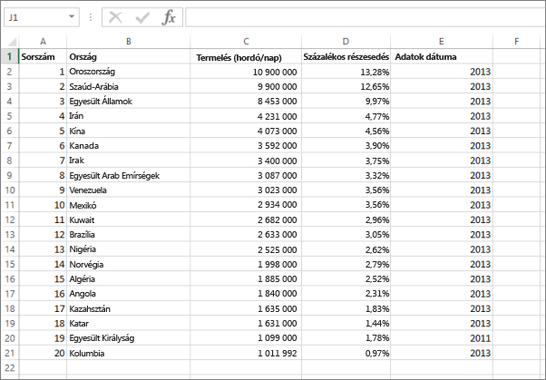
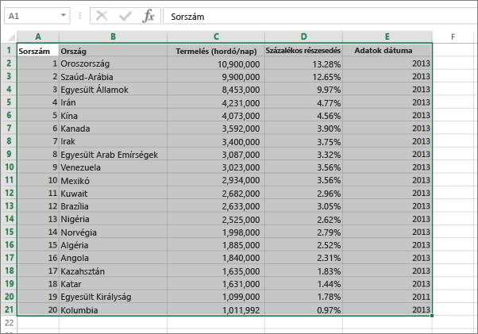
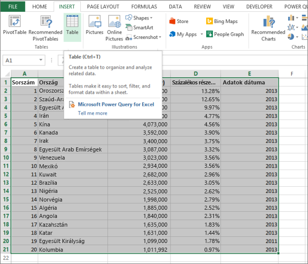
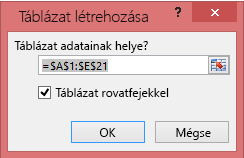
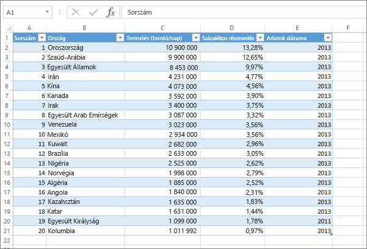

# Hiba: Nem található adat az Excel-munkafüzetben

>[!NOTE]
>Ez a cikk az Excel 2007-es vagy újabb verzióira vonatkozik.

Excel-munkafüzet Power BI-ba történő importálásakor a következő hiba jelenhet meg:

*Hiba: Nem található adat az Excel-munkafüzetben. Lehet, hogy az adatok nem megfelelő formátumúak. A munkafüzetet szerkesztenie kell az Excelben, majd újra kell importálnia.*

## Gyors megoldás
1. Szerkessze a munkafüzetet az Excelben.
2. Válassza ki az adatokat tartalmazó cellatartományt. Az első sornak az oszlopfejléceket (oszlopneveket) kell tartalmaznia.
3. Táblázat létrehozásához nyomja le a **Ctrl + T** billentyűket.
4. Mentse a munkafüzetet.
5. Térjen vissza a Power BI-ba, és importálja ismét a munkafüzetet, vagy ha az Excel 2016-ban dolgozik, és a OneDrive Vállalati verzióban mentette a munkafüzetet, kattintson a Fájl > Közzététel lehetőségre az Excelben.

## Részletek
### Ok
Az Excelben cellatartományokból hozhat létre **táblázatot**, ami megkönnyíti az adatok rendezését, szűrését és formázását.

Excel-munkafüzet importálásakor a Power BI ezeket a táblázatokat keresi, majd egy adatkészletbe importálja őket, ha pedig nem talál táblázatot, akkor ez a hibaüzenet jelenik meg.

### Megoldás
1. Nyissa meg a munkafüzetet az Excelben. 
    >[!NOTE]
    >Ezek a képek az Excel 2013-ból valók. Ha más verziót használ, a megjelenés eltérő lehet, de a lépések ugyanazok.
    
    
2. Válassza ki az adatokat tartalmazó cellatartományt. Az első sornak az oszlopfejléceket (oszlopneveket) kell tartalmaznia:
   
    
3. A **BESZÚRÁS** lap menüszalagján kattintson a **Táblázat** elemre. (Vagy használja a **Ctrl + T** billentyűparancsot.)
   
    
4. A következő párbeszédpanel jelenik meg. Ellenőrizze, hogy a **Táblázatban vannak fejlécek** lehetőség ki van jelölve, majd nyomja le az **OK** gombot:
   
    
5. Az adatok most már táblázatként vannak formázva:
   
    
6. Mentse a munkafüzetet.
7. Térjen vissza a Power BI-ba. Kattintson az Adatok lekérése elemre a bal oldali navigációs ablaktábla alján.
   
    
8. A **Fájlok** mezőben válassza a **Beolvasás** lehetőséget.
   
    
9. Importálja újra az Excel-munkafüzetet. Az importálási folyamatnak most már sikeresen meg kell találnia a táblázatot.
   
    Ha az importálás még mindig sikertelen, hozza a tudomásunkra a Súgó menü **Közösség ** lehetőségére kattintva:
   
    
