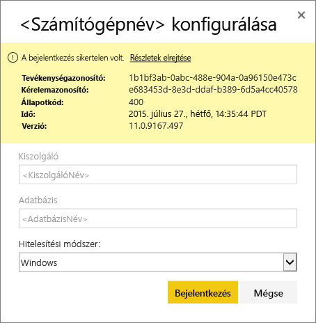
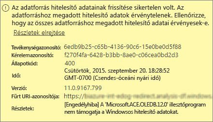
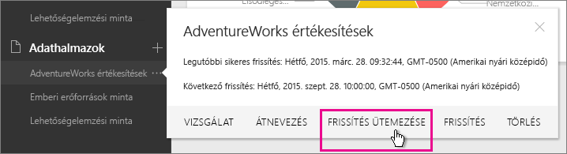
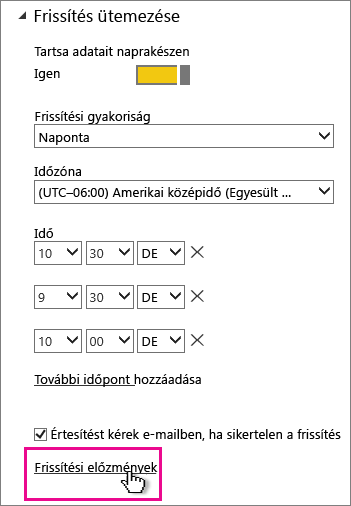
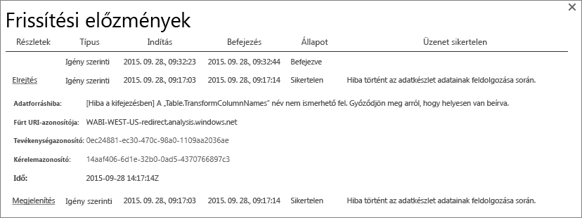
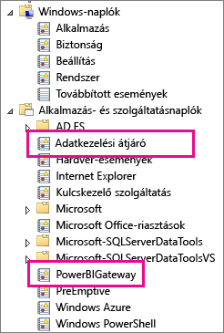
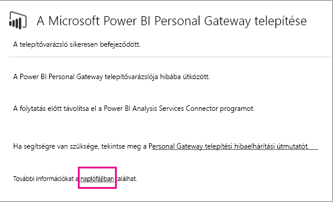
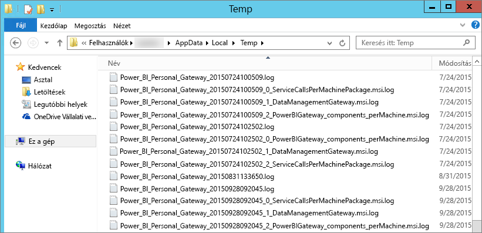

# A Power BI személyes átjáró hibáinak elhárítása
Ebben a cikkben áttekintjük a Power BI személyes átjáró használata kapcsán gyakorta felmerülő kérdéseket.

> [!NOTE]
> Az átjáró aktuális, személyes használatú verziója a **Helyszíni adatátjáró (személyes)**. A telepített példányt frissítve térjen át erre a verzióra.
> 
> 

## Frissítés a legújabb verzióra
Ha az átjáró verziója elavult, számos probléma felmerülhet.  Általában véve célszerű mindig a legújabb verziót használni.  Ha az átjárót már legalább egy hónapja nem frissítette, javasoljuk, hogy telepítse az átjáró legújabb verzióját, majd nézze meg, hogy jelentkezik-e ugyanaz a probléma.

## Telepítés
**A személyes átjáró 64 bites** ‒ Ha számítógépe 32 bites, a személyes átjárót nem fogja tudni telepíteni. A telepítéshez 64 bites operációs rendszerre van szükség. Telepítenie kell a Windows 64 bites verzióját, vagy 64 bites számítógépre kell telepítenie a személyes átjárót.

**Bár Ön rendszergazda a számítógépen, a személyes átjárót nem tudja szolgáltatásként telepíteni** ‒ A telepítés meghiúsulhat, ha a felhasználó tagja a helyi Rendszergazda csoportnak, de a csoport házirendje nem engedélyezi, hogy az adott felhasználónév szolgáltatásként jelentkezzen be.  Egyelőre ellenőrizze, hogy a csoportházirend lehetővé teszi-e, hogy a felhasználó szolgáltatásként jelentkezzen be. Ennek a problémának a javításán még dolgozunk. [További információk](https://technet.microsoft.com/library/cc739424.aspx)

**A művelet túllépte az időkorlátot** ‒ Ez gyakran előfordul, ha a számítógép (fizikai gép vagy VM), amelyre telepíti a személyes átjárót, egymagos processzorral rendelkezik. Zárja be az alkalmazásokat, állítsa le azokat a folyamatokat, melyek nem nélkülözhetetlenek, és próbálja meg újra telepíteni az átjárót.

**Az Adatkezelési átjáró vagy az Analysis Services Connector nem telepíthető a személyes átjáróval egy gépre** – Ha a gépén már telepítve van az Analysis Services Connector vagy az Adatkezelési átjáró, távolítsa el, majd próbálja meg ismét telepíteni a személyes átjárót.

> [!NOTE]
> Ha a telepítés során problémát észlel, a telepítési napló valószínűleg tartalmaz olyan információt, amely segít megoldani a kérdést. Ezzel kapcsolatban a [telepítési naplókról](#SetupLogs) szóló részben talál további információkat.
> 
> 

 **Proxybeállítások** Ha olyan környezetet használ, amelyben szükség van proxy használatára, problémák jelentkezhetnek a személyes átjáró telepítésekor. Ha további információkra van szüksége a proxyadatok konfigurálásával kapcsolatban, tekintse át a [Power BI-átjárók proxybeállításainak konfigurálásáról](service-gateway-proxy.md) szóló cikket.

## Frissítés ütemezése
**Hiba: The credential stored in the cloud is missing. (A felhőben tárolt hitelesítő adat hiányzik.)**

Ilyen hiba az \<adatkészletek\> beállításainál jelentkezhet, ha az adatkészlethez korábban megadott ütemezett frissítést, majd eltávolította és újratelepítette a személyes átjárót. A személyes átjáró eltávolításakor a rendszer eltávolítja az adatkészletek frissítéshez szükséges adatforrás-hitelesítési adatokat a Power BI szolgáltatásból.

**Megoldás:** A Power BI-ban lépjen az adatkészletre vonatkozó beállítások frissítéséhez. Az adatforrások kezelésére szolgáló felületen mindegyik hibás adatforrásnál kattintson a Hitelesítő adatok szerkesztése lehetőségre, majd jelentkezzen be ismét az adatforrásra.

**Hiba: The credentials provided for the dataset are invalid. (Az adatkészlethez megadott hitelesítő adatok érvénytelenek.) A folytatáshoz először frissítse a hitelesítő adatokat a lap frissítésével vagy az Adatforrás beállításai párbeszédpanelen.**

**Megoldás**: Ha a hitelesítő adatokkal kapcsolatos üzenet jelenik meg, az a következőket jelentheti:

* Ellenőrizze, hogy naprakészek-e az adatforrásokra történő bejelentkezéshez használt felhasználói nevek és jelszavak. A Power BI-ban lépjen az adatkészlet beállításainak frissítéséhez. Az adatforrások kezelési felületén kattintson az adatforrás melletti Hitelesítő adatok szerkesztése lehetőségre, majd frissítse az adatforráshoz tartozó hitelesítő adatokat.
* Egy felhőbeli forrás és egy helyi forrás egyesített lekérdezése a személyes átjárón keresztül nem frissíthető, ha bármelyik forrás OAuth eljárást használ a hitelesítéshez. Ilyen például a CRM Online és egy helyi SQL-szerver egyesítése is. Ebben az esetben a frissítés nem fog sikerülni, mert a CRM Online használatához OAuth-hitelesítésre van szükség.
  
  Ez egy ismert probléma, foglalkozunk vele. A probléma úgy kerülhető meg, hogy külön lekérdezést használ a felhőbeli forráshoz és a helyszíni adatforráshoz, majd összefésüléssel vagy összefűzéssel egyesíti az eredményeket.

**Hiba: Unsupported data source. (Nem támogatott adatforrás.)**

**Megoldás:** Ha nem támogatott adatforrásról tájékoztató üzenetet kap a frissítések ütemezése közben, az a következőket jelentheti: 

* Jelenleg Power BI-ban nem támogatott az adatforrás frissítése. 
* Az Excel-munkafüzet nem tartalmaz adatmodellt, csak munkafüzet adatokat. A Power BI jelenleg csak akkor támogatja a frissítést, ha a feltöltött Excel-munkafüzet tartalmaz adatmodellt. Ha az Excelbe a Power Query-t használva importál adatokat, válassza az Adatok betöltése adatmodellbe lehetőséget. Így gondoskodhat arról, hogy az adatokat egy adatmodellbe importálja a rendszer. 

**Hiba: [Az adatok nem kombinálhatók] a &lt;lekérdezés rész&gt;/&lt;... &gt; / &lt;... &gt; olyan adatforrásokhoz próbál hozzáférni, melyek különböző adatvédelmi szintjei együtt nem használhatók. Hozza létre újból az adatok kombinációját.**

**Megoldás**: Ezt a hibát az adatvédelmi szintekre vonatkozó korlátozások és az Ön által használt adatforrástípusok okozzák.

**Error: Data source error: We cannot convert the value "\[Table\]" to type Table. (Adatforrás-hiba: A [Tábla] érték nem konvertálható a következő típusra: Tábla.)**

**Megoldás**: Ezt a hibát az adatvédelmi szintekre vonatkozó korlátozások és az Ön által használt adatforrástípusok okozzák.

**Hiba: There is not enough space for this row. (Ez a sor nem fér el.)**

Ilyesmi akkor fordulhat elő, ha az egyik sor mérete nagyobb mint 4 MB. Állapítsa meg, hogy az adatforrás melyik soráról van szó, majd ezt a sort próbálja meg kiszűrni, vagy próbálja meg csökkenteni a méretét.

## Adatforrások
**Hiányzó adatszolgáltató** – A személyes átjáró csak 64 bites verzióban érhető el. Működéséhez arra van szükség, hogy a számítógépre, amelyen a személyes átjáró üzemel, telepítve legyen az adatszolgáltató 64 bites verziója. Például, ha az adatkészletben szereplő adatforrás Microsoft Access típusú, telepítenie kell a 64 bites ACE-szolgáltatót arra a számítógépre, amelyen a személyes átjáró is fut.  

>[!NOTE]
>Ha 32 bites Excellel rendelkezik, nem fog tudni 64 bites ACE-szolgáltatót telepíteni a gépre.

**Access-adatbázis használata esetén a Windows-hitelesítés nem támogatott** – Access-adatbázis esetén a Power BI jelenleg csak a névtelen hitelesítést támogatja. Dolgozunk azon, hogy Windows-hitelesítést lehessen használni az Access-adatbázisokhoz is.

**Bejelentkezési hiba az adatforrás eléréséhez használandó hitelesítő adatok beírásakor** – Ha a Windows hitelesítési adatok beírásakor ehhez hasonló hibaüzenetet kap, amikor megpróbál kapcsolódni egy adatforráshoz, elképzelhető, hogy a személyes átjáró egy régebbi verzióját használja. [Telepítse a Power BI személyes átjáró legfrissebb verzióját](https://powerbi.microsoft.com/gateway/).

  

**Hiba: Bejelentkezési hiba Windows-hitelesítés kijelölésekor, ACE OLEDB-t használó adatforrás esetén** – Ha ACE OLEDB szolgáltatót használó adatforrás esetén a hitelesítési adatok beírásakor az alábbi üzenet jelenik meg:

A Power BI jelenleg nem támogatja a Windows-hitelesítést ACE OLEDB szolgáltatót használó adatforrások esetén.

**Megoldás:** A hiba elkerülése érdekében válassza a Névtelen hitelesítést. A hagyományos ACE OLEDB szolgáltatók esetén a Névtelen hitelesítő adatok egyenértékűek Windows-hitelesítő adatokkal.

## Csempefrissítés
Ha az irányítópult csempéinek frissítésével kapcsolatban kap hibaüzenetet, tekintse át a következő cikket:

[Csempékkel kapcsolatos hibák elhárítása](refresh-troubleshooting-tile-errors.md)

## Hibaelhárítási eszközök
### Frissítési előzmények
A **Frissítési előzmények** segítenek áttekinteni az előfordult hibákat, és hasznos adatokat biztosítanak arra az esetre, ha a támogatást nyújtó ügyfélszolgálathoz kellene fordulnia. Mind az ütemezett, mind az igény szerinti frissítéseket megtekintheti. A **Frissítési előzmények** oldalra az alábbiak szerint juthat el.

1. A Power BI navigációs ablaktáblájának **Adatkészletek** területén jelöljön ki egy adatkészletet, majd válassza a &gt;Menü megnyitása&gt; **Frissítés ütemezése** lehetőséget.
   
2. A **Beállítások:** &gt;**Frissítés ütemezése** párbeszédablakban kattintson a **Frissítési előzmények** lehetőségre.  
   
   
   

### Eseménynaplók
Több eseménynapló is létezik, melyekből tájékozódhat. Az első kettőt, a **Data Management Gateway** (Adatkezelési átjáró) és a **PowerBIGateway** (PowerBI átjáró) naplókat akkor láthatja, ha Ön rendszergazda a számítógépen.  Ha ön nem rendszergazda, és a személyes átjárót használja, a naplóbejegyzéseket az **Alkalmazásnaplóban** fogja tudni megtekinteni.

A **Data Management Gateway** (Adatkezelési átjáró) és **PowerBIGateway** naplók az **Alkalmazás- és szolgáltatásnaplók** között találhatók.

### Nyomon követés a Fiddlerrel
A [Fiddler](http://www.telerik.com/fiddler) a Telerik által kifejlesztett, HTTP-forgalmat figyelő ingyenes eszköz.  Nyomon követheti a Power BI szolgáltatás és az ügyfélszámítógép közötti adatforgalmat. Ebből kiderítheti az esetleges hibákat, illetve az egyéb kapcsolódó információkat.

### Telepítési naplók
Ha a **személyes átjárót** nem tudja telepíteni, megjelenik egy hivatkozás, melynek segítségével megjelenítheti a telepítési naplót. Itt valószínűleg további információkat talál a hibával kapcsolatban. Ezek mindegyike windowsos telepítési napló, vagy más néven MSI-napló. Ezek a bejegyzések meglehetősen összetettek és nehezen olvashatók. A hiba rendszerint alul olvasható, ugyanakkor a hiba okát nem egyszerű megállapítani. Lehet, hogy egy másik naplóban feljegyzett hibák eredményeképpen alakult ki, de az is előfordulhat, hogy egy korábbi bejegyzésben szereplő hiba miatt.

Másik lehetőségként megnyithatja a **Temp mappát** (%temp%), és megtekintheti a **Power\_BI\_** sztringgel kezdődő fájlokat.

> [!NOTE]
> Elképzelhető, hogy a %temp% használatával a Temp mappa egyik almappájába kerül.  A **Power\_BI\_**  fájljai a temp könyvtár gyökerében lesznek megtalálhatók.  Ehhez lehet, hogy egy vagy két szinttel feljebb kell lépnie.
> 
> 

## Következő lépések
[A Power BI-átjárók proxybeállításainak konfigurálása](service-gateway-proxy.md)  
[Adatok frissítése](refresh-data.md)  
[A Power BI személyes átjáró](personal-gateway.md)  
[Csempékkel kapcsolatos hibák elhárítása](refresh-troubleshooting-tile-errors.md)  
[A Helyszíni adatátjáróval kapcsolatos hibák elhárítása](service-gateway-onprem-tshoot.md)  
További kérdései vannak? [Kérdezze meg a Power BI közösségét](http://community.powerbi.com/)

