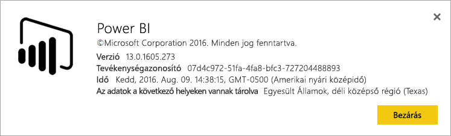
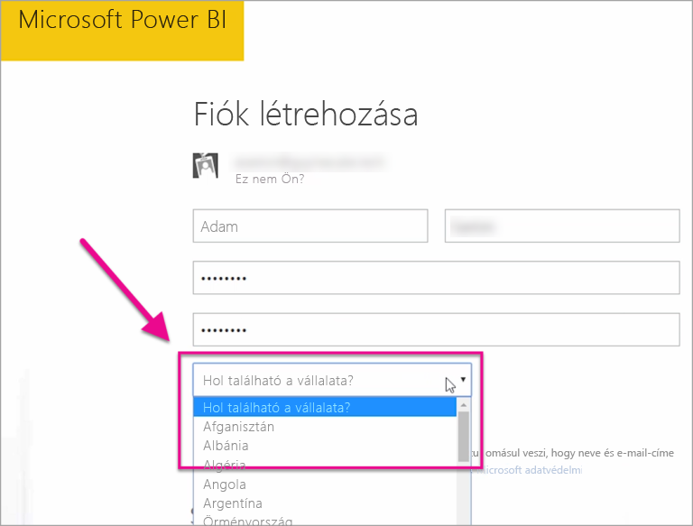

# Hol található a Power BI-bérlőm?
<iframe width="560" height="315" src="https://www.youtube.com/embed/0fOxaHJPvdM?showinfo=0" frameborder="0" allowfullscreen></iframe>

Tudja meg, hogy hol található a Power BI-bérlője, és hogy miként történt ennek a helynek a kiválasztása. Ennek a megértése fontos, mert hatással lehet a szolgáltatással kapcsolatos interakciókra.

## A Power BI-bérlő helyének meghatározása
A bérlő régiójának megkereséséhez tegye az alábbiakat.

1. Kattintson a **?** kérdőjelre a Power BI szolgáltatásban.
2. Kattintson **A Power BI bemutatása** elemre.
3. Nézze meg **Az adatok a következő helyeken vannak tárolva** melletti szöveget. Ebben a régióban található a bérlő.

## Az adatrégió kiválasztásának módja
Az adatrégió a bérlő első létrehozásakor kiválasztott országon alapul. Ez a Power BI mellett az Office 365-re való regisztrációra is vonatkozik, mivel ez egy megosztott információ. Ha ez egy új bérlő, regisztrációkor meg fog jelenni az országok legördülő menüje.

Ettől a választástól függ, hogy hol lesznek az adatai tárolva. A Power BI a kiválasztott országhoz legközelebbi adatrégiót fogja választani.

> [!WARNING]
> Ez a választás nem módosítható!
> 
> 

További kérdései vannak? [Kérdezze meg a Power BI közösségét](http://community.powerbi.com/)

