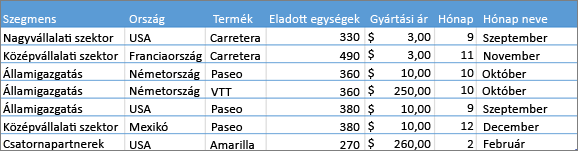
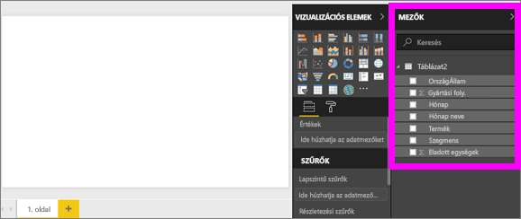
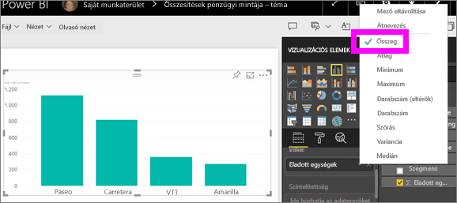
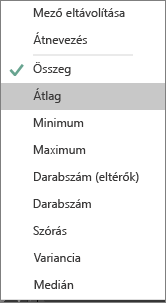
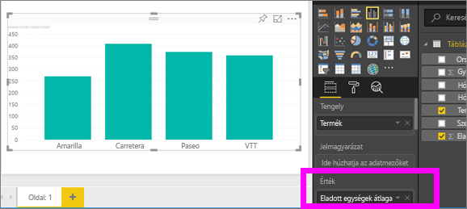
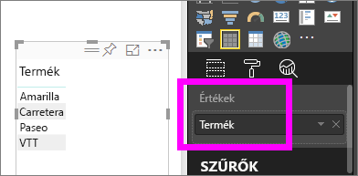
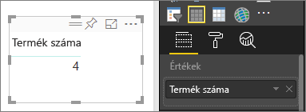
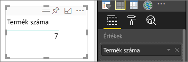
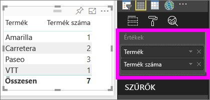

# Összesítések a Power BI-vizualizációkban
## Mi az az összesítés?
Néha szükség van az adatok értékeinek matematikai összevonására. Ez a matematikai művelet lehet összeadás, átlagolás, maximumérték meghatározása, darabszám meghatározása, stb. Az adatok értékeinek összevonását *összesítésnek* nevezzük. Az ilyen matematikai műveletek eredménye az *összesítési érték*. 

Amikor a Power BI szolgáltatás és a Power BI Desktop vizualizációkat hoz létre, előfordulhat, hogy összesítés is történik. Az így létrehozott összesítés gyakran éppen megfelelő a célnak, de előfordulhat, hogy az értékeket másféle módon szükséges összesíteni.  Ilyen lehet például, ha összeg helyett átlagot szeretnénk. A vizualizációkban használt összesítések többféle módszerrel is kezelhetők és módosíthatók.

Először vizsgáljuk meg az *adattípusokat*, hiszen az adat típusa határozza meg, hogy az illető adatot lehet-e egyáltalán összesíteni, és ha igen, milyen módon.

## Adattípusok
A legtöbb adathalmazban többféle adattípus található. Az adatok alapvetően lehetnek numerikusak vagy nem numerikusak. Numerikus adatot összeg, átlag, szám, minimum, variancia és sok más módszerrel is összesíthetünk. Még a szöveges adat is (ezt néha *kategóriaadatnak* is nevezzük) összesíthető. Ha kategóriamezőket próbálunk összegezni úgy, hogy egy csak számalapú gyűjtőbe (például **Értékek** vagy **Elemleírások**) helyezzük őket, a Power BI képes megszámlálni az egyes kategóriák normál vagy eltérő előfordulásait. Bizonyos speciális adattípusok, például a dátumok néhány saját összegzési típussal is rendelkeznek, ilyenek lehetnek a legkorábbi, a legújabb, az első vagy az utolsó. 

Az alábbi példában:
- A **Units Sold** és a **Manufacturing Price** oszlopok numerikus adatokat tartalmaznak
-  A **Segment**, **Country**, **Product**, **Month**, és **Month Name** nevű oszlopok kategóriaadatokat tartalmaznak

   

Amikor a Power BI-ban vizualizációkat hoz létre, a numerikus adatok néhány kategóriaadat alapján lesznek összesítve (alapértelmezetten az *összeg* használatával).  Például a „Units Sold ***by Product***” (értékesített egységek termékek szerint), a „Units Sold ***by Month***” (értékesített egységek hónapok szerint) és a „Manufacturing Price ***by Segment***” (gyártási költség szegmens alapján). Néhány számmezőt gyakran **mértéknek** is nevezzük. A Power BI jelentésszerkesztőjében egyszerűen megtalálhatók a mértékek, mert mindig a ∑ jellel jelennek meg a mezőlistában. További információ: [Jelentésszerkesztő – Bevezetés](service-the-report-editor-take-a-tour.md).

## Miért nem az elvártnak megfelelően működnek az összesítések?
Az összesítések használata a Power BI-ban bonyolult lehet – például számmezőről van szó, és a Power BI nem engedélyezi az összesítés módosítását. Vagy esetleg olyan mezőről van szó (például évszám), amelynek nem kellene szerepelnie az összesítésben, csak az ahhoz tartozó előfordulások számát szeretnénk megszámlálni.

Leggyakrabban a problémát az adott mező adatkészletben történő definiálása okozza. Elképzelhető, hogy a mező szövegként van definiálva, és emiatt nem lehet azt összeadáshoz vagy átlagoláshoz használni. Sajnos [csak az adatkészlet tulajdonosa tudja módosítani a mezők kategóriáját](desktop-measures.md). Ha tehát tulajdonosi hozzáféréssel rendelkezik az adatkészlethez akár a Desktopban, akár abban a programban, amellyel létrehozták az adathalmazt (ilyen lehet például az Excel), akkor ezt a problémát el tudja hárítani. Ellenkező esetben azonban az adathalmaz tulajdonosától kell segítséget kérnie.  

A cikk végén szerepel egy **Megfontolandó szempontok és hibaelhárítás** című szakasz, amely segíthet eligazodni mindebben.  Ha ebben nem találja meg a választ, tegye fel kérdését a [Power BI közösségi fórumában](http://community.powerbi.com), ahol gyors választ kaphat közvetlenül a Power BI csapatától.

## Számmezők összevonásának módosítása
Tegyük fel, hogy egy diagramban különböző termékekhez tartozó értékesítési adatok összesítése szerepel, de Ön inkább átlagot szeretne számolni. 

1. Hozzon létre egy olyan diagramot, amely egy kategóriát és egy mértéket használ. Ebben a példában a „Units Sold by Product” (értékesített egységek termék szerint) összesítést használjuk.  A Power BI alapbeállítás szerint létrehoz egy diagramot, amely összegzi az értékesített egységeket (az Érték mezőben szereplő mérték) minden egyes termék esetében (a Tengely mezőben lévő kategória).

   

2. A Megjelenítések ablaktáblán, kattintson a jobb gombbal a mértékre, majd válassza ki a kívánt összesítési típust. Ebben az esetben most az Átlagot választjuk. Ha nem jelenik meg a kívánt összesítési típus, olvassa el a „Megfontolandó szempontok és hibaelhárítás” részt alább.  
   
   
   
   > [!NOTE]
   > A legördülő menüben elérhető lehetőségek a következőktől függenek: 1) a kijelölt mező, illetve 2) a mező adatkészlet-tulajdonos általi kategorizálása.
   > 
3. A vizualizáció most már az átlag szerinti összesítést használja.

   

##    Az adatok összesítésének módjai

A mezők összesítésekor esetlegesen rendelkezésre álló lehetőségek:

* **Összegzés mellőzése**. A lehetőség használatakor az adott mező egyes értékeit a rendszer különállóként kezeli, és nem összegzi. Gyakran használható, ha olyan számazonosítós oszlopról van szó, amelyet nem kell összeadni.
* **Összeg**. Összeadja a mezőben szereplő összes értéket.
* **Átlag**. Az értékek számtani középértékét számítja ki.
* **Minimum**. A legkisebb értéket mutatja.
* **Maximum**. A legnagyobb értéket mutatja.
* **Darabszám (nem üres).** A nem üres mezőkben lévő értékek darabszámát adja vissza.
* **Darabszám (eltérők).** A mezőkben lévő különböző értékek darabszámát adja vissza.
* **Szórás.**
* **Variancia**.
* **Medián**.  A mediánt (középértéket) mutatja. Ez az az érték, amely hozzá képest ugyanannyi számú kisebb és nagyobb elemmel rendelkezik.  Ha 2 mediánról van szó, a Power BI átlagolja őket.

Nézzük például az alábbi adatokat:

| Ország | Összeg |
|:--- |:--- |
| Amerikai Egyesült Államok |100 |
| Egyesült Királyság |150 |
| Kanada |100 |
| Németország |125 |
| Franciaország | |
| Japán |125 |
| Ausztrália |150 |

Ezek az alábbi eredményeket adnák vissza:

* **Összegzés mellőzése**: minden érték külön jelenik meg
* **Összeg**: 750
* **Átlag**: 125
* **Maximum**:  150
* **Minimum**: 100
* **Darabszám (nem üres):** 6
* **Darabszám (eltérők):** 4
* **Szórás:** 20,4124145...
* **Variancia:** 416,666...
* **Medián:** 125

## Összesítés létrehozása a kategória- (szöveg-) mező használatával
Nem numerikus mezőt is lehet összesíteni. Ha például egy Terméknév nevű mezőről van szó, felveheti értékként, majd beállíthatja azt a **Darabszám** vagy a **Darabszám (eltérők)**, az **Első** vagy **Utolsó** használatára. 

1. Ebben a példában a **Product** (Termék) mezőt is az Értékek közé húztuk. Az Értékek mező általában numerikus értékekhez használatos. A Power BI felismeri, hogy ez egy szöveges mező, ezért az összesítést úgy állítja be, hogy az **Összegzés mellőzése** legyen érvényes, és egy egyoszlopos táblázatot hoz létre.
   
   
2. Ha ilyenkor az összesítést az alapértelmezett **Összegzés mellőzése** lehetőségről a **Darabszám (eltérők)** lehetőségre módosítjuk, a Power BI megszámlálja a különböző termékekhez tartozó darabszámot. Ebben az esetben az eredmény 4.
   
   
3. Ha az összesítést a **Darabszám** lehetőségre módosítjuk, a Power BI a teljes darabszámot adja vissza. Ebben az esetben a **Product** (Termék) 7 tételt tartalmaz. 
   
   

4. Ha ugyanazt a mezőt (ebben az esetben a **Product**, azaz Termékek mezőt) az Értékek közé húzzuk, és változtatás nélkül hagyjuk az **Összegzés mellőzése** beállítást, akkor a Power BI az összeget termékek szerint adja vissza.

   

## Megfontolandó szempontok és hibaelhárítás
K: Miért nem látható az **Összeg mellőzése** lehetőség?

V: A kijelölt mező valószínűleg számított mérték, vagy olyan speciális mérték, amelyet a Excelben vagy a [Power BI Desktopban](desktop-measures.md) hoztak létre. Minden számított mértékhez saját nem változtatható képlet tartozik. A használt összesítés nem módosítható.  Ha az például összeg, akkor csak összeg maradhat. A Mezők listában a *számított mértékek* számológép szimbólummal vannak ellátva.

K: A mező **számalapú**. Miért csak a **Darabszám** és a **Darabszám (eltérők)** lehetőséget lehet kiválasztani?

V1: A valószínű magyarázat az, hogy az adatkészlet tulajdonosa véletlenül vagy szándékosan *nem* számként kategorizálta az adott mezőt. Ha például egy adatkészletben szerepel az **Év** mező, az adatkészlet tulajdonosa szövegként kategorizálhatja azt, mivel valószínű, hogy az **Év** mező csak számlálásra (például az 1974-ben született személyek száma), nem pedig összeadásra vagy átlagolásra szolgál. Ha Ön a tulajdonos, az adatkészletet a Power BI Desktop alkalmazásban nyithatja meg, és a **Modellezés** lapon módosíthatja az adattípust.  

V2: A számológép ikonnal rendelkező mezők *számított mértéknek* minősülnek, és mindegyik számított mérték saját nem módosítható képlettel rendelkezik, amelyet csak az adathalmaz tulajdonosa módosíthat. A használt számítás lehet egyszerű összesítés, mint például átlagolás vagy összeadás, de lehet bonyolultabb művelet is, mint például „szülőkategóriához való hozzájárulás százaléka” vagy „göngyölített összeg az év kezdete óta”. A Power BI nem összegzi vagy átlagolja az eredményeket, csak újraszámítást végez az egyes adatpontokhoz kapcsolódóan (a nem változtatható képlet használatával).

V3: Egy másik lehetőség az, hogy az adott mezőt egy olyan *gyűjtőbe* helyezte, amely csak kategóriaértékeket engedélyez.  Ebben az esetben csak a Darabszám és a Darabszám (eltérők) típus érhető el.

V4: A harmadik lehetőség pedig az, hogy tengelyen használja az adott mezőt. Például a sávdiagramok tengelyén a Power BI egy sávot jelenít meg mindegyik eltérő értékhez kapcsolódóan – és egyáltalán nem összesíti a mezőértékeket. 

>[!NOTE]
>Az egyetlen kivételt e szabály alól a pontdiagram képviseli, amely *megköveteli* az összesített értékek használatát az X és az Y tengelyeken.

K: Pontdiagramot használok, és szeretném, ha az adott mező *nem* szerepelne az összesítésben.  Hogyan lehet ezt elérni?

V: A **Részletek** gyűjtőbe vegye fel a mezőt, ne az X vagy Y tengelyhez tartozó gyűjtőbe.

K: Számmezők vizualizációhoz való hozzáadásakor azok többsége alapértelmezés szerint összeadásban szerepel, de a rendszer egyes mezőket átlagoláshoz, számláláshoz vagy egyéb összesítéshez használ.  Miért nem mindig ugyanazt az alapértelmezett összesítést használja a rendszer?

V: Az adatkészlet tulajdonosa állíthatja be az egyes mezőkhöz tartozó, alapértelmezett összesítést. Ha Ön az adatkészlet tulajdonosa, az alapértelmezett összesítést a Power BI Desktop **Modellezés** lapján módosíthatja.

K: Adatkészlet-tulajdonos vagyok, és azt szeretném, hogy a rendszer egy adott mezőt soha ne használjon összesítéshez.

V: A Power BI Desktop **Modellezés** lapján állítsa be az **Adattípus** lehetőséget **Szöveg** típusra.

K: Nem látom az **Összegzés mellőzése** lehetőséget a legördülő menüben.

V: Próbálja eltávolítani a mezőt, majd vegye fel újra.

További kérdései vannak? [Kérdezze meg a Power BI közösségét](http://community.powerbi.com/)

