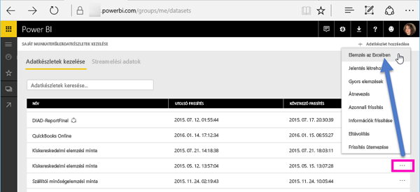
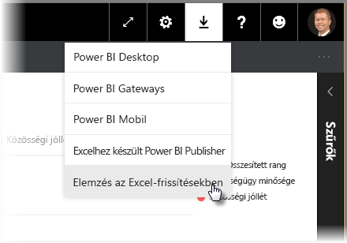
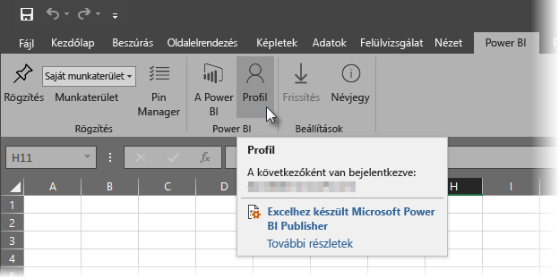
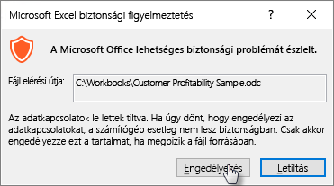

# Elemzés az Excelben
Előfordulhat, hogy az Excel használatával szeretne megnézni és kezelni egy Power BI-adatkészletet. Az **Elemzés az Excelben** funkció segítségével pontosan ezt teheti meg, valamit elérheti az Excel kimutatás-, diagram- és szeletelő funkcióit a Power BI-ban létező adatkészletre vonatkozóan.

## Követelmények
Az **Elemzés az Excelben** funkció használatának van néhány követelménye:

* Az **Elemzés az Excelben** funkciót a Microsoft Excel 2010 SP1 és újabb változatai támogatják.
* Az Excel-kimutatások nem támogatják a numerikus mezők áthúzással való összevonását. A Power BI-adatkészletnek *rendelkeznie kell előre meghatározott mértékekkel*.
* Egyes cégeknél olyan csoportházirendek lehetnek érvényben, amelyek megakadályozzák az **Elemzés az Excelben** funkció használatához szükséges Excel-frissítések telepítését. Ha nem tudja telepíteni ezeket a frissítéseket, forduljon a rendszergazdájához.
* Az **Excelben való elemzéshez** Pro-licenc szükséges. A különböző licenctípusok eltérő funkcióiról bővebben a [Power BI-funkciókat licenctípus alapján](service-features-license-type.md) ismertető témakörben olvashat. 

## Hogyan működik?
Amikor a **Power BI**-ban egy adatkészlet vagy jelentés három pont (...) menüjéből kiválasztja az **Elemzés az Excelben** lehetőséget, a Power BI létrehoz egy .ODC-fájlt, és letölti azt a böngészőből a számítógépre.

Ha a fájlt megnyitja az Excelben, megjelenik egy üres **kimutatás** és egy **mező**lista, benne a Power BI adatkészletből származó táblákkal, mezőkkel és mértékekkel. Ugyanúgy hozhat létre kimutatásokat, diagramokat és elemezheti az adatkészletet, mintha egy helyi adatkészlettel dolgozna az Excelben.

Az .ODC-fájl egy MSOLAP kapcsolati sztringgel kapcsolódik a Power BI-adatkészlethez. Az adatok elemzésekor vagy használatakor az Excel lekérdezi ezt a Power BI-adatkészletet, majd az eredményeket az Excelbe adja vissza. Ha az adatkészlet egy élő adatforráshoz kapcsolódik a DirectQueryvel, akkor a Power BI lekérdezi az adatforrást, és az eredményeket az Excelbe adja vissza.

Az **Elemzés az Excelben** különösen hasznos olyan adatkészletek és jelentések esetében, amelyek *Analysis Services – táblázatos* vagy *többdimenziós* adatbázisokhoz kapcsolódnak, vagy olyan Power BI Desktop-fájlok vagy Excel-munkafüzetek esetében, amelyek adatmodelljeinek mértékeit adatelemzési (DAX) kifejezések használatával hozták létre.

## Első lépések az Elemzés az Excelben szolgáltatással
A Power BI-ban válassza ki egy jelentés vagy adatkészlet neve melletti három pont (...) menüt, és a menüből válassza az **Elemzés az Excelben** lehetőséget.

### Excel-frissítések telepítése
Az **Elemzés az Excelben** első használatakor telepíteni kell néhány frissítést az Excel kódtárába. A rendszer kéri az Excel-frissítések letöltésére és futtatására (ez elindítja az *SQL_AS_OLEDDB.msi* Windows-telepítőcsomag telepítését). Ez a csomag telepíti a **Microsoft AS OLE DB Provider for SQL Server 2016 RC0 (előzetes verzió)** eszközt.

> [!NOTE]
> Ügyeljen arra, hogy jelölje be a **Ne jelenjen meg többé ez az üzenet** lehetőséget az **Excel-frissítések telepítése** párbeszédablakban. A frissítést csak egyszer kell telepíteni.
> 
> 

Ha újra le kell tölteni az **Elemzés az Excelben** funkcióhoz szükséges frissítéseket, letöltheti őket a Power BI **Letöltés** ikonjára kattintva, ahogy az a következő képen látható.

### Bejelentkezés a Power BI-ba
Bár a böngészőjében bejelentkezett a Power BI-ba, azonban amikor először nyit meg az Excelben egy új .ODC-fájlt, akkor a rendszer kérheti, hogy jelentkezzen be a Power BI-ba a Power BI-fiókjával. Ez hitelesíti az Excel kapcsolódását a Power BI-hoz.

### Több Power BI-fiókkal rendelkező felhasználók
Bizonyos felhasználók több Power BI-fiókkal is rendelkeznek, és olyan helyzetbe kerülhetnek, hogy az egyik fiókkal bejelentkeztek a Power BI-ba, de az Elemzés az Excelben szolgáltatásban használt adatkészlethez egy másik fiókjuknak van hozzáférése. Ilyen esetekben egy **Tiltott** hibaüzenet vagy sikertelen bejelentkezési hibaüzenet jelenhet meg, amikor a felhasználó megpróbál hozzáférni egy Elemzés az Excelben-munkafüzetben használt adatkészlethez.

Ekkor lehetősége van újra bejelentkezni azzal a Power BI-fiókkal, amelynek hozzáférése van az Elemzés az Excelben által elért adatkészlethez. Másik lehetőségként kiválaszthatja az Excel **Power BI** menüszalagjának **Profil** elemét, ami azonosítja, hogy jelenleg melyik fiókkal van bejelentkezve, és megad hivatkozást, amelyen keresztül a felhasználó kijelentkezhet (majd újra be, egy másik fiókkal).

### Adatkapcsolatok engedélyezése
A Power BI-adatok Excelben való elemzéséhez a rendszer kéri, hogy erősítse meg az .odc-fájl nevét és elérési útját, majd kattintson az **Engedélyezés** lehetőségre.

> [!NOTE]
> A Power BI-bérlők rendszergazdái a *Power BI felügyeleti portál* használatával letilthatják az **Elemzés az Excelben** funkciót az Analysis Services-adatbázisokban tárolt helyszíni adatbázisok esetében. Ha ez a lehetőség le van tiltva, akkor az **Elemzés az Excelben** nem érhető el az Analysis Services-adatbázisok esetében, de továbbra is elérhető más típusú adatkészletekhez.
> 
> 

## Elemzés
Most hogy megnyitotta az Excelt és van egy üres kimutatási táblája, készen áll arra, hogy különféle elemzéseket végezzen a Power BI-adatkészleten. Akárcsak a helyi munkafüzetek esetében, az Elemzés az Excelben használatakor is létrehozhat kimutatásokat és diagramokat, adatokat adhat hozzá más forrásokból és így tovább. Emellett természetesen különböző munkalapokat is létrehozhat, amelyek különféle módon nyújtanak betekintést az adatokba.

> [!NOTE]
> Fontos tudni, hogy az **Elemzés az Excelben** funkció minden részletszintű adatot elérhetővé tesz minden olyan felhasználó számára, akinek jogosultsága van az adatkészlet hozzáféréséhez.
> 
> 

## Mentés
A Power BI-adatkészlethez kapcsolt munkafüzetet ugyanúgy lehet menteni, mint minden más munkafüzetet. Nem lehet azonban a munkafüzetet a Power BI-ban közzétenni vagy visszaimportálni, mivel a Power BI-ban csak olyan munkafüzetek tehetők közzé vagy importálhatók, amelyek az adatokat táblákban vagy egy adatmodellben tárolják. Mivel az új munkafüzetnek csupán egy kapcsolata van a Power BI-adatkészlethez, ezért a Power BI-ban való közzététel vagy importálás körkörös hivatkozást eredményezne.

## Megosztás
A munkafüzetet a mentés után megoszthatja más Power BI-felhasználókkal a cégen belül.

Ha egy felhasználó megnyitja a munkafüzetet, akivel Ön megosztotta azt, akkor úgy fogja látni a kimutatásokat és az adatokat, ahogyan azok a munkafüzet utolsó mentésekor voltak, ami nem feltétlenül egyezik meg az adatok legfrissebb verziójával. A legújabb adatok lekéréséhez a felhasználóknak a **Frissítés** gombot kell használniuk az **Adatok** menüszalagon. Mivel a munkafüzet egy Power BI-adatkészlethez kapcsolódik, így a munkafüzetet frissíteni szándékozó felhasználónak be kell jelentkeznie a Power BI-ba és telepítenie kell az Excel-frissítéseket, amikor első alkalommal kísérli meg a munkafüzetet ily módon frissíteni.

Mivel a felhasználóknak frissíteniük kell az adatkészletet, és az Excel Online nem támogatja a külső kapcsolatok frissítését, ezért javasoljuk, hogy a felhasználók a számítógépükön az Excel asztali verziójával nyissák meg a munkafüzetet.

## Hibaelhárítás
Előfordulhat az Elemzés az Excelben funkció használata során, hogy nem várt eredményt kap, vagy nem a kívánt módon működik. [Ez az oldal az Elemzés az Excelben használata során felmerülő gyakori problémákra nyújt megoldást](desktop-troubleshooting-analyze-in-excel.md)