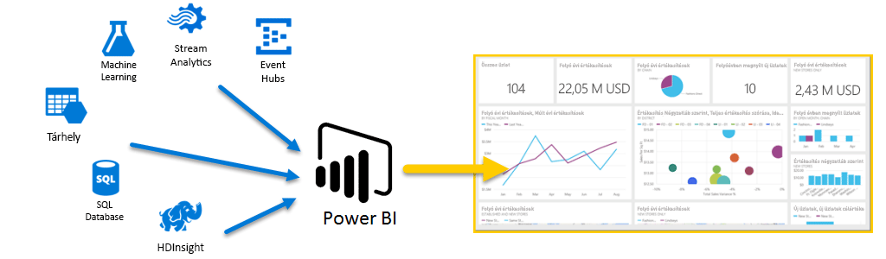
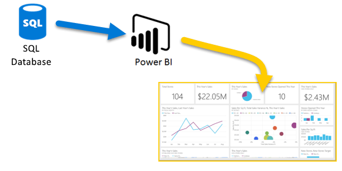
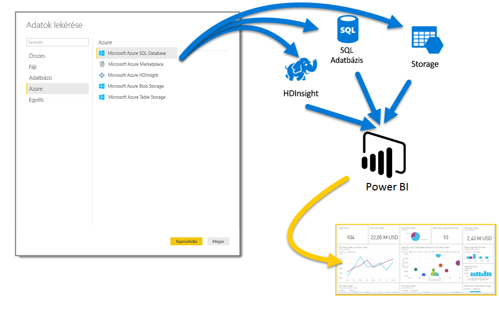
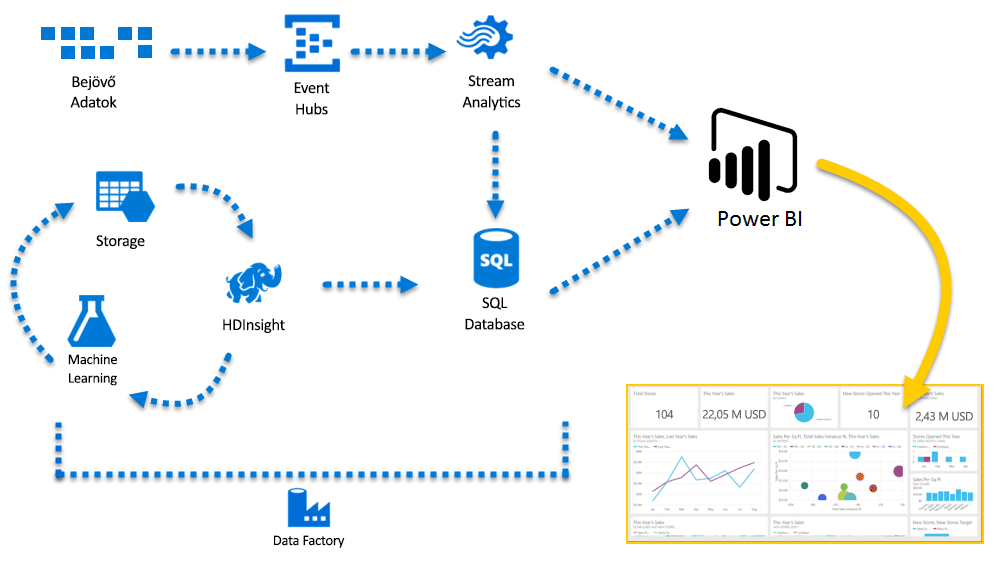

# Az Azure és a Power BI
Az **Azure** szolgáltatások és a **Power BI** segítségével adatfeldolgozási erőfeszítéseit elemzésekké és jelentésekké alakíthatja, amelyek valós idejű betekintést nyújtanak üzleti tevékenységébe. Legyen az adatfeldolgozás felhőalapú vagy helyszíni, egyszerű vagy összetett, egyetlen forrásból származó vagy tömegesen skálázott, raktározott vagy valós idejű, az Azure és a Power BI biztosítja a beépített kapcsolódást és integrációt üzletiintelligencia-erőfeszítéseinek életre keltéséhez.

A Power BI seregnyi elérhető Azure kapcsolattal rendelkezik, és ezekkel a szolgáltatásokkal éppoly páratlan üzletiintelligencia-megoldásokat hozhat létre, mint maga a vállalkozása. Csatlakozhat egyetlen vagy csak maréknyi Azure-adatforráshoz, majd egyéni jelentéseket hozhat létre az adatok alakításával és finomításával.

### Az Azure SQL Database és a Power BI
Kiindulhat egy közvetlen Azure SQL Database-kapcsolatból, és jelentéseket készíthet üzletmenetének figyeléséhez. A [Power BI Desktop](desktop-getting-started.md) segítségével jelentéseket hozhat létre a vállalkozását előmozdító trendek és fő teljesítménymutatók azonosításához.

Rengeteg további információt tudhat meg az [Azure SQL Database](http://azure.microsoft.com/services/sql-database/)-ről.

### A felhőadatok átalakítása, alakítása és egyesítése
Összetettebb adatokkal és mindenféle típusú forrással rendelkezik? Nem gond. A **Power BI Desktop** és az Azure-szolgáltatások révén egyetlen koppintással kapcsolatokat hozhat létre az **Adatok lekérése** párbeszédpanelről. Ugyanazon lekérdezésen belül csatlakozhat a **Azure SQL Database**-hez, az **Azure HDInsight**-adatforráshoz és az **Azure Blob Storage**-hoz (vagy az **Azure Table Storage**-hoz), majd válassza ki azon részhalmazaikat, amelyekre szüksége van, és ott pontosítsa az adatokat.

Létrehozhat különböző jelentéseket is a különböző célközönségek számára, ugyanazon adatkapcsolatokat, sőt ugyanazon lekérdezéseket használva. Csak készítsen egy új jelentésoldalt, finomítsa a vizualizációkat az egyes célközönségek számára, és kövesse figyelemmel, hogy vállalkozása tájékozott maradjon.

További információt a következő forrásokban talál:

* [Azure SQL Database](http://azure.microsoft.com/services/sql-database/)
* [Azure HDInsight](http://azure.microsoft.com/services/hdinsight/)
* [Azure Storage](http://azure.microsoft.com/services/storage/) (Blob Storage és Table Storage)

### Váljon komplexszé (és járjon az élen) az Azure-szolgáltatások és a Power BI segítségével
Az Azure és a Power BI segítségével igényei szerint növekedhet. A több forrásból származó adatok feldolgozásának kihasználása, a masszív valós idejű rendszerek használata, a [Stream Analytics](http://azure.microsoft.com/services/stream-analytics/) és az [Event Hubs](http://azure.microsoft.com/services/event-hubs/) használata és a különböző SaaS-szolgáltatások üzletiintelligencia-jelentésekben való egyesítése előnyt jelenthetnek vállalkozása számára.

### Az alkalmazás csatlakoztatása a Power BI API-k használatával
A Power BI használatával tájékozódhat a meglévő alkalmazásairól is. A Power BI API révén az alkalmazásfejlesztők teljes adathalmazokat küldhetnek a Power BI-ba programozott módon. Folyamatosan frissítenie kell? A Power BI API-kkal a fejlesztők valós idejű adatfrissítéseket küldhetnek az első lépések gyors megtételéhez, majd továbbléphetnek az Azure Stream Analytics használatára, ha a méretezési követelmények érdemessé teszik azt.

Nagy mennyiségű információt találhat a Power BI API-król a [Power BI fejlesztői portálján](http://dev.powerbi.com). 

### Mit tehet az Azure-ban és a Power BI-ban?
Mindenféle esetek vannak, ahol az **Azure** és a **Power BI** egyesíthető – a lehetőségek éppoly egyediek, mint maga a vállalkozása. További információ értaz **Azure-szolgáltatásokról** tekintse meg ezt az [áttekintő oldalt](http://go.microsoft.com/fwlink/?LinkId=535031&clcid=0x409), amely ismerteti a **az Azure használatával történő adatelemzési forgatókönyveket**, és ismerteti, miként törhet élre vállalkozása azzal, hogy értelmet ad adatforrásainak.

