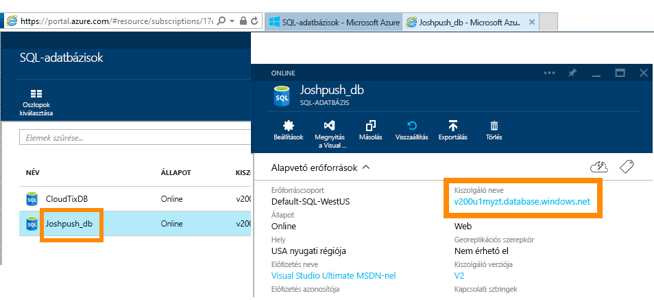
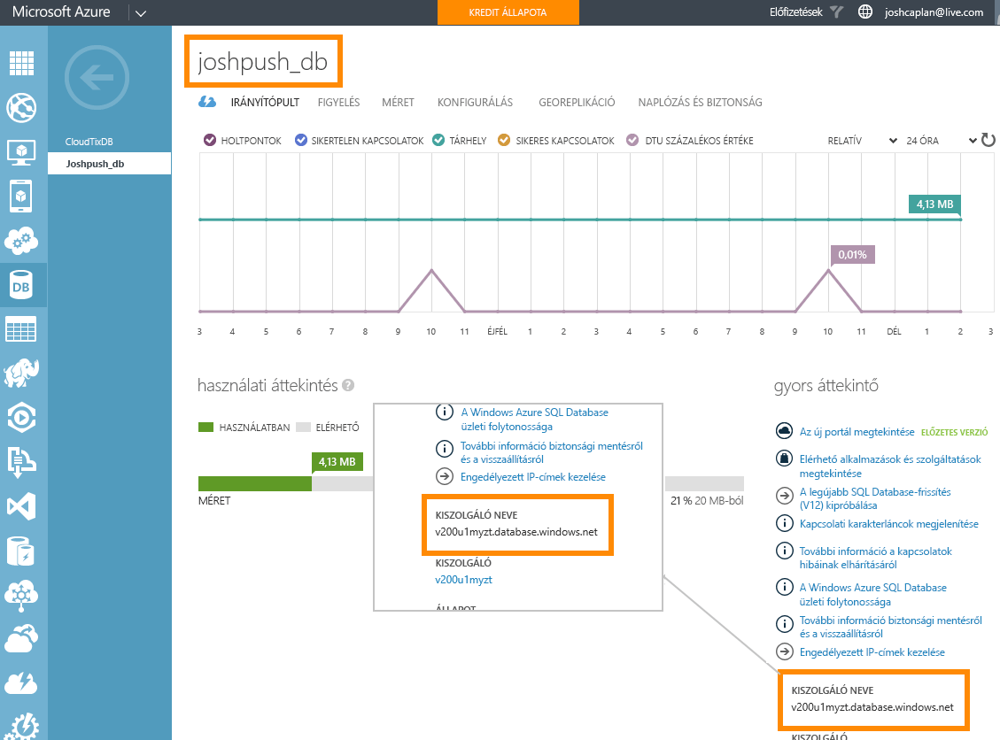

# Az Azure SQL Database DirectQueryvel
Ismerje meg, hogyan lehet az Azure SQL Database-hez közvetlenül kapcsolódni, és élő adatok használatával jelentéseket létrehozni. Nem szükséges az adatok a saját forrásukból a Power BI-ba juttatni.

A DirectQuery használatával, miközben a jelentés nézetben feltárja az adatokat, lekérdezéseket küld vissza az Azure SQL Database-nek. Ez a kezelőfelület olyan felhasználók számára javasolt, akik már ismerik az adatbázisokat és azokat az entitásokat, amelyekhez az adatbázisok kapcsolódnak.

**Megjegyzések:**

* A kapcsolódáskor a teljes szervernevet adja meg (további részleteket lejjebb talál)
* Győződjön meg arról, hogy az adatbázisra vonatkozó tűzfalszabályokban konfigurálva van az „[Azure-szolgáltatások hozzáférésének engedélyezése](https://msdn.microsoft.com/library/azure/ee621782.aspx)”.
* Minden művelet, mint például egy oszlop kiválasztása vagy egy szűrő felvétele, visszaküld egy lekérdezést az adatbázisnak
* A csempék körülbelül 15 percenként frissülnek (a frissítést nem szükséges ütemezni). Ezt a kapcsolódáskor módosíthatja a Speciális beállítások között.
* A Q&A nem érhető el DirectQuery-adatkészletek esetén
* A sémaváltozások felvétele nem automatikus

Ezek a korlátozások és megjegyzések a kezelőfelület további fejlesztése folyamán változhatnak. Alább láthatók a kapcsolódás lépéseinek részletei. 

## A Power BI Desktop és a DirectQuery
A Power BI Desktop használata szükséges ahhoz, hogy az Azure SQL Database-hez DirectQueryvel kapcsolódhasson. Ez a megközelítés nagyobb rugalmasságot és további képességeket biztosít. A Power BI Desktoppal létrehozott jelentések közzétehetők a Power BI szolgáltatásban. További tudnivalók arról, hogyan kapcsolódhat az [Azure SQL Database-hez DirectQuery használatával](desktop-use-directquery.md) a Power BI Desktopban. 

## Kapcsolódás a Power BI-on keresztül
Már nem kapcsolódhat közvetlenül a Power BI szolgáltatásból az Azure SQL Database-hez. Az [Azure SQL Database-összekötő](https://app.powerbi.com/getdata/bigdata/azure-sql-database-with-live-connect) kiválasztásakor a rendszer arra kéri Önt, hogy a kapcsolatot a Power BI Desktopból hozza létre. A Power BI Desktop jelentéseit közzéteheti a Power BI szolgáltatásban. 

### Paraméterértékek keresése
A teljes szervernevet és adatbázisnevet az Azure Portalon találhatja meg.

## Következő lépések
[A DirectQuery használata a Power BI Desktopban](desktop-use-directquery.md)  
[Első lépések a Power BI használatával](service-get-started.md)  
[Adatbeolvasás a Power BI-ban](service-get-data.md)  
További kérdései vannak? [Felteheti őket a Power BI-közösségnek](http://community.powerbi.com/)

