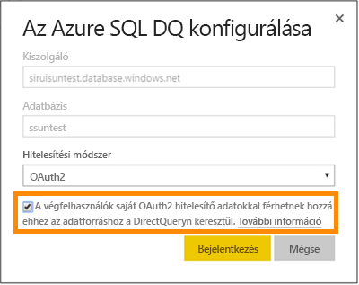

# Az Azure SQL Database DirectQueryvel
Ismerje meg, hogyan lehet az Azure SQL Database-hez közvetlenül kapcsolódni, és élő adatok használatával jelentéseket létrehozni. Nem szükséges az adatok a saját forrásukból a Power BI-ba juttatni.

A DirectQuery használatával, miközben a jelentés nézetben feltárja az adatokat, lekérdezéseket küld vissza az Azure SQL Database-nek. Ez a kezelőfelület olyan felhasználók számára javasolt, akik már ismerik az adatbázisokat és azokat az entitásokat, amelyekhez az adatbázisok kapcsolódnak.

**Megjegyzések:**

* A kapcsolódáskor a teljes szervernevet adja meg (további részleteket lejjebb talál)
* Győződjön meg arról, hogy az adatbázisra vonatkozó tűzfalszabályokban konfigurálva van az [Azure-szolgáltatásokhoz való hozzáférés engedélyezése](https://msdn.microsoft.com/library/azure/ee621782.aspx)
* Minden művelet, mint például egy oszlop kiválasztása vagy egy szűrő felvétele, visszaküld egy lekérdezést az adatbázisnak
* A csempék óránként frissülnek (a frissítést nem szükséges ütemezni). Ezen a csatlakozáskor lehet módosítani, a Speciális beállítások között.
* DirectQueryvel elért adatkészletek esetén a Q&A nem használható
* A rendszer nem követi automatikusan a sémák változásait

Ezek a korlátozások és figyelmeztetések a felhasználói felületek fejlesztésével változhatnak. Alább láthatók a kapcsolódás lépéseinek részletei. 

## A Power BI Desktop és a DirectQuery
A Power BI Desktop használata szükséges ahhoz, hogy az Azure SQL Database-hez DirectQueryvel kapcsolódhasson. Ez a megközelítés nagyobb rugalmasságot és további képességeket biztosít. A Power BI Desktoppal létrehozott jelentések közzétehetők a Power BI szolgáltatásban. További tudnivalók arról, hogyan kapcsolódhat az [Azure SQL Database-hez DirectQuery használatával](desktop-use-directquery.md) a Power BI Desktopban. 

## Egyszeri bejelentkezés

Miután közzétett egy Azure SQL DirectQuery-adathalmazt a szolgáltatásban, engedélyezheti az Azure Active Directory (Azure AD) OAuth2 használatával való egyszeri bejelentkezést (SSO) a végfelhasználók számára. 

Az egyszeri bejelentkezés engedélyezéséhez nyissa meg az adathalmaz beállításait, majd az **Adatforrások** lapot, és jelölje be az Egyszeri bejelentkezés jelölőnégyzetet.

Ha az egyszeri bejelentkezési beállítás engedélyezve van, és a felhasználók használják az adatforrásra épülő jelentéseket, a Power BI elküldi a hitelesített Azure AD-beli hitelesítő adataikat a lekérdezésekben az Azure SQL Database-adatbázisnak. Ez lehetővé teszi a Power BI számára, hogy figyelembe vegye az adatforrás szintjén konfigurált biztonsági beállításokat.

Az egyszeri bejelentkezési beállítás az adatforrást használó összes adathalmazra érvényes lesz. Az importálási forgatókönyvekhez használt hitelesítési módszerre nincs hatással.

## Paraméterértékek megkeresése
A teljes szervernevet és adatbázisnevet az Azure Portalon találhatja meg.

## Következő lépések
[A DirectQuery használata a Power BI Desktopban](desktop-use-directquery.md)  
[Első lépések a Power BI használatával](service-get-started.md)  
[Power BI – Adatok lekérése](service-get-data.md)  
További kérdései vannak? [Kérdezze meg a Power BI közösségét](http://community.powerbi.com/)
