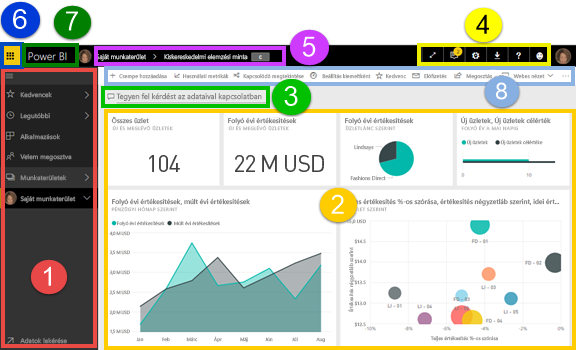
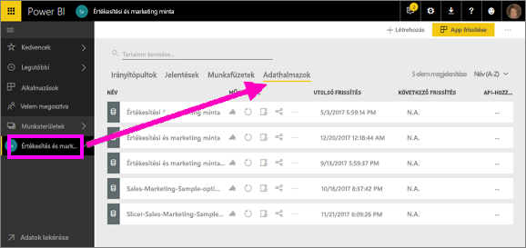
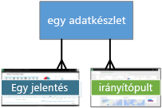
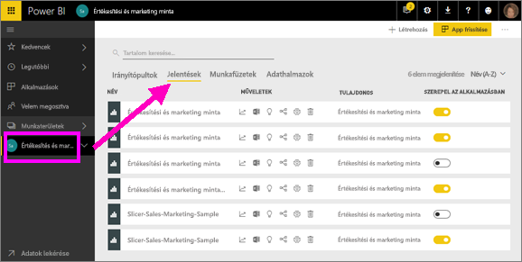
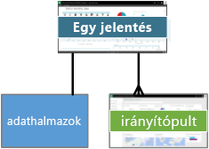
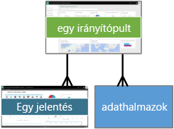
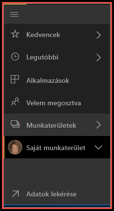

# Power BI – a Power BI szolgáltatás alapfogalmai

A cikk feltételezi, hogy már [regisztrált a Power BI szolgáltatásra](service-self-service-signup-for-power-bi.md), és [hozzáadott adatokat](service-get-data.md).

A Power BI szolgáltatás megnyitásakor egy ***irányítópult*** jelenik meg. Az irányítópult megkülönbözteti a Power BI szolgáltatást a Power BI Desktoptól.

A Power BI szolgáltatás felhasználói felületének főbb elemei:

1. navigációs ablak (bal oldali navigáció)
2. vászon (ebben az esetben a csempékkel rendelkező irányítópult)
3. Q&A kérdésmező
4. ikongombok, beleértve a súgót és a visszajelzést is
5. irányítópult címe (navigációs útvonal, más néven útkövetés)
6. Az Office 365 appindítója
7. A Power BI kezdőlapjának gombja
8. Címkézett ikongombok

Ezeket később részletesen is ismertetjük, de először vegyük sorra a Power BI néhány alapfogalmát.

De meg is nézheti ezt a videót, mielőtt tovább olvassa a cikket.  A videóban Will ismerteti az alapfogalmakat, és végigvezeti a Power BI szolgáltatáson.

<iframe width="560" height="315" src="https://www.youtube.com/embed/B2vd4MQrz4M" frameborder="0" allowfullscreen></iframe>

## A Power BI alapfogalmai
A Power BI négy alapvető építőeleme a következő: ***irányítópultok***, ***jelentések***, ***munkafüzetek*** és ***adathalmazok***. Ezek mind pedig ***munkaterületekbe*** vannak szervezve. A négy építőelem részletes ismertetéséhez fontos tisztában lenni a munkaterületek működésével, ezért először ezekkel foglalkozunk. 

## Munkaterületek
A munkaterületek a Power BI irányítópultjainak, jelentéseinek, munkafüzeteinek és adathalmazainak tárolói. A munkaterületeknek kétféle típusa van: a **Saját munkaterület* és az alkalmazás-munkaterületek. Mi tehát egy *alkalmazás*? Egy Power BI-*alkalmazás* az irányítópultok és jelentések egy olyan gyűjteménye, amely arra szolgál, hogy alapvető metrikákat bocsátson a szervezet rendelkezésére. Az alkalmazások interaktívak, de nem szerkeszthetők 

- A *Saját munkaterület* az egyes Power BI-ügyfelek személyes munkaterülete, melyen a tartalmaikat használhatják. A Saját munkaterületéhez csak Ön fér hozzá. Ha bármely tartalmát meg szeretné osztani, erre több lehetősége is van: létrehozhat egy alkalmazás-munkaterületet, melyen a tartalmakat egy *alkalmazásba* kötegeli és elérhetővé teszi mások számára a szervezetben, vagy létrehozhat egy alkalmazás-munkaterületet, és a munkatársaknak hozzáférést adhat ehhez a munkaterülethez, hogy megoszthassanak egymással tartalmakat és együtt tudjanak működni.     
-  Az *alkalmazás-munkaterületeken* együtt lehet működni és tartalmakat lehet megosztani a munkatársakkal. Emellett itt lehet a szervezet számára alkalmazásokat létrehozni, közzétenni és kezelni. Azon tartalmak átmeneti területeiként és tárolóiként tekinthet rájuk, melyek Power BI-alkalmazásokat alkotnak majd. Az alkalmazás-munkaterületekhez hozzáadhat munkatársakat, és közösen dolgozhatnak irányítópultokon, jelentéseken, munkafüzeteken és adathalmazokon. Az alkalmazás-munkaterületek minden tagjának Power BI Pro-licenccel kell rendelkeznie, az alkalmazások felhasználóinak (az alkalmazásokhoz hozzáféréssel rendelkező munkatársaknak) azonban nem feltétlenül van szükségük Pro-licencre.  

További tudnivalókért tekintse meg a Tartalomjegyzék **Megosztás és együttműködés** című szakaszát, az [Irányítópultok és jelentések közös használata és megosztása](service-how-to-collaborate-distribute-dashboards-reports.md) című szakasztól kezdődően.

Most pedig lépjünk tovább a Power BI építőelemeire. Adatok nélkül nem lehetnek sem irányítópultjai, sem jelentései (illetve lehetnek üres irányítópultjai és jelentései, de amíg adatok nem kerülnek beléjük, nincs sok hasznuk), tehát ismerje meg először az **adatkészleteket**.

## Adatkészletek
Az *adatkészlet* olyan adatok gyűjteménye, amelyeket *importál*, vagy amelyekhez *csatlakozik*. A Power BI sokféle adatkészlet importálását, csatlakoztatását és egy helyen történő megjelenítését teszi lehetővé.  

Az adathalmazok *munkaterületekhez* vannak társítva, és egy adott adathalmaz számos munkaterületnek része lehet. Amikor megnyit egy munkaterületet, az ahhoz társított adatkészletek az **Adatkészletek** lapon vannak felsorolva. Mindegyik itt megnevezett adatkészlet egyetlen adatforrásnak felel meg, például egy OneDrive-beli Excel-munkafüzetnek, egy helyszíni táblázatos SSAS-adatkészletnek vagy egy Salesforce-adatkészletnek. Sok különböző adatforrást támogatunk, a számuk egyre növekszik. [Itt megtekintheti a Power BI-jal használható adatkészlettípusok listáját](service-get-data.md).

Az alábbi példában a „Sales and marketing” („Értékesítési és marketing”) alkalmazás-munkaterület van kijelölve, és rákattintottak az **Adatkészletek** fülre.

**EGY** adatkészlet:

* használható újra és újra, egy vagy több munkaterületen.
* Több jelentésben is felhasználható.
* Az ebből az egy adatkészletből származó vizualizációkat több irányítópulton is megtekintheti.
  
  

[Adathalmazhoz való csatlakozáshoz vagy annak importálásához](service-get-data.md) kattintson az **Adatok beolvasása** lehetőségre a bal oldali navigáció alján, vagy válassza a **+ Létrehozás > Adatkészlet** lehetőséget (a jobb felső sarokban). Kövesse az utasításokat az adott forráshoz való csatlakozáshoz vagy annak importálásához, majd adja hozzá az adathalmazt az aktív munkaterülethez. Az új adathalmazokat sárga csillag jelöli. A Power BI-ban végzett munka nem változtatja meg az alapjául szolgáló adatkészletet.

Ha Ön [része egy ***alkalmazás-munkaterületnek***](service-collaborate-power-bi-workspace.md), akkor a munkaterület bármelyik tagja által hozzáadott adatkészletek a többi tag számára is láthatók.

Az adathalmazok frissíthetők, átnevezhetők, elemezhetők és eltávolíthatók. Adathalmazok alapján létrehozhat jelentéseket újonnan, vagy [gyors elemzések](service-insights.md) futtatásával.  A **Kapcsolódó megtekintése** lehetőséget választva megtekintheti, hogy melyek azok a jelentések és irányítópultok, melyek már használnak adathalmazt. Ha elemezni szeretne egy adatkészletet, kattintson rá. Ilyenkor az adatkészletet a jelentésszerkesztőben nyitja meg, ahol mélyre áshat az adatokban, és vizualizációkat hozhat létre belőlük. Ez már továbbvezet a következő témához: a jelentésekhez.

### További ismeretek
* [Power BI Premium – pontosan mi is ez?](service-premium.md)
* [Adatbeolvasás a Power BI szolgáltatásban](service-get-data.md)
* [A Power BI-hoz használható mintaadathalmazok](sample-datasets.md)

## Jelentések
A Power BI-jelentések egy vagy több diagramból állnak, és vizualizációkat tartalmaznak (diagramok vagy grafikonok, például vonaldiagram, kördiagram, fatérkép stb. formájában). A vizualizációk másik elnevezése ***vizualizációs elem***. Egyetlen jelentés vizualizációi csak egy adatkészleten alapulhatnak. Jelentések létrehozhatók újonnan a Power BI szolgáltatásban, importálhatók a munkatársak által megosztott irányítópultokból, és létrehozhatók olyan adatkészletekhez való csatlakozással, amelyek az Excelből, a Power BI Desktopból, adatbázisokból, SaaS-alkalmazásokból vagy [alkalmazásokból](service-get-data.md) származnak.  Ha például csatlakozik egy Power View-lapokat tartalmazó Excel-munkafüzethez, akkor a Power BI elkészít egy jelentést a lapok alapján. Ha pedig SaaS-alkalmazáshoz csatlakozik, a Power BI egy előre elkészített jelentést importál.

A jelentések megtekintésének és használatának két módja van: az [Olvasó nézet és a Szerkesztő nézet](service-reading-view-and-editing-view.md).  A jelentés ***Szerkesztési nézetének*** elemzési, tervezési, kiépítési és megosztási funkcióihoz csak a jelentés készítője, a társtulajdonosok és az erre feljogosított felhasználók férhetnek hozzá. Azok, akikkel ők megosztják a jelentést, az ***Olvasó nézet*** segítségével tanulmányozhatják és használhatják.   

Amikor megnyit egy munkaterületet, az ahhoz társított jelentések a **Jelentések** lapon vannak felsorolva. A listán szereplő jelentések mind olyan vizualizációkat tartalmaznak egy vagy több oldalon, amelyek kizárólag a mögöttes adathalmazok egyikén alapulnak. Ha meg szeretne nyitni egy jelentést, kattintson vagy koppintson rá. 

Amikor megnyit egy alkalmazást, egy irányítópult jelenik meg.  Az alapul szolgáló jelentések megnyitásához válasszon egy jelentésből rögzített irányítópult-csempét (melyekről lentebb olvashat bővebben). Ne feledje, hogy nem minden csempe van jelentésből rögzítve, ezért előfordulhat, hogy több csempére is rá kell kattintania, mire talál egy jelentést. 

Alapértelmezés szerint a jelentés Olvasó nézetben nyílik meg.  A Szerkesztési nézet megnyitásához egyszerűen kattintson a **Jelentés szerkesztése** lehetőségre (ha rendelkezik a szükséges engedélyekkel). 

Az alábbi példában a „Sales and marketing” („Értékesítési és marketing”) alkalmazás-munkaterület van kijelölve, és rákattintottak a **Jelentések** fülre.

**EGY** jelentés:

* egyetlen munkaterületen szerepel
* az adott munkaterület több irányítópultjához is társítható (az adott jelentésből rögzített csempék több irányítópulton is megjelenhetnek).
* Egy adatkészletből származó adatokból készíthető el. (Azzal az egy apró kivétellel, hogy a Power BI Desktop több adatkészletet is kombinálhat egy jelentésen belül, amelyet aztán importálni lehet a Power BI-ba.)
  
  

### További ismeretek
* [Jelentések a Power BI szolgáltatásban és a Power BI Desktopban](service-reports.md)
* [Jelentések a Power BI-mobilalkalmazásokban](mobile-reports-in-the-mobile-apps.md)

## Irányítópultok
*Irányítópultokat* Ön hozhat létre **a Power BI szolgáltatásban**, vagy egy munkatársa hozhatja létre **a Power BI szolgáltatásban** és oszthatja meg Önnel. Egyetlen vászonból áll, amely csempéket és widgeteket tartalmazhat. Minden jelentésből vagy a [Q&A-ból](power-bi-q-and-a.md) rögzített csempe egyetlen, az irányítópultra rögzített [vizualizációt](power-bi-report-visualizations.md) jelenít meg, amely egy adathalmazon alapul. Teljes jelentésoldalak is rögzíthetők az irányítópultokon egyetlen csempeként. Sokféleképpen adhat csempét az irányítópulthoz, de ebben az áttekintő témakörben nincs lehetőség ennek bemutatására. További információkért tekintse meg [Az irányítópult csempéi a Power BI szolgáltatásban](service-dashboard-tiles.md) című oldalt. 

Miért hoznak létre a felhasználók irányítópultokat?  Csak néhány ok a sok közül:

* Azért, hogy egy pillantással átláthassák a döntéshozatalhoz szükséges összes információt.
* Azért, hogy figyelhessék a munkájukkal kapcsolatos leglényegesebb információkat.
* Azért, hogy minden munkatárs naprakész információkkal rendelkezzen, és ugyanazokat az adatokat lássa és használja.
* Azért, hogy figyelhessék az üzleti folyamat, termék, vállalati egység, marketingkampány stb. állapotát.
* Azért, hogy egy nagyobb irányítópult személyre szabott nézetét hozzák létre – a számukra fontos összes metrikával.

Amikor megnyit egy munkaterületet, az ahhoz társított irányítópultok az **Irányítópultok** lapon vannak felsorolva. Ha meg szeretne nyitni egy irányítópultot, egyszerűen kattintson vagy koppintson rá. Amikor megnyit egy alkalmazást, egy irányítópult jelenik meg.  Minden irányítópult az alapjául szolgáló adathalmaz(ok) valamely részhalmazának egyedi nézetét jeleníti meg.  Ha tulajdonosa az irányítópultnak, szerkesztési hozzáféréssel rendelkezik az alapjául szolgáló adathalmaz(ok)hoz és jelentésekhez is.  Ha az irányítópultot megosztották Önnel, használhatja az irányítópultot és az alapjául szolgáló jelentéseket, de nem fogja tudni menteni a módosításokat.

Ön vagy a munkatársak számos különböző módon [oszthatnak meg irányítópultokat](service-share-dashboards.md). Az irányítópultok megosztásához Power BI Pro szükséges, és a megosztott irányítópultok megtekintéséhez is szükséges lehet.

> [!NOTE]
> A rögzítésről és a csempékről részletesebben olvashat „Az irányítópult és a csempék” című részben.
> 

**EGY** irányítópult:

* Egy adott munkaterülethez van társítva.
* Több adatkészletből jeleníthet meg vizualizációkat.
* Több jelentésből jeleníthet meg vizualizációkat.
* Más eszközökből (pl. Excel) rögzített vizualizációkat is megjeleníthet.
  
  

### További ismeretek
* [Új üres irányítópult létrehozása, majd adatok beolvasása](service-dashboard-create.md).
* [Irányítópult megkettőzése](service-dashboard-copy.md) 
* [Irányítópult telefonos nézetének létrehozása](service-create-dashboard-mobile-phone-view.md)

## Munkafüzetek
A munkafüzetek speciális típusú adathalmazok. Ha elolvasta a fenti **Adathalmazok** című szakaszt, már szinte mindent tud a munkafüzetekről, amit tudnia kell. Lehet azonban, hogy szeretné megtudni, hogy a Power BI miért sorolja be az Excel-munkafüzeteket egyes esetekben **adathalmazként**, máskor pedig **munkafüzetként**. 

Ha Excel-fájlokhoz használja az **Adatok beolvasása** parancsot, lehetősége van *importálni* a fájlt, vagy pedig *csatlakozni* hozzá. Ha a Csatlakozás lehetőséget választja, a munkafüzet ugyanúgy jelenik meg a Power BI-ban, mint az Excel Online-ban. Az Excel Online-nal ellentétben azonban ebben az esetben néhány kiváló funkció segítségével rögzítheti a munkalapok egyes elemeit közvetlenül az irányítópulton.

A Power BI-ban nincs lehetőség a munkafüzet szerkesztésére. Ha azonban módosításokra van szüksége, a Szerkesztés elemre kattintva kiválaszthatja, hogy az Excel Online-ban szeretné szerkeszteni a munkafüzetet, vagy megnyitja azt a számítógépen, az Excelben. A rendszer menti az összes módosítást a OneDrive-on található munkafüzetbe.

### További ismeretek
* [Adatok lekérdezése Excel-munkafüzetből](service-excel-workbook-files.md)
* [Közzététel a Power BI-ban az Excelből](service-publish-from-excel.md)

## Saját munkaterület
A munkaterületekről és építőelemekről már szó esett. Tekintsük ismét a Power BI felületét, és tekintsük át a Power BI szolgáltatás kezdőlapjának alkotóelemeit.

### 1. **Navigációs ablak** (bal oldali navigáció)
A navigációs ablakban keresheti meg a munkaterületeket és a Power BI építőelemeit – az irányítópultokat, a jelentéseket, a munkafüzeteket és az adathalmazokat –, és mozoghat azok között.  

  

* Az **Adatok beolvasása** elemre kattintva [adatkészleteket, jelentéseket és irányítópultokat vehet fel a Power BI-ba](service-get-data.md).
* A navigációs sávot a  ikonnal bonthatja ki vagy csukhatja össze.
* A **Kedvencek** lehetőséget választva megnyithatja és kezelheti kedvenc tartalmait.
* A **Legutóbbiak** lehetőséget választva megtekintheti és megnyithatja a legutóbb megtekintett tartalmakat
* Az **Alkalmazások** lehetőséget választva megtekinthet, megnyithat vagy törölhet alkalmazásokat.
* Egy munkatárs tartalmakat osztott meg Önnel? A **Velem megosztva** lehetőséget választva kereshet a tartalmak között és rendezheti azokat, hogy megtalálja, amit keres.
* A **Munkaterületek** lehetőséget választva megjelenítheti és megnyithatja a munkaterületeket.

Egy kattintással:

* egy ikonra vagy fejlécre kattintva megnyithatja az elemet a Tartalom nézetben
* a jobbra mutató nyilakra (>) kattintva megnyithatja a Kedvencek, a Legutóbbiak vagy a Munkaterületek úszó menüjét. 
* a sávnyíl ikonra () kattintva megjelenítheti a **Saját munkaterület** irányítópultokat, jelentéseket, munkafüzeteket és adathalmazokat tartalmazó görgethető listáját.
* Hozzáférhet az adatkészlethez, hogy elemezze.

### 2. **Vászon** 
Mivel meg van nyitva egy irányítópult, a vászonterületen vizualizációs csempék jelennek meg. Ha például a jelentésszerkesztő lenne megnyitva, a vászonterületen egy jelentésoldal jelenne meg. 

Az irányítópultokat [csempék](service-dashboard-tiles.md) alkotják.  A csempéket a jelentések Szerkesztési nézetében, a Q&A funkcióval és más irányítópultokon hozhatja létre, továbbá rögzítheti őket az Excel, az SSRS és más szolgáltatásokból is. A [widget](service-dashboard-add-widget.md) egy speciális csempe, amely magához az irányítópulthoz tartozik. A megjelenő csempéket a jelentés létrehozója/tulajdonosa helyezte el az irányítópulton.  A csempét a *rögzítés* műveletével kell hozzáadni az irányítópulthoz.

További információkért tekintse meg az **Irányítópultok** részt (feljebb).

### 3. **Q&A kérdésmező**
Az adatelemzés egyik módja, hogy feltesz egy kérdést a Power BI Q&A funkciójának. Erre az egy vizualizáció formájában válaszol. A Q&A szolgáltatással tartalmak adhatók hozzá irányítópultokhoz vagy jelentésekhez.

A Q&A az irányítópulthoz csatlakozó adatkészlet(ek)ben keresi a választ.  Csatlakozó adatkészlet az, amelynek legalább egy csempéje rögzítve van az irányítópulton.

A Q&A már a kérdés beírásának elején átirányítja Önt a Q&A lapra. A kérdés beírása közben a Q&A többek között átfogalmazással, automatikus kitöltéssel, valamint javaslatokkal segít a legjobb kérdés feltevésében és a helyes válasz megtalálásában. Ha megfelelőnek találja a kapott vizualizációt (választ), rögzítse az irányítópulton. További információkért tekintse meg a [Q&A a Power BI-ban](power-bi-q-and-a.md) című részt.

### 4. **Ikongombok** 
A jobb felső sarokban látható ikonokkal érhetők el a beállítások, az értesítések, a letöltések, a súgó és a Power BI-csapatnak történő visszajelzés. A dupla nyílra kattintva **Teljes képernyős** módban nyithatja meg az irányítópultot.  

### 5. **Irányítópult címe** (navigációs útvonal, más néven útkövetés)
Nem lehet minden esetben könnyen meghatározni, hogy melyik munkaterület és irányítópult aktív, ezért a Power BI létrehoz egy navigációs útvonalat.  Ebben a példában a munkaterület (a Saját munkaterület) és az irányítópult címe (Kiskereskedelmi elemzési minta) látható.  Ha meg lenne nyitva egy jelentés, a rendszer a jelentés nevét hozzáfűzné a navigációs útvonal végéhez.  Az útvonal minden szakasza egy aktív hivatkozás.  

Figyelje meg az irányítópult címe után álló „C” ikont. Az irányítópult „bizalmas” („confidential”) [adatbesorolási címkével](service-data-classification.md) rendelkezik. A címke az adatok tartalmi és biztonsági szintjét határozza meg. Ha a rendszergazda bekapcsolta az adatok besorolását, minden irányítópulthoz be lesz állítva egy alapértelmezett címke. Az irányítópultok tulajdonosainak az irányítópult tényleges biztonsági szintjének megfelelően kell módosítaniuk a címkét.

### 6. **Az Office 365 appindítója**
Az appindítóban minden Office 365-alkalmazás könnyedén elérhető egyetlen kattintással. Itt gyorsan megnyithatja az e-maileket, a dokumentumokat, a naptárat és egyebeket. 

### 7. **A Power BI kezdőlapja**
Ezt a lehetőséget választva megnyithatja a [kiemelt irányítópultot](service-dashboard-featured.md) (ha beállított ilyet), ellenkező esetben a legutóbb megtekintett irányítópult nyílik meg.

   

### 8. **Címkézett ikongombok**
A képernyő ezen területén további lehetőségek találhatók a tartalom (ebben az esetben az irányítópult) használatához.  A címkézett ikonok mellett látható a három pont (...) ikon, melyet választva egyebek mellett olyan lehetőségeket jeleníthet meg, mint például az irányítópult megkettőzése, nyomtatása és frissítése.

   

## Következő lépések
[A Power BI bemutatása](power-bi-overview.md)  
[Navigáció: Eligazodás a Power BI szolgáltatásban](service-the-new-power-bi-experience.md)
[Power BI-videók](videos.md)  
[A jelentésszerkesztő – bemutató](service-the-report-editor-take-a-tour.md)

További kérdései vannak? [Kérdezze meg a Power BI közösségét](http://community.powerbi.com/)

