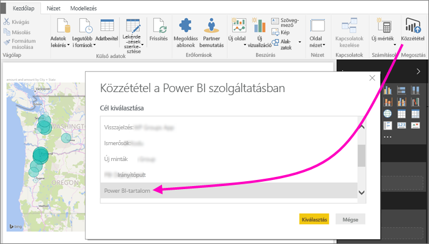
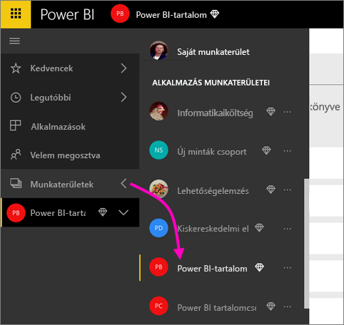
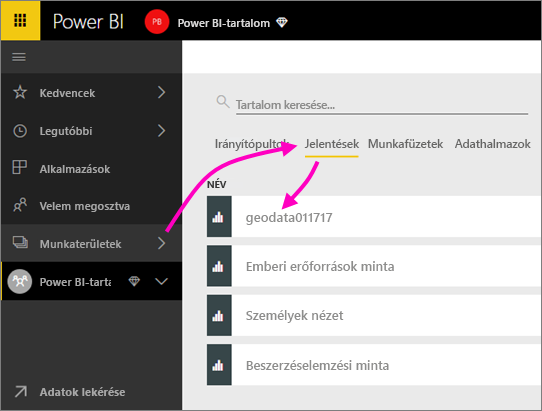
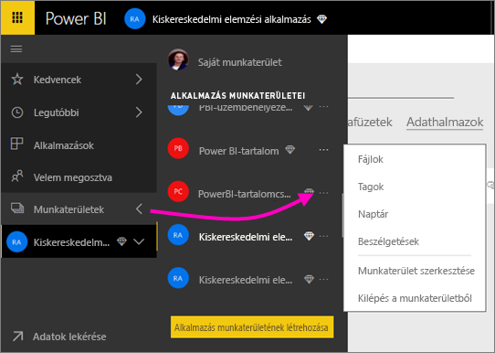
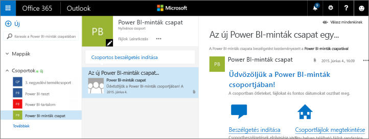
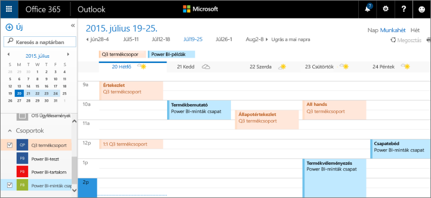

# Együttműködés a Power BI alkalmazás-munkaterületén
A Power BI alkalmazás-munkaterületek kitűnően alkalmasak arra, hogy munkatársaival irányítópultokon, jelentéseken és adatkészleteken együttműködve hozzanak létre *alkalmazásokat*. A munkaterületeknek éppen ez a rendeltetése – az együttműködés. Miután munkatársaival végzett az irányítópultokon és jelentéseken végzett közös munkával, azokat alkalmazásként csomagolhatja és terjesztheti. Szerezzen átfogó ismereteket [alkalmazások és alkalmazás-munkaterületek Power BI-ban történő létrehozásáról](service-create-distribute-apps.md). 

Az együttműködés a Power BI-ban nem csupán a munkaterületekre terjed ki. Az Office 365 további csoportszolgáltatásokat is kínál, mint a fájlok megosztása a OneDrive Vállalati verziójában, az Exchange-beszélgetések, a megosztott naptár és feladatok és így tovább. További ismereteket is szerezhet az [Office 365-csoportokról](https://support.office.com/article/Create-a-group-in-Office-365-7124dc4c-1de9-40d4-b096-e8add19209e9).

Az alkalmazás-munkaterületek csak a [Power BI Próban](service-free-vs-pro.md) elérhetők.

## Együttműködés Power BI Desktop-fájlokon az alkalmazás-munkaterületén
Ha közzétesz egy Power BI Desktop-fájlt a Power BI alkalmazás-munkaterületén, akkor a munkaterületen mindenki közreműködhet benne.

1. A Power BI **Kezdőlap** sávján válassza a **Közzététel** lehetőséget, majd a **Cél választása** mezőben válassza az alkalmazás-munkaterületét.
   
    
2. A Power BI szolgáltatásban válassza a Munkaterületek elem melletti nyilat, majd az alkalmazás-munkaterületét.
   
    
3. Válassza a Jelentések fület, majd jelölje ki a jelentést.
   
    
   
    Ettől kezdve ugyanúgy használható, mint bármely más Power BI-jelentés. Az alkalmazás-munkaterületen közreműködők Önnel együtt [módosíthatják a jelentést](service-reports.md), és csempéket menthetnek a választott irányítópultra.

## Együttműködés az Office 365-ben
Az Office 365-beli együttműködés kiindulópontja a Power BI-beli alkalmazás-munkaterület.

1. A Power BI szolgáltatásban válassza a Munkaterületek elem melletti nyilat, majd a munkaterület neve melletti három pontot (**...**). 
   
   
2. Ebből a menüből több módon is együttműködhet a csoportjával: 
   
   * Részt vehet [csoportbeszélgetésben az Office 365-ben](service-collaborate-power-bi-workspace.md#have-a-group-conversation-in-office-365).
   * [Eseményt ütemezhet](service-collaborate-power-bi-workspace.md#schedule-an-event-on-the-group-workspace-calendar) az alkalmazás csoport-munkaterületének naptárában.
   
   Az alkalmazás csoport-munkaterületének első megnyitása az Office 365-ben eltarthat egy ideig. Várjon 15-30 percet, majd frissítse az oldalt.

## Csoportbeszélgetés az Office 365-ben
1. Válassza a munkaterület neve melletti három pontot (...) \> **Beszélgetések**. 
   
    
   
   Az alkalmazás-munkaterület levelezésre és beszélgetésre szolgáló oldala az Office 365 Outlookban nyílik meg.
   
   
2. További információ az [Office 365 Outlook-csoportbeszélgetésekről](https://support.office.com/Article/Have-a-group-conversation-a0482e24-a769-4e39-a5ba-a7c56e828b22).

## Esemény ütemezése az alkalmazás csoport-munkaterületének naptárában
1. Válassza a munkaterület neve melletti három pontot (**...**) \> **Naptár**. 
   
   
   
   Ezzel megnyílik az alkalmazás csoport-munkaterületének naptárja az Office 365 Outlookban.
   
   
2. További információ az [Office 365 Outlook csoportnaptárairól](https://support.office.com/Article/Add-edit-and-subscribe-to-group-events-0cf1ad68-1034-4306-b367-d75e9818376a).

## Alkalmazás-munkaterület kezelése
Ha Ön egy alkalmazás-munkaterület tulajdonosa vagy rendszergazdája, akkor fel is vehet vagy el is távolíthat munkaterülettagokat. További információ a [Power BI alkalmazás-munkaterület kezeléséről](service-manage-app-workspace-in-power-bi-and-office-365.md).

## További lépések
* [Alkalmazások és alkalmazás-munkaterületek létrehozása a Power BI-ban](service-create-distribute-apps.md)
* További kérdései vannak? [Kérdezze a Power BI-közösséget!](http://community.powerbi.com/)
* Visszajelzést szeretne küldeni? Keresse fel a [Power BI Ideas](https://ideas.powerbi.com/forums/265200-power-bi) fórumot.

