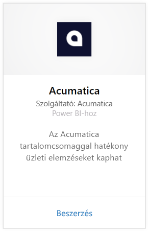
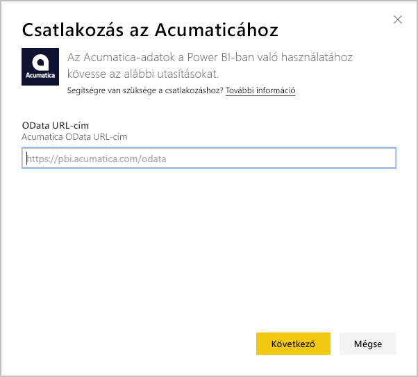
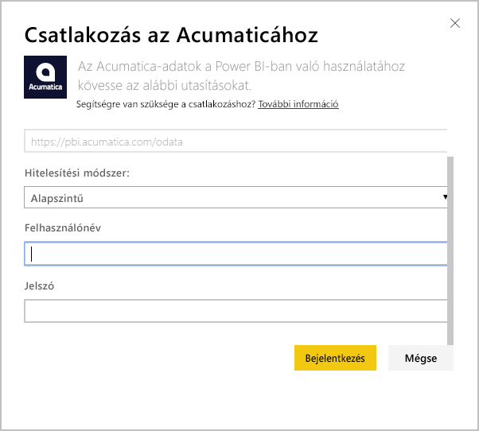
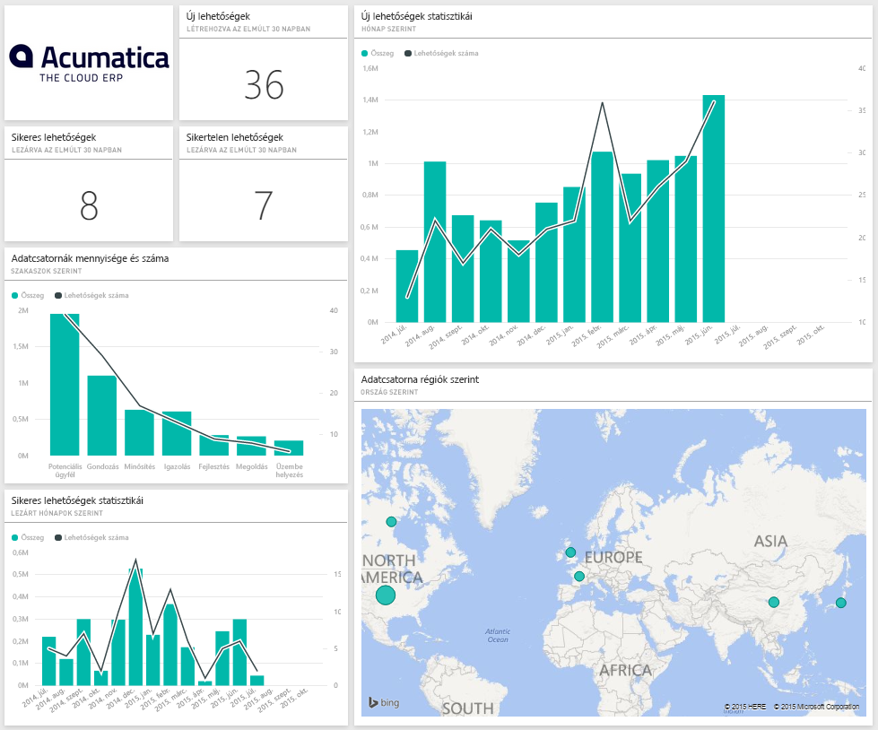
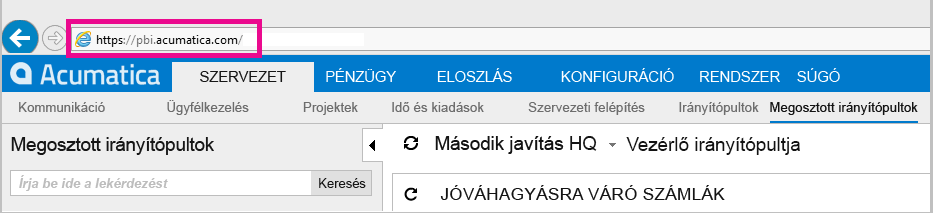
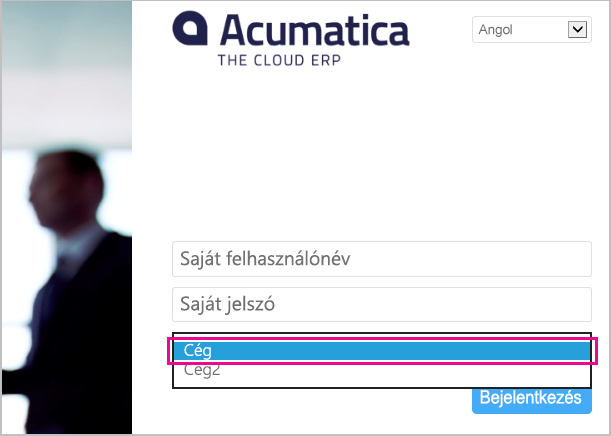

# Csatlakozás az Acumatica eszközhöz a Power BI-ban
A Power BI-hoz készült Acumatica tartalomcsomaggal gyors elemzéseket kaphat a lehetőségadatokról. A Power BI lekéri többek között a lehetőségek, a fiókok és az ügyfelek adatait, majd ezek alapján felépíti az alapértelmezett irányítópultot és a kapcsolódó jelentéseket.

Kapcsolódjon az [Acumatica tartalomcsomaghoz](https://app.powerbi.com/getdata/services/acumatica), vagy tájékozódjon bővebben az [Acumatica és a Power BI integrációjáról](https://powerbi.microsoft.com/integrations/acumatica).

>[!NOTE]
>Ehhez a tartalomcsomaghoz az Acumatica v5.2-es vagy újabb verziója szükséges.

## A csatlakozás menete
1. A bal oldali navigációs ablaktábla alján kattintson az **Adatok lekérése** elemre.
   
   
2. A **Szolgáltatások** mezőben kattintson a **Beolvasás** elemre.
   
   
3. Kattintson az **Acumatica** \> **Beolvasás** elemre.
   
   
4. Adja meg az Acumatica OData-végpontját. Az OData-végpont teszi lehetővé, hogy egy külső rendszer adatokat kérjen az Acumatica eszköztől. Az Acumatica OData-végpontja az alábbiak szerint van formázva, és HTTPS-t használ:
   
     https://[sitedomain]/odata/[companyname]
   
   A Cég neve adatra csak akkor van szükség, ha többvállalatos üzemelő példánnyal dolgozik. Az Acumatica-fiók ezen paraméterének megkereséséről alább talál további információkat.
   
   
5. A Hitelesítési módszer beállításánál válassza az **Alapszintű** lehetőséget. Adja meg az Acumatica-fiókhoz tartozó felhasználónevét és a jelszavát, majd kattintson a **Bejelentkezés** elemre.
   
    
6. Miután a Power BI importálta az adatokat, a bal oldali navigációs ablaktáblán új irányítópult, jelentés és modell jelenik meg. Az új elemeket sárga csillag jelöli \*, amely a rákattintás után eltűnik; az irányítópult kijelölése után az alábbi képhez hasonló elrendezés jelenik meg:
   
    

**Hogyan tovább?**

* [Kérdéseket tehet fel a Q&A mezőben](power-bi-q-and-a.md) az irányítópult tetején.
* [Módosíthatja az irányítópult csempéit](service-dashboard-edit-tile.md).
* [Kiválaszthatja valamelyik csempét](service-dashboard-tiles.md) a mögöttes jelentés megnyitásához.
* Noha az adatkészlet napi frissítésre van ütemezve, módosíthatja a frissítési ütemezést, vagy igény szerint frissíthet az **Azonnali frissítés** gombbal.

## Rendszerkövetelmények
Ehhez a tartalomcsomaghoz az Acumatica v5.2-es vagy újabb verziója szükséges, ezért kérjük, hogy ellenőrizze a verziót az Acumatica rendszergazdájának segítségével.

## Paraméterek keresése
**Acumatica OData-végpont**

Az Acumatica OData-végpontja az alábbiak szerint van formázva, és HTTPS-t használ:

    https://[sitedomain]/odata/[companyname]

Ha be van jelentkezve az Acumatica szolgáltatásba, az alkalmazástartomány a böngésző címsorában látható. Az alábbi példában a webhely tartománya `https://pbi.acumatica.com`, így a megadandó OData-végpont `https://pbi.acumatica.com/odata` lesz.

 

A Cég neve adatra csak akkor van szükség, ha többvállalatos üzemelő példánnyal dolgozik. Ez az információ az Acumatica bejelentkezési oldalán található.

## Hibaelhárítás
Ha nem tud bejelentkezni, ellenőrizze hogy a helyesen formázott Acumatica OData-végpontot adta-e meg.

    https://<application site domain>/odata/<company name>

Ha nem sikerül a csatlakozás, kérje a rendszergazda segítségét az Acumatica verziójának ellenőrzéséhez. Ehhez a tartalomcsomaghoz 5.2-es, vagy újabb verzióra van szükség.

## Következő lépések
[Első lépések a Power BI-ban](service-get-started.md)

[Adatok lekérése a Power BI-ban](service-get-data.md)

