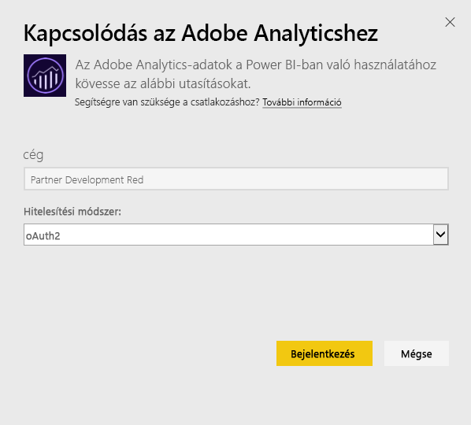
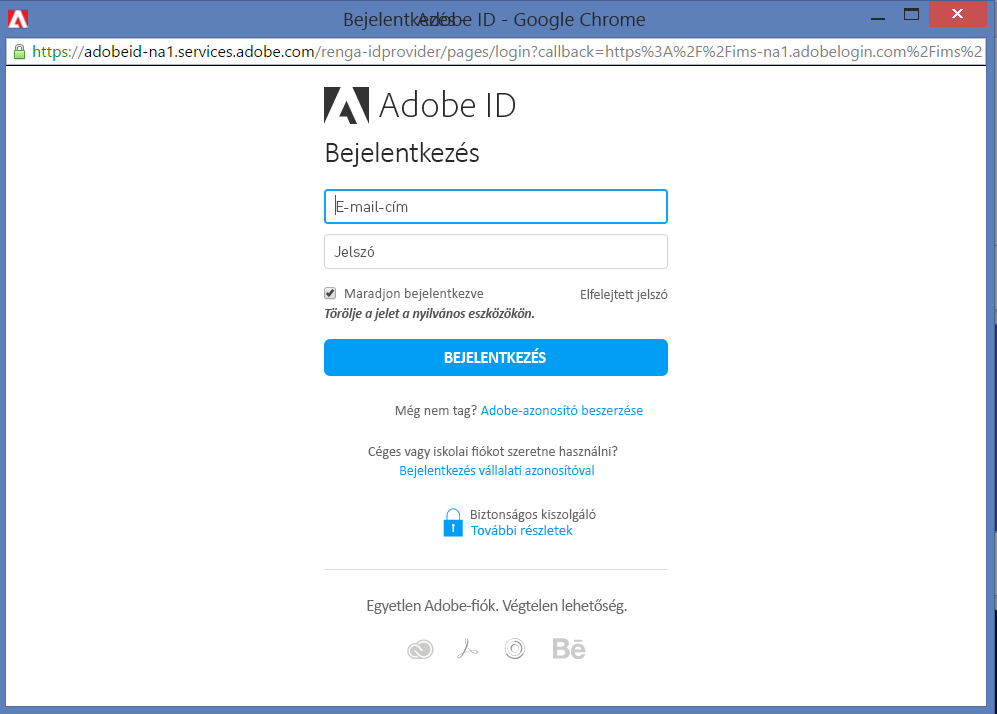
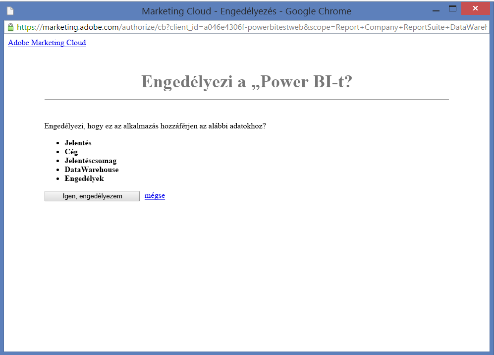
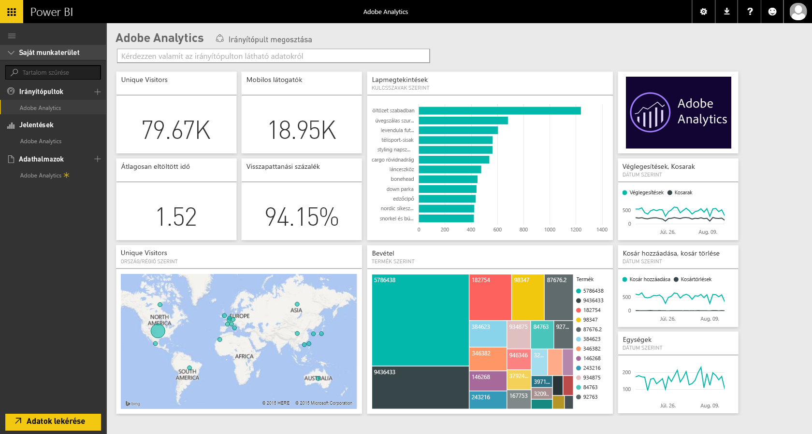
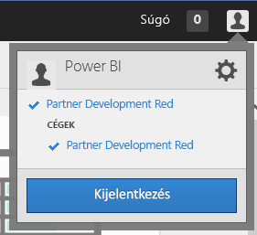
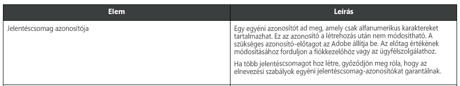

# Kapcsolódás az Adobe Analytics eszközhöz a Power BI használatával
Ha a Power BI-ból kíván kapcsolódni az Adobe Analytics eszközhöz, csatlakozzon az Adobe Analytics Marketing Cloud-fiókjához. Az ekkor megjelenő alkalmazás egy Power BI-irányítópult és -jelentéskészlet segítségével tünteti fel a webhelye forgalmára és felhasználóira vonatkozó elemzéseket. Az adatok naponta egyszer automatikusan frissülnek. Az irányítópultot és a jelentéseket használhatja és megtekintheti, de nem mentheti a változásokat.

Kapcsolódjon az [Adobe Analytics](https://app.powerbi.com/getdata/services/adobe-analytics) eszközhöz, vagy tájékozódjon tovább az [Adobe Analytics és a Power BI integrációjáról](https://powerbi.microsoft.com/integrations/adobe-analytics).

## A kapcsolódás menete
[!INCLUDE [powerbi-service-apps-get-more-apps](./includes/powerbi-service-apps-get-more-apps.md)]

1. Válassza az **Adobe Analytics** \>  **Beolvasás** lehetőséget.
   
   
2. A Power BI az Adobe Analytics rendszerében egy adott cég- és jelentésazonosítóhoz (nem pedig a jelentéscsomag nevéhez) csatlakozik. A [paraméterek megkereséséről](#FindingParams) alább olvashat részletesebben.
   
   
3. A **Hitelesítési módszer**, beállításánál válassza az **oAuth2** \> **Bejelentkezés** lehetőséget. Amikor a rendszer kéri, adja meg az Adobe Analytics-fiók hitelesítő adatait. 
   
    
   
    
4. Az **Elfogadás** elemre kattintva engedélyezze az Adobe Analytics adataihoz való hozzáférést a Power BI számára.
   
   
5. Jóváhagyás után az importálás automatikusan megkezdődik. 

## Az Adobe Analytics irányítópultjának és jelentéseinek megtekintése
[!INCLUDE [powerbi-service-apps-open-app](./includes/powerbi-service-apps-open-app.md)]

      

[!INCLUDE [powerbi-service-apps-open-app](./includes/powerbi-service-apps-what-now.md)]

## Tartalom
A Power BI az Adobe Analytics jelentéskészítő API segítségével a következő táblázatokhoz határoz meg és futtat jelentéseket:

| **Táblázat neve** | **Oszlop adatai** |
| --- | --- |
| Termékek |elements=  "product" (top 25)   metrics="cartadditions", "cartremovals", "carts", "cartviews", "checkouts", "revenue", "units" |
| Böngészők |elements= "browser" (top 25)   metrics="bounces", "bouncerate", "visitors", "visits", "uniquevisitors", "totaltimespent", "pageviews" |
| Oldalak |elements= "page" (top 25)   metrics="cartadditions", "cartremovals", "carts", "cartviews", "checkouts", "revenue", "units", "visits", "uniquevisitors", "pageviews", "bounces", "bouncerate", "totaltimespent" |
| JavaScript engedélyezve |elements=  "javascriptenabled”, “browser” (top 25) |
| Mobil operációs rendszer |elements= "mobileos"(top 25)  metrics="bounces", "bouncerate", "visitors", "visits", "uniquevisitors", "totaltimespent", "cartadditions", "cartremovals", "checkouts", "revenue", "units", "pageviews" |
| Keresőmotor-kulcsszavak |elements= "searchengine" "searchenginekeyword"   metrics="bounces", "bouncerate", "visitors", "visits", "entries", "uniquevisitors", "totaltimespent", "cartadditions", "cartremovals", "carts", "cartviews", "checkouts", "revenue", "units", "pageviews" |
| Keresőmotor termékekhez |elements= "searchengine", "product"   metrics="bounces", "bouncerate", "visitors", "visits", "entries", "uniquevisitors", "totaltimespent", "cartadditions", "cartremovals", "carts", "cartviews", "checkouts", "revenue", "units", "pageviews" |
| Hivatkozó lapok |elements= "referrer" (top 15), “page" (top 10)   metrics="bounces", "bouncerate", "visitors", "visits", "entries", "uniquevisitors", "totaltimespent", "cartadditions", "cartremovals", "carts", "cartviews", "checkouts", "revenue", "units", "pageviews" |
| Geocountry-oldalak |elements= "geocountry" (Top 20), "page"   metrics="bounces", "bouncerate", "visitors", "visits", "entries", "uniquevisitors", "totaltimespent", "cartadditions", "cartremovals", "carts", "cartviews", "checkouts", "revenue", "units", "pageviews" |
| Geocountry termék |elements= "geocountry" (Top 20), "product"  metrics="bounces", "bouncerate", "visitors", "visits", "entries", "uniquevisitors", "totaltimespent", "cartadditions", "cartremovals", "carts", "cartviews", "checkouts", "revenue", "units" |
| Keresés ország és régió szerint |elements= "geocountry" (Top 200)   metrics="bounces", "bouncerate", "visitors", "visits", "entries", "uniquevisitors", "totaltimespent", "cartadditions", "cartremovals", "carts", "cartviews", "checkouts", "revenue", "units" |
| Nyelv |elements= "language", "browser" (Top 25)   metrics="bounces", "bouncerate", "visitors", "visits", "uniquevisitors", "totaltimespent", "pageviews", "cartadditions", "cartremovals", "checkouts", "carts", "cartviews" |
| Keresés keresőmotor szerint |elements= "searchengine" (top 100)   metrics="bounces", "bouncerate", "visitors", "visits", "entries", "uniquevisitors", "totaltimespent", "cartadditions", "cartremovals", "carts", "cartviews", "checkouts", "revenue", "units" |
| Keresés böngésző szerint |elements= "browser" (top 25) |

## Rendszerkövetelmények
Hozzáférés az [Adobe Analytics eszközhöz](http://www.adobe.com/marketing-cloud/web-analytics.html), az alábbiakban leírt helyes paramétereket is beleértve.

## Paraméterek keresése
**Cég**

A Cég érték bejelentkezés után a fiók jobb felső részén látható. Ügyeljen a kis- és nagybetűk, valamint a szóköz használatára. Pontosan úgy kell beírnia, ahogy a fiókban szerepel.

**A jelentéscsomag azonosítója**

A jelentéscsomag azonosítója a jelentéscsomaggal együtt jön létre. Az azonosító értékének meghatározásához forduljon a rendszergazdához. Vegye figyelembe, hogy ez nem azonos a jelentéscsomag nevével.

Az Adobe [dokumentációjából](https://marketing.adobe.com/resources/help/en_US/reference/new_report_suite.html):

## Hibaelhárítás
Ha a hitelesítő adatok beírása után hiányzó engedélyről szóló hibaüzenetet kap, ellenőrizze a rendszergazdánál, hogy van-e hozzáférése az Adobe Analytics API-hoz. Győződjön meg arról is, hogy a megadott Adobe-azonosító kapcsolódik az Ön (Adobe Analytics-céghez társított) Marketing Cloud cégéhez.

Ha a hibaüzenet azután jelenik meg, hogy sikeresen túljutott a hitelesítő adatok képernyőn, lehetséges hogy a jelentések befejezése túl sokáig tart. Gyakori hibaüzenet *„A jelentések lekérése az Adobe Analytics jelentésből sikertelen volt. Tartalom többek között a &quot;hivatkozó, oldal&quot;, az időtartam körülbelül xx másodperc volt”*. Tekintse át a „Tartalom” szakaszt, és vesse össze az Adobe-példány méretével. Erre az időkorlátra jelenleg nem lehet megoldást találni, de foglalkozunk azzal a lehetőséggel, hogy frissítéseket adjunk ki, amelyek támogatást biztosítanak a nagyobb példányokhoz, ezért a Power BI csapata várja a visszajelzését a https://ideas.powerbi.com oldalon.

## Következő lépések
* [Mik a Power BI szolgáltatáson belüli alkalmazások?](service-install-use-apps.md)
* [Adatok lekérése a Power BI-ban](service-get-data.md)
* További kérdései vannak? [Kérdezze meg a Power BI közösségét](http://community.powerbi.com/)

