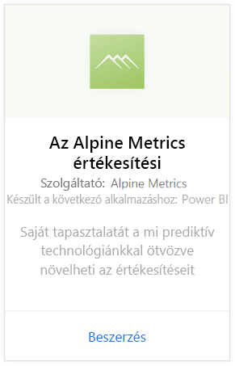
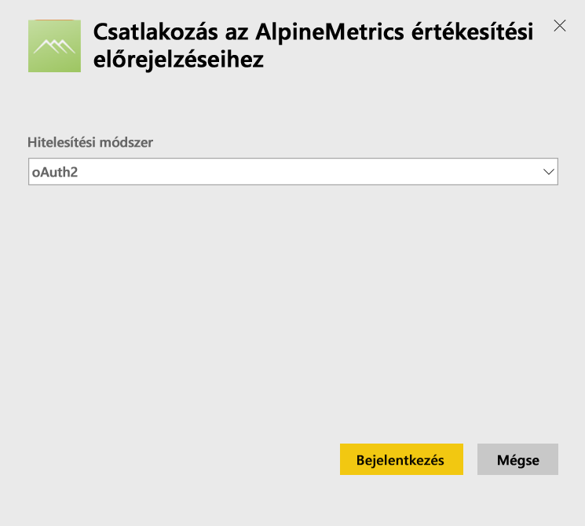
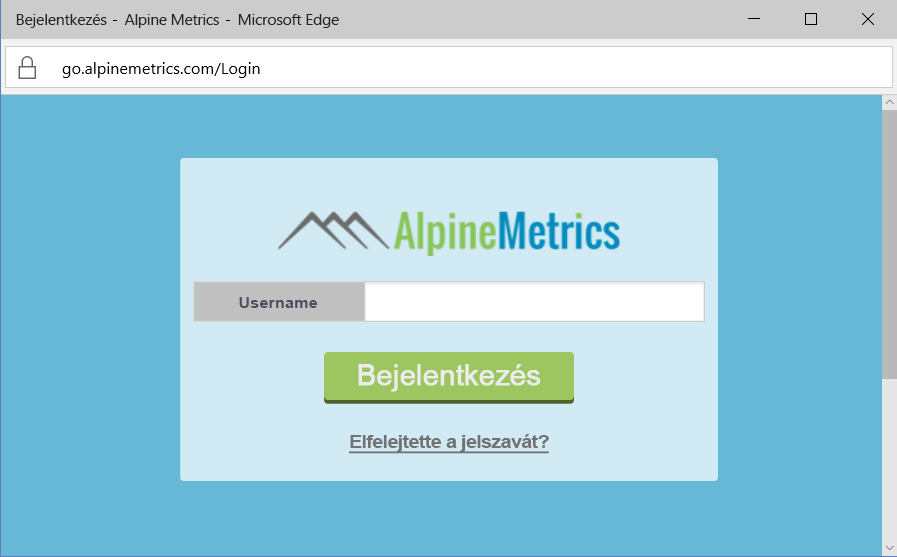
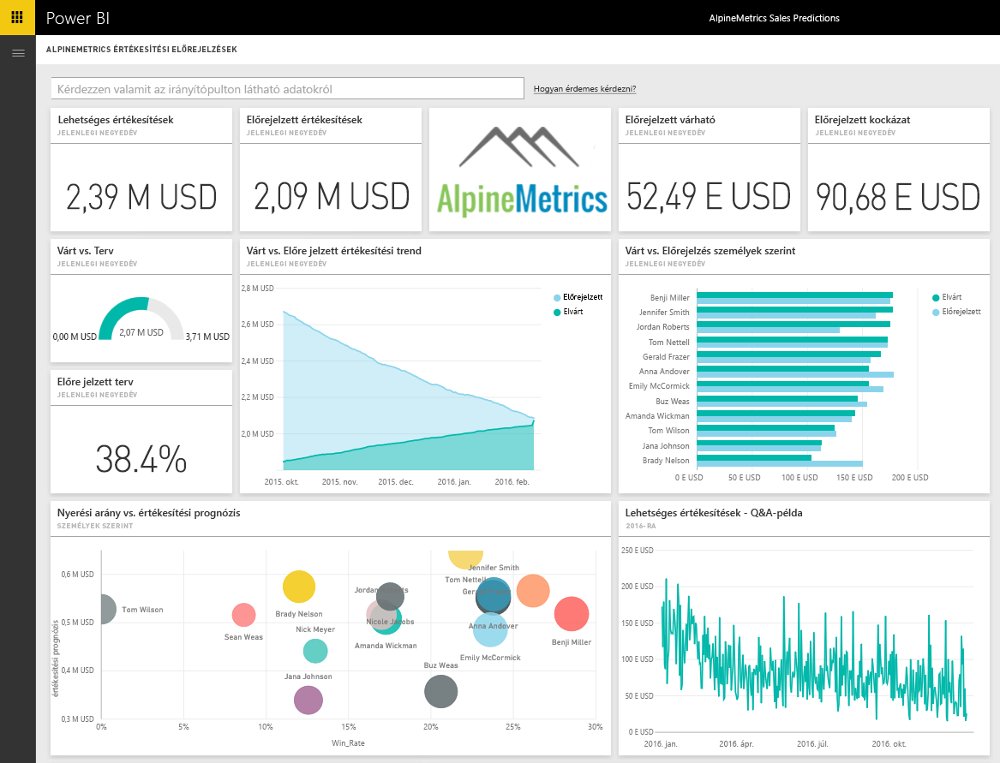

# Kapcsolódás a Power BI-ból az Alpine Metrics Sales Predictionshöz
Az Alpine Metrics a legkorszerűbb prediktív értékesítésifolyamat-optimalizálási szolgáltatást biztosítja a felhőben és igény szerint, kis és nagy értékesítési vállalatok számára. A Power BI-hoz készült Alpine Metrics Sales Predictions-tartalomcsomag mélyebb elemzési lehetőségeket biztosít az üzlete jövőjével kapcsolatban, és egyebek között olyan metrikákat tartalmaz, mint a lehetséges és az előrejelzett eladások és kockázatok. 

Kapcsolódjon a Power BI-hoz készült [Alpine Metrics Sales Predictions-tartalomcsomaghoz](https://app.powerbi.com/getdata/services/alpine-metrics).

## A kapcsolódás menete
1. Válassza az Adatok lekérése elemet a bal oldalon lévő navigációs ablaktábla alján.  
   
    
2. A **Szolgáltatások** mezőben válasza a **Beolvasás** elemet.  
   
    
3. Válassza a **AlpineMetrics Sales Predictions**, majd a **Beolvasás** lehetőséget.  
   
    
4. Válassza ki az **OAuth 2**, majd a **Bejelentkezés** lehetőséget. Amikor a rendszer kéri, adja meg az AlpineMetrics-fiókja hitelesítő adatait.
   
    
   
    
5. A kapcsolódás után automatikusan betöltődik egy irányítópult, egy jelentés és egy adatkészlet. A befejezést követően a csempék frissülni fognak az Ön fiókjából származó adatokkal.
   
    

**Hogyan tovább?**

* [Tegyen fel egy kérdést a Q&A mezőben](service-q-and-a.md), amely az irányítópult tetején található.
* [Módosítsa a csempéket](service-dashboard-edit-tile.md) az irányítópulton.
* [Válasszon ki egy csempét](service-dashboard-tiles.md) az alapjául szolgáló jelentés megnyitásához.
* Az adatkészlet naponta frissül, de módosíthatja a frissítési ütemezést, és bármikor frissíthet igény szerint is az **Azonnali frissítés** lehetőséggel.

## A csomag tartalma
A tartalomcsomag a következő táblázatok adatait tartalmazza:  

    - Fiók    
    - Üzlet    
    - Ország    
    - Iparág    
    - Lehetőség  
    - Személy  
    - Előrejelzés    
    - Előrejelzési előzmények    
    - Termék  
    - Régió    

## Rendszerkövetelmények
A tartalomcsomag példányának létrehozásához egy olyan Alpine Metrics-fiók szükséges, amely rendelkezik engedélyekkel a fenti táblázatokhoz.

## Következő lépések
[Első lépések a Power BI használatával](service-get-started.md)

[Power BI – Alapfogalmak](service-basic-concepts.md)

