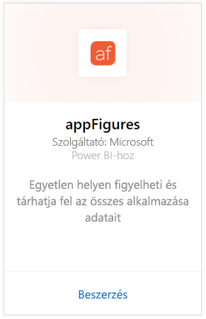
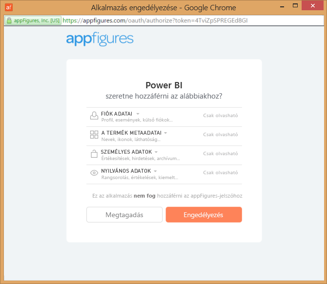
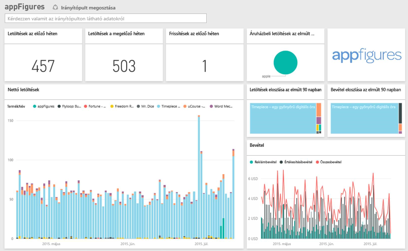
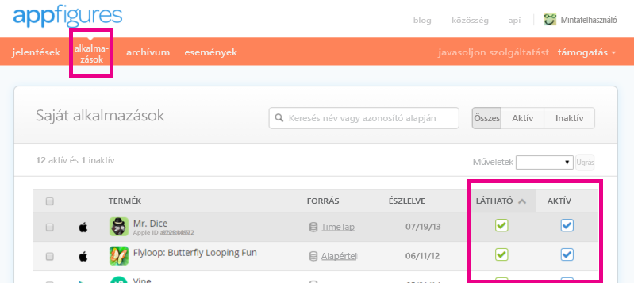

# Csatlakozás az appFigures-hoz a Power BI használatával
A Power BI és az appFigures-tartalomcsomag segítségével egyszerűen nyomon követheti az alkalmazásait leíró fontos statisztikákat. A Power BI adatokat kér le többek között az alkalmazás értékesítéséről, letöltéseiről és hirdetési statisztikáiról, majd felépít egy alapértelmezett irányítópultot, és létrehozza a kapcsolódó jelentéseket.

Csatlakozzon az [appFigures-tartalomcsomaghoz](https://app.powerbi.com/getdata/services/appfigures), vagy tájékozódjon bővebben [az appFigures és a Power BI integrációjáról.](https://powerbi.microsoft.com/integrations/appfigures)

## A csatlakozás menete
1. A bal oldali navigációs ablaktábla alján kattintson az **Adatok lekérése** elemre.
   
   
2. A **Szolgáltatások** mezőben válassza a **Beolvasás** elemet.
   
   
3. Kattintson az **appFigures** \>  **Get** elemre.
   
   
4. A **Hitelesítési módszer** beállításánál válassza az **oAuth2** \> **Bejelentkezés** lehetőséget. Amikor a rendszer kéri, adja meg az appFigures-beli hitelesítő adatait, majd haladjon végig a hitelesítés folyamatán.
   
   Az első kapcsolódás alkalmával a Power BI kérni fogja, hogy engedélyezze az olvasási hozzáférést a fiókjához. Az **Engedélyezés** elemre kattintva kezdje el az importálási folyamatot. Ez a fiókban tárolt adatok mennyiségétől függően néhány percet is igénybe vehet.
   
   
5. Miután a Power BI importálta az adatokat, a bal oldali navigációs ablaktáblán egy új irányítópult, jelentés és adatkészlet jelenik meg. Az új elemeket sárga csillag jelöli \*:
   
    
6. Válassza ki az appFigures irányítópultját. A Power BI ezt az alapértelmezett irányítópultot hozta létre az adatok megjelenítésére. Az irányítópultot igény szerint módosíthatja, hogy az adatok a kívánt módon jelenjenek meg.
   
    

**Mi a következő lépés?**

* [Kérdéseket tehet fel a Q&A mezőben](power-bi-q-and-a.md) az irányítópult tetején.
* [Módosíthatja az irányítópult csempéit](service-dashboard-edit-tile.md).
* [Kiválaszthatja valamelyik csempét](service-dashboard-tiles.md) a mögöttes jelentés megnyitásához.
* Noha az adatkészlet napi frissítésre van ütemezve, módosíthatja a frissítési ütemezést, vagy igény szerint frissíthet az **Azonnali frissítés** gombbal.

## A csomag tartalma
A Power BI-ban a következő, appFigures-ból származó adatok érhetők el.

| **Tábla neve** | **Leírás** |
| --- | --- |
| Országok |Ez a táblázat az országnevekről ad tájékoztatást. |
| Dátumok |Ez a táblázat az appFigures-fiókban lévő aktív és látható alkalmazásokhoz tartozó dátumokat tartalmazza a mai naptól visszamenőleg az adatok közzétételének (PublishDate) legkorábbi időpontjáig. |
| Események |Ez a táblázat a letöltések, értékesítések és hirdetések napi adatait tartalmazza országok szerint az egyes alkalmazásokról. Vegye figyelembe, hogy az alkalmazásértékesítési és az alkalmazáson belüli értékesítési adatok egyaránt ebben a táblázatban szerepelnek – a különbségtételre a <strong>Típus</strong> oszlopot használhatja. |
| Alkalmazáson belüli vásárlások |Ez a táblázat az appFigures-fiókban lévő aktív és látható alkalmazásokhoz hozzárendelt különböző típusú alkalmazáson belüli vásárlások adatait tartalmazza. |
| Termékek |Ez a táblázat az appFigures-fiókban lévő különféle aktív és látható alkalmazások adatait tartalmazza. |

## Hibaelhárítás
Ha egy alkalmazás adatai nem jelennek meg a Power BI-ban, ellenőrizze, hogy az alkalmazás látható és aktív-e az appFigures-oldal **alkalmazások** lapján.

## Következő lépések
* [Első lépések a Power BI-ban](service-get-started.md)
* [Adatok lekérése a Power BI-ban](service-get-data.md)

