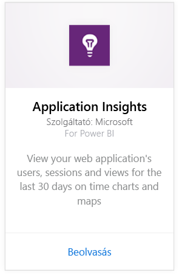
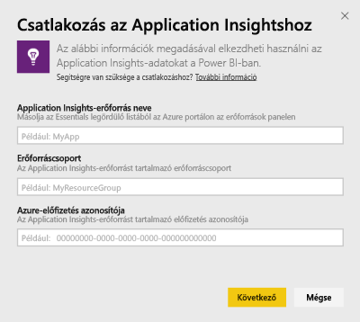
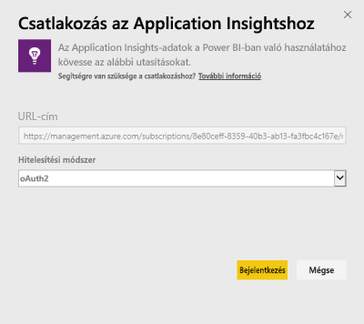
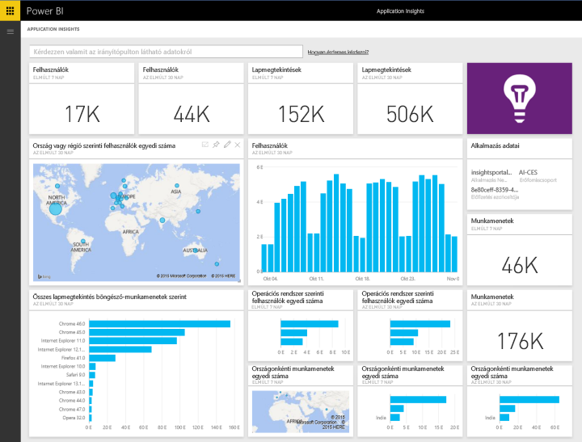
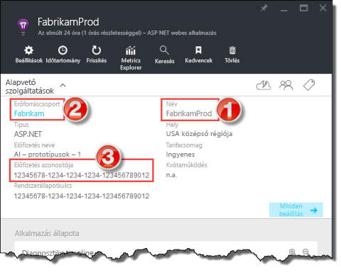
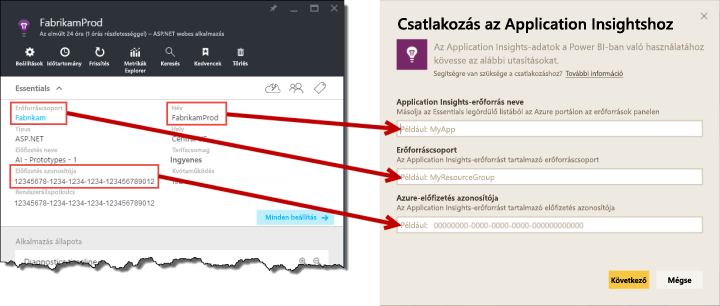

# Csatlakozás az Application Insightshoz Power BI-jal
A Power BI használatával nagyszerű egyéni irányítópultokat hozhat létre az [Application Insights](https://azure.microsoft.com/documentation/articles/app-insights-overview/) telemetriai adataiból. Alkalmazásai telemetriai adatait újszerű módokon jelenítheti meg. Több alkalmazás vagy szolgáltatás mutatóit egyetlen irányítópulton egyesítheti. Az Application Insights-hoz készült Power BI tartalomcsomagnak ez az első kiadása. Olyan általánosan elterjedt, használati metrikákkal kapcsolatos widgeteket tartalmaz, mint például az aktív felhasználók száma, oldalmegtekintések, munkamenetek, böngésző- és operációsrendszer-verziók, valamint a felhasználók földrajzi eloszlása egy térképen.

Csatlakozzon a [Power BI-hoz készített Application Insights tartalomcsomaghoz](https://app.powerbi.com/getdata/services/application-insights).

>[!NOTE]
>Ez az integrációs mód már **elavult**. Ha többet szeretne megtudni az Application Insights Power BI-hoz való csatlakoztatásáról, használja az [elemzési lekérdezés exportálása funkciót](https://docs.microsoft.com/azure/application-insights/app-insights-export-power-bi#export-analytics-queries).

## Csatlakozás
1. Kattintson az **Adatok lekérése** elemre a bal oldalon lévő navigációs ablaktábla alján.
   
    
2. A **Szolgáltatások** mezőben kattintson a **Beolvasás** gombra.
   
    
3. Kattintson az **Application Insights** > **Letöltés most** lehetőségre.
   
    
4. Adja meg annak az alkalmazásnak az adatait az **Application Insights Resource name** (Application Insights-erőforrás neve), a **Resource Group** (Erőforráscsoport) és a **Subscription** (Előfizetés azonosító) paramétereknél, amelyhez csatlakozni szeretne. Ha ezzel kapcsolatban további információra van szüksége, tekintse át alább az [Application Insights paraméterek megkeresése](#FindingAppInsightsParams) részt.
   
        
5. Kattintson a **Sign In** (Bejelentkezés) lehetőségre, majd a csatlakozáshoz kövesse a képernyőn olvasható lépéseket.
   
    
6. Az importálás automatikusan megkezdődik. Amikor befejeződik, megjelenik egy értesítés, a navigációs ablaktáblán pedig megjelenik egy új irányítópult, jelentés és modell, egy csillaggal jelölve.  Az importált adatok megtekintéséhez válassza ki az irányítópultot.
   
    

**Hogyan tovább?**

* [Kérdéseket tehet fel a Q&A mezőben](consumer/end-user-q-and-a.md) az irányítópult tetején.
* [Módosíthatja az irányítópult csempéit](service-dashboard-edit-tile.md).
* [Kiválaszthatja valamelyik csempét](consumer/end-user-tiles.md) a mögöttes jelentés megnyitásához.
* Noha az adatkészlet napi frissítésre van ütemezve, módosíthatja a frissítési ütemezést, vagy igény szerint frissíthet az **Azonnali frissítés** gombbal.

## Tartalom
Az Application Insights tartalomcsomag a következő táblákat és metrikákat tartalmazza:  

    ´´´
    - ApplicationDetails  
    - UniqueUsersLast7Days   
    - UniqueUsersLast30Days   
    - UniqueUsersDailyLast30Days  
    - UniqueUsersByCountryLast7Days  
    - UniqueUsersByCountryLast30Days   
    - PageViewsDailyLast30Days   
    - SessionsLast7Days   
    - SessionsLast30Days  
    - PageViewsByBrowserVersionDailyLast30Days   
    - UniqueUsersByOperatingSystemLast7Days   
    - UniqueUsersByOperatingSystemLast30Days    
    - SessionsDailyLast30Days   
    - SessionsByCountryLast7Days   
    - SessionsByCountryLast30Days   
    - PageViewsByCountryDailyLast30Days  
    ´´´ 

## Paraméterek helye
Mind a Resource Name (Erőforrás neve), mind a Resource Group (Erőforráscsoport) és a Subscription ID (Előfizetés azonosítója) megtalálhatók az Azure Portalon. Ha a névre (Name) kattint, a rendszer megjelenít egy részteles nézetet, és az „Essentials” (Alapvető erőforrások) legördülő listából kikeresheti azokat az értékeket, amelyekre szüksége van.

Másolja ki és illessze be a használni kívánt értékeket a Power BI-hoz beadandó mezőkbe:

## Következő lépések
[Első lépések a Power BI-ban](service-get-started.md)

[Adatok lekérése a Power BI-ban](service-get-data.md)

