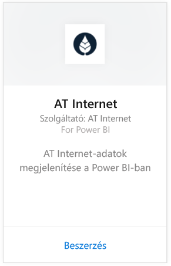
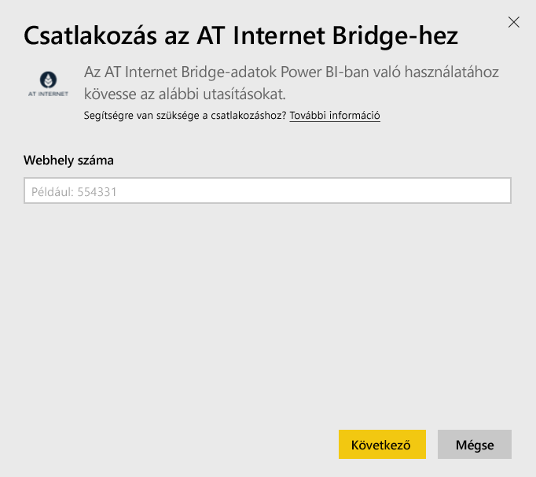
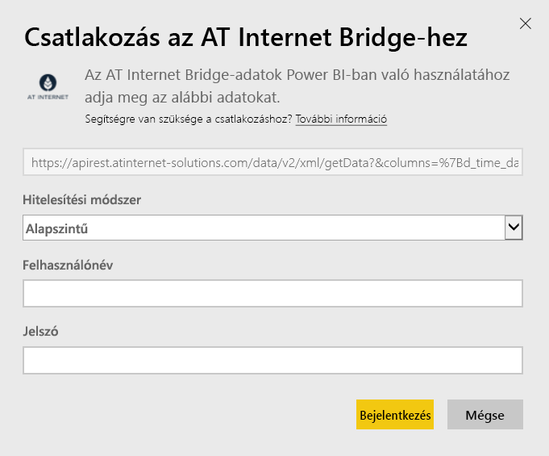

# Csatlakozás az AT Internet Bridge-hez Power BI-jal
Az AT Internet digitális analitikus platformját, az Analytics Suite-ot használva azonnal értékes információkhoz juthat adataiból. A Power BI-hoz készített AT Internet Bridge tartalomcsomag webhelyéhez használható adatlátogatásokat, forrásokat, honosításokat és eszközöket tartalmaz.

Csatlakozzon a [Power BI-hoz készült AT Internet Bridge tartalomcsomaghoz](https://app.powerbi.com/getdata/services/at-internet-bridge).

## Csatlakozás módja
1. Kattintson az **Adatok lekérése** elemre a bal oldalon lévő navigációs ablaktáblán.
   
    
2. A **Szolgáltatások** mezőben válassza a **Beolvasás** lehetőséget.
   
    
3. Válassza az **AT Internet Bridge** \> **Letöltés most** lehetőséget.
   
   
4. Adja meg annak az AT Internet webhelynek a számát, amelyhez kapcsolódni szeretne.
   
   
5. Hitelesítési módszerként válassza a **Basic** (Alapszintű) lehetőséget, adja meg AT Internethez használt felhasználónevét és jelszavát, majd kattintson a **Bejelentkezés** lehetőségre.
   
   
6. Az importálás megkezdéséhez kattintson a **Csatlakozás** lehetőségre. Ha a csatlakozás létrejött, a Navigációs ablaktáblán megjelenik egy új irányítópult, jelentés és modell. Az importált adatok megtekintéséhez válassza ki az irányítópultot.
   
    

**Hogyan tovább?**

* [Tegyen fel egy kérdést a Q&A mezőben](service-q-and-a.md), ami az irányítópult tetején található
* [Módosítsa a csempéket](service-dashboard-edit-tile.md) az irányítópulton.
* [Kattintson egy csempére](service-dashboard-tiles.md) az alapjául szolgáló jelentés megtekintéséhez.
* Az adatkészlet naponta frissül, de módosíthatja a frissítési ütemezést, és bármikor frissíthet igény szerint is a **Frissítés** lehetőségre kattintva

## A csomag tartalma
Ez a tartalomcsomag az elmúlt 45 nap adatait tartalmazza az alábbi táblákban:  

    - Conversion (Konverzió)  
    - Devices (Eszközök)  
    - Localization (Honosítás)  
    - Sources (Források)  
    - Global Visits (Globális látogatások)  

## Következő lépések
[Power BI ‒ első lépések](service-get-started.md)

[Power BI – Alapfogalmak](service-basic-concepts.md)

