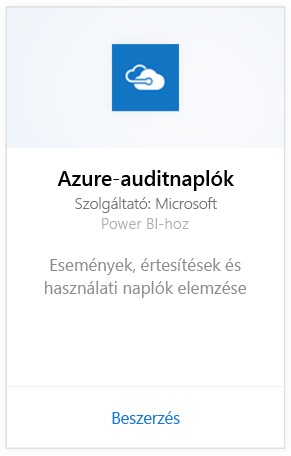
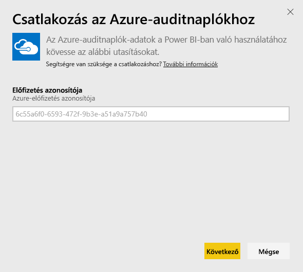
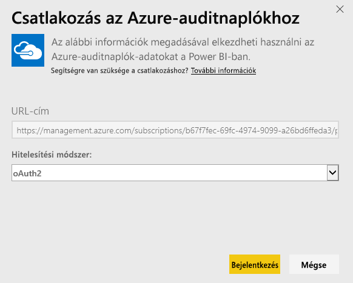
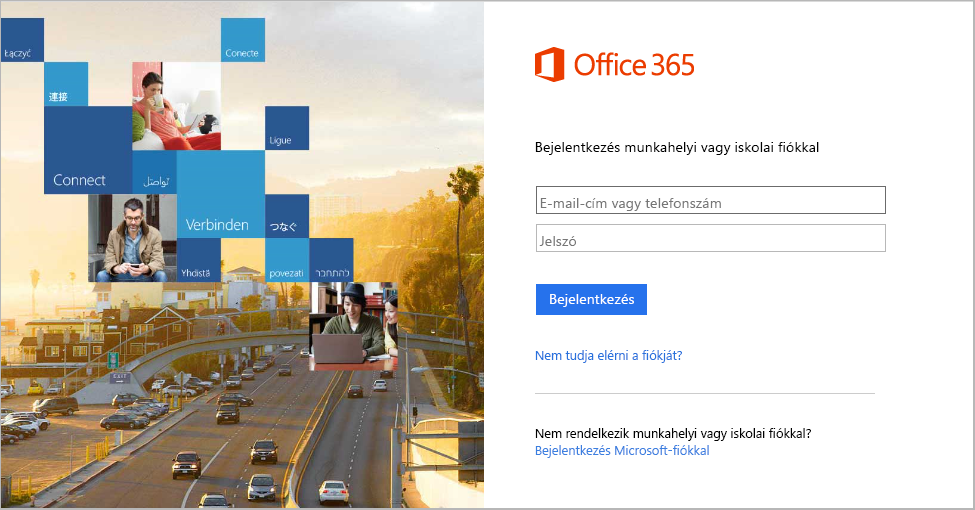
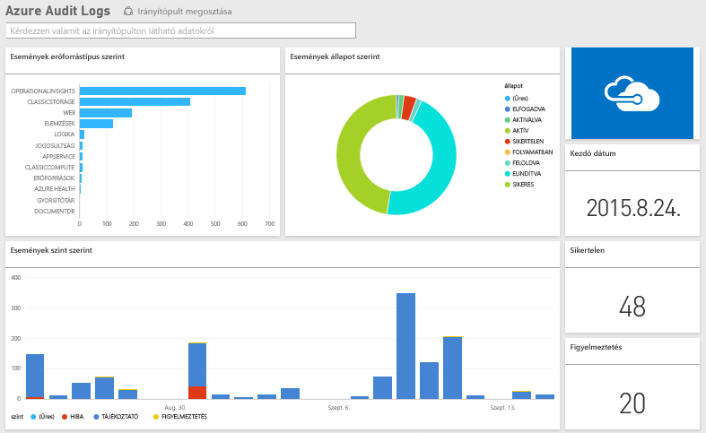

# Kapcsolódás Azure-auditnaplókhoz a Power BI-jal
Az Azure-auditnaplók tartalomcsomagjával elemezheti és vizualizálhatja az auditnaplókban tárolt információt. A Power BI lekéri az adatait, előregyártott irányítópultot készít, és jelentéseket hoz létre az adatok alapján.

[Kapcsolódjon az Azure-auditnaplók tartalomcsomaghoz](https://app.powerbi.com/getdata/services/azure-audit-logs), vagy olvasson továbbiakat az [Azure-auditnaplók és a Power BI integrációjáról](https://powerbi.microsoft.com/integrations/azure-audit-logs).

## A csatlakozás menete
1. A bal oldali navigációs ablaktábla alján kattintson az **Adatok lekérése** elemre.  
   
    
2. A **Szolgáltatások** mezőben kattintson a **Beolvasás** gombra.  
   
     
3. Kattintson az **Azure-auditnaplók** > **Beolvasás** gombra.  
   
   
4. Amikor az alkalmazás kéri, adja meg az **Azure-beli előfizetés-azonosítóját**. Az [előfizetés-azonosító](#FindingParams) megkereséséről az alábbiakban olvashat részletesen.   
   
    
5. A **Hitelesítési módszer** beállításánál válassza az **oAuth2** \> **Bejelentkezés** lehetőséget.
   
    
6. A bejelentkezési folyamat befejezéséhez adja meg a fiók hitelesítő adatait.
   
    
7. A Power BI le fogja tölteni az Azure-auditnapló adatait, és használatra kész irányítópultot és jelentést hoz létre. 
   
    

**Hogyan tovább?**

* [Kérdéseket tehet fel a Q&A mezőben](power-bi-q-and-a.md) az irányítópult tetején.
* [Módosíthatja az irányítópult csempéit](service-dashboard-edit-tile.md).
* [Kiválaszthatja valamelyik csempét](service-dashboard-tiles.md) a mögöttes jelentés megnyitásához.
* Noha az adatkészlet napi frissítésre van ütemezve, módosíthatja a frissítési ütemezést, vagy igény szerint frissíthet az **Azonnali frissítés** gombbal.

## Rendszerkövetelmények
Az Azure-auditnaplók tartalomcsomagnak hozzáférésre van szüksége az auditnaplókhoz az Azure Portalon. A részleteket [itt](https://azure.microsoft.com/documentation/articles/insights-debugging-with-events/) találja.

## Paraméterek keresése
Az előfizetés-azonosítót két egyszerű módon találhatja meg.

1. A https://portal.azure.com helyről -&gt; Tallózás -&gt; Előfizetések -&gt; Előfizetés-azonosító
2. A https://manage.windowsazure.com helyről -&gt; Beállítások -&gt; Előfizetési azonosító

Az előfizetés-azonosító egy hosszú betű- és számsor, ami a fenti \#4. lépésben láthatóhoz hasonlít. 

## Hibaelhárítás
Ha hitelesítési hibát tapasztal vagy frissítési próbálkozáskor érvénytelen hitelesítő adatok miatti hibát, akkor próbálja törölni az Azure-auditnaplók tartalomcsomag összes példányát, és próbáljon újrakapcsolódni.

## Következő lépések
[Első lépések a Power BI-ban](service-get-started.md)  
[Power BI – Alapfogalmak](service-basic-concepts.md)  

