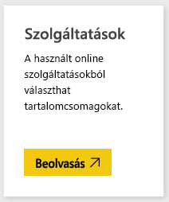
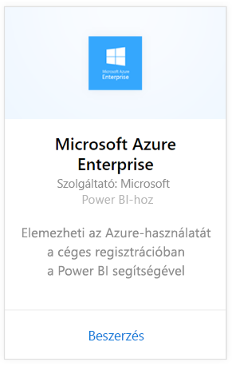
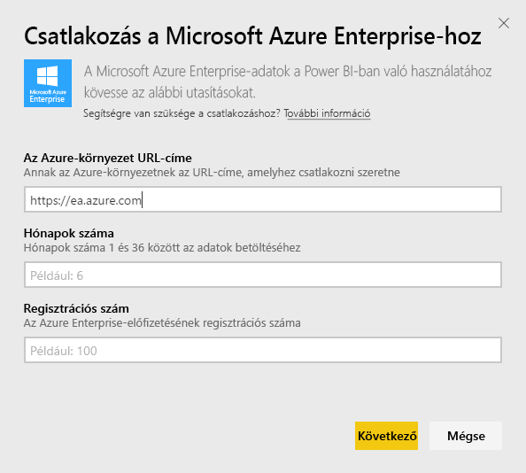
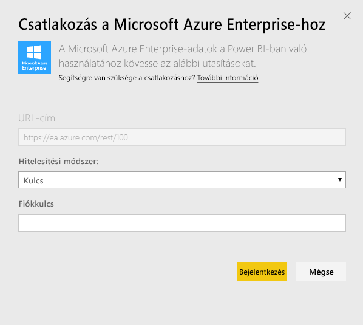
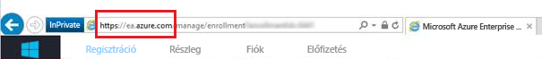
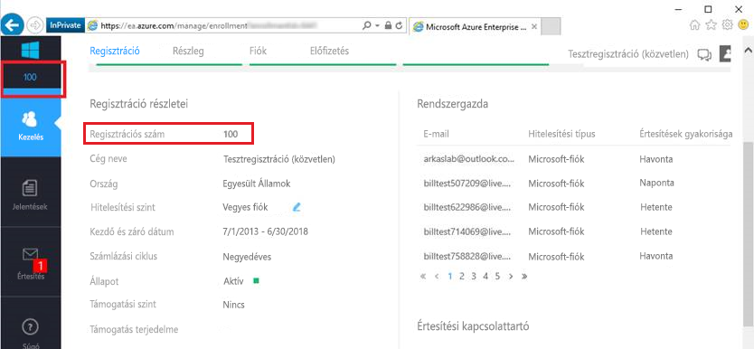
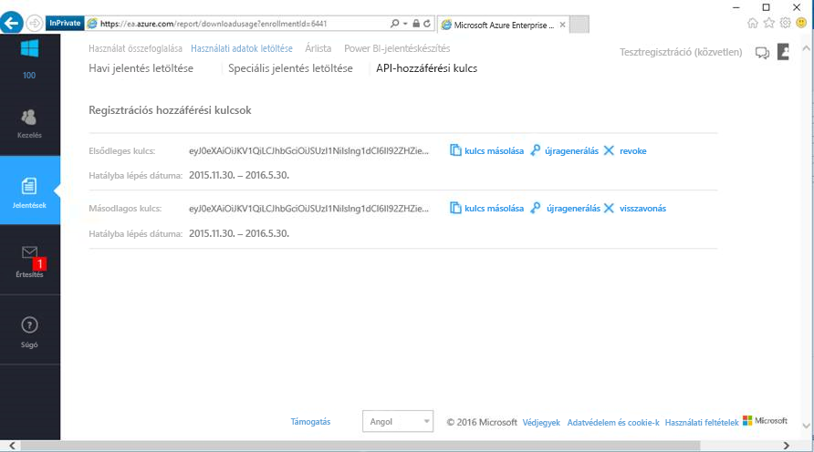

# Csatlakozás a Microsoft Azure Enterprise-hoz a Power BI használatával
A Power BI-tartalomcsomag segítségével a Power BI-ban vizsgálhatja és figyelheti Microsoft Azure Enterprise-beli adatait. Az adatok naponta egyszer automatikusan frissülnek.

Csatlakozás a [Microsoft Azure Enterprise-tartalomcsomaghoz](https://app.powerbi.com/getdata/services/azure-enterprise) a Power BI használatával.

## A csatlakozás menete
1. A bal oldali navigációs ablaktábla alján kattintson az **Adatok lekérése** elemre.
   
    
2. A **Szolgáltatások** mezőben válasza a **Beolvasás** elemet.
   
   
3. Kattintson a **Microsoft Azure Enterprise** \> **Beolvasás** elemre.
   
   
4. Adja meg az Azure-környezet URL-címét, az Azure Enterprise regisztrációs számát, és azt, hogy hány havi adatot kíván importálni. Az Azure-környezet URL-címe `https://ea.azure.com` vagy `https://ea.windowsazure.cn`. A [paraméterek megkereséséről](#FindingParams) alább olvashat részletesebben.
   
    
5. A csatlakozáshoz adja meg a hozzáférési kulcsát. A beléptetési kulcs az Azure EA Portalon található.
   
    
6. Az importálási folyamat automatikusan megkezdődik. Ha befejeződött, a navigációs panelen megjelenik egy új irányítópult, jelentés és modell. Válassza ki az irányítópultot az importált adatok megtekintéséhez.
   
   

**Mi a következő lépés?**

* [Kérdéseket tehet fel a Q&A mezőben](power-bi-q-and-a.md) az irányítópult tetején.
* [Módosíthatja az irányítópult csempéit](service-dashboard-edit-tile.md).
* [Kiválaszthatja valamelyik csempét](service-dashboard-tiles.md) a mögöttes jelentés megnyitásához.
* Noha az adatkészlet napi frissítésre van ütemezve, módosíthatja a frissítési ütemezést, vagy igény szerint frissíthet az **Azonnali frissítés** gombbal.

## A csomag tartalma
Az Azure Enterprise-tartalomcsomag havi adatjelentéseket nyújt a kapcsolódási folyamat során megadott hónapok időtartamára. A tartomány változó időintervalluma miatt az adatkészlet frissülésével a benne foglalt adatok is frissülnek.

## Rendszerkövetelmények
A tartalomcsomag használatához hozzáférés szükséges a Vállalati szolgáltatásokhoz az Azure Portalon.

## Paraméterek helye
A Power BI-jelentések készítése olyan közvetlen, partneri és közvetett vállalati szerződéssel rendelkező ügyfelek számára elérhető, akik meg tudják tekinteni a számlázási adatokat. A kapcsolódási folyamathoz szükséges értékek megkereséséről alább tájékozódhat.

**Az Azure-környezet URL-címe**

* Ez általában a https://ea.azure.com, de bejelentkezéskor ellenőrizheti a megjelenő URL-címet.
  
    

**Hónapok száma**

* Egy 1 és 36 közötti szám, amely az importálni kívánt hónapok száma (a mai naptól számítva).

**Beléptetési szám**

* Ez az Azure Enterprise beléptetési száma, amely az [Azure Enterprise Portal](https://ea.azure.com/) kezdőképernyőjén, a „Regisztráció részletei” felületen található.
  
    

**Hozzáférési kulcs**

* A hozzáférési kulcs az Azure Enterprise portálon a „Használati adatok letöltése” > „API hozzáférési kulcsa” alatt található.
  
    

**További segítség**

* Az Azure Enterprise Power BI csomag telepítésével kapcsolatos további segítségért jelentkezzen be az Azure Enterprise Portalra, és tekintse meg az API súgófájlját a „Súgó” felületen, valamint a további utasításokat a Jelentések -> Használati adatok letöltése -> API hozzáférési kulcsa alatt.

## Következő lépések
[Első lépések a Power BI-ban](service-get-started.md)

[Adatok lekérése a Power BI-ban](service-get-data.md)

