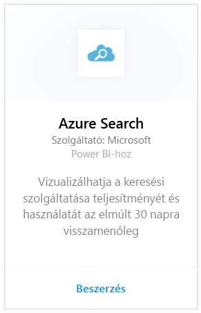
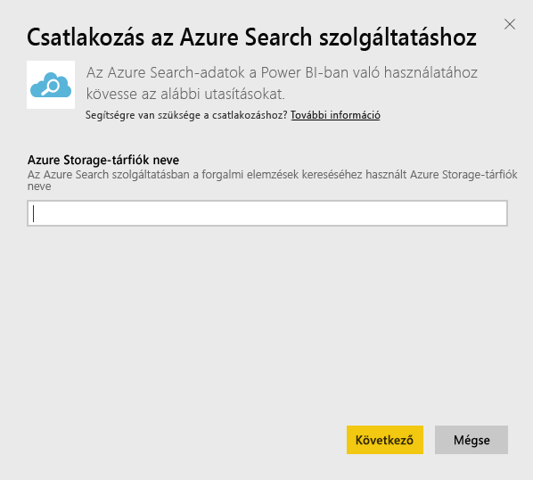
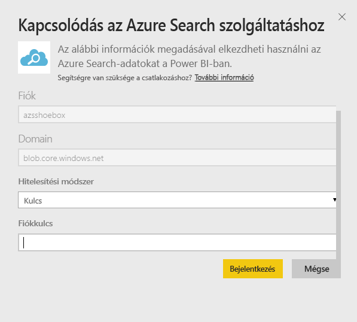
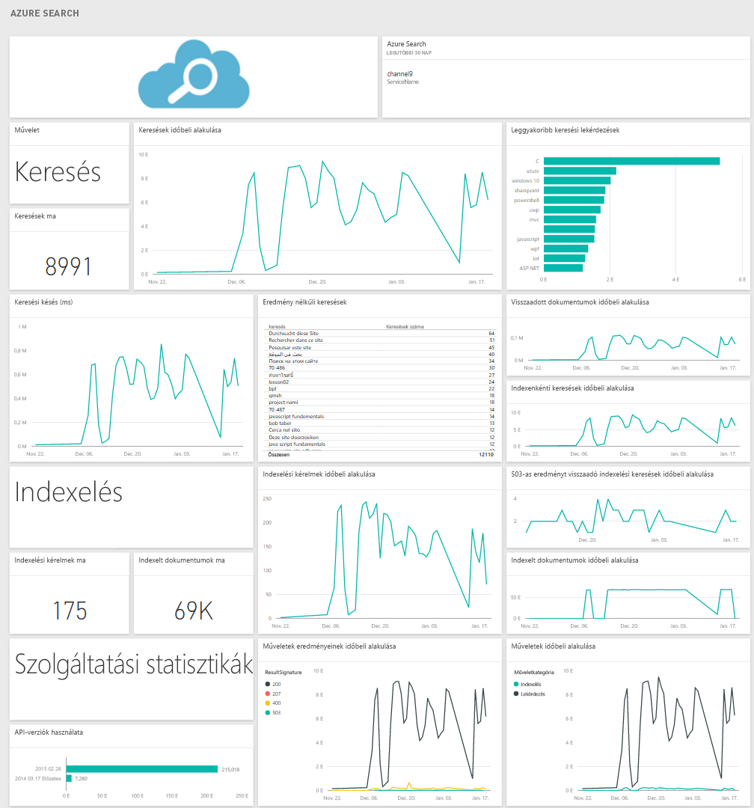

# Kapcsolódás az Azure Search szolgáltatáshoz a Power BI-jal
Az Azure Search Forgalomelemzés funkciójával monitorozható és értelmezhető az Azure Search szolgáltatáshoz beérkező forgalom. A Power BI-hoz készült Azure Search-tartalomcsomag segítségével részletes információk szerezhetők a keresési adatok alapján az elmúlt 30 napra visszamenőleg (a keresésről, az indexelésről, a szolgáltatás statisztikáiról és a késésről). Az [Azure blog bejegyzésében](https://azure.microsoft.com/blog/analyzing-your-azure-search-traffic/) további részletek olvashatók.

Kapcsolódjon a Power BI-hoz készült [Azure Search-tartalomcsomaghoz](https://app.powerbi.com/getdata/services/azure-search).

## A kapcsolódás menete
1. A bal oldali navigációs ablaktábla alján kattintson az **Adatok lekérése** elemre.
   
    
2. A **Szolgáltatások** keretben kattintson a **Beolvasás** elemre.
   
    
3. Válassza az **Azure Search** \> **Beolvasás** elemet.
   
   
4. Adja meg annak a Table Storage-fióknak a nevét, amely az Azure Search-elemzést tárolja.
   
   
5. Hitelesítési mechanizmusként válassza a **Kulcs** lehetőséget, majd adja meg a Storage-fiók kulcsát. Kattintson a **Bejelentkezés** gombra. Ennek hatására elkezdődik a betöltés.
   
   
6. Amikor befejeződik a betöltés, a navigációs panelen megjelenik egy új irányítópult, egy új jelentés és egy új modell. Az importált adatok megtekintéséhez válassza az irányítópultot.
   
    

**Mi a következő lépés?**

* [Kérdéseket tehet fel a Q&A mezőben](power-bi-q-and-a.md) az irányítópult tetején.
* [Módosíthatja az irányítópult csempéit](service-dashboard-edit-tile.md).
* [Kiválaszthatja valamelyik csempét](service-dashboard-tiles.md) a mögöttes jelentés megnyitásához.
* Noha az adatkészlet napi frissítésre van ütemezve, módosíthatja a frissítési ütemezést, vagy igény szerint frissíthet az **Azonnali frissítés** gombbal.

## Rendszerkövetelmények
Az Azure Search-tartalomcsomag csak akkor használható, ha az Azure Search Forgalomelemzés engedélyezve van a fiókban.

## Hibaelhárítás
Ellenőrizze, hogy helyesen adta-e meg a Storage-fiók nevét, illetve a teljes hozzáférési kulcsot. A Storage-fiók nevének meg kell egyeznie annak a fióknak a nevével, amelyben az Azure Search Forgalomelemzés konfigurálva van.

## Következő lépések
[A Power BI bemutatása](power-bi-overview.md)

[Power BI – Alapfogalmak](service-basic-concepts.md)

