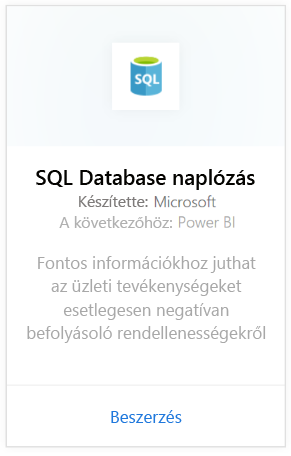
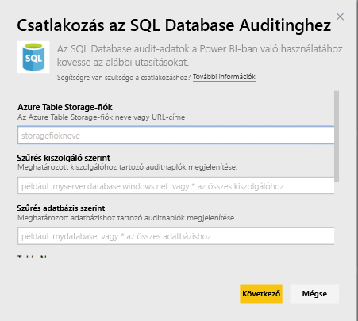
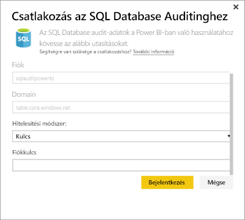
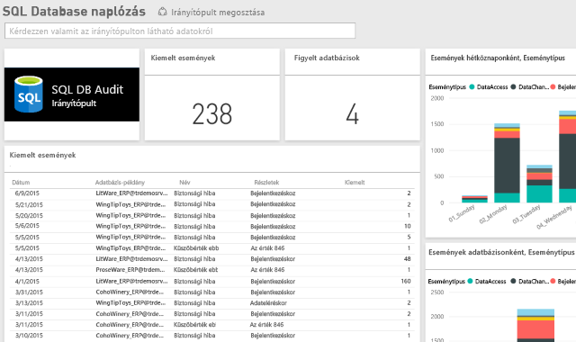

# SQL Database Auditing tartalomcsomag a Power BI-hoz
Az Azure [SQL Database naplózási szolgáltatásához](http://azure.microsoft.com/documentation/articles/sql-database-auditing-get-started/) készült Power BI-tartalomcsomag segít megérteni az adatbázisban zajló tevékenységet, valamint felismerni azokat az ellentmondásokat és anomáliákat, amelyek üzleti aggályokra adhatnak okot, vagy biztonsági szabálysértések gyanúját vethetik fel. 

Kapcsolódjon a Power BI-hoz készült [SQL Database Auditing tartalomcsomaghoz](https://app.powerbi.com/getdata/services/sql-db-auditing).

>[!NOTE]
>A tartalomcsomag importálja minden olyan táblából az adatokat, amelynek a nevében szerepel az „AuditLogs” kifejezés, és hozzáfűzi egyetlen adatmodelltáblához, amelynek „AuditLogs” a neve. Az adatok a legutóbbi 250 ezer eseményt tartalmazzák, és naponta frissülnek.

## A kapcsolódás menete
1. Kattintson az **Adatok lekérése** elemre a bal oldalon lévő navigációs panel alján.
   
    
2. Válassza a Szolgáltatások terület Beolvasás gombját.
   
    
3. Válassza az **SQL Database Auditing** \> **Beolvasás** elemet.
   
   
4. A Csatlakozás a következőhöz: SQL Database Auditing ablakban:
   
   - Adja meg az eseménynaplókat tároló Azure Table Storage-fiók nevét vagy URL-címét.
   
   - Adja meg az Önt érdeklő SQL-kiszolgáló nevét. Ha mindegyik kiszolgáló auditnaplóit be szeretné tölteni, a „\*” értéket írja be.
   
   - Adja meg az Önt érdeklő SQL-adatbázis nevét. Ha mindegyik adatbázis auditnaplóit be szeretné tölteni, a „\*” értéket írja be.
   
   - Adja meg az Önt érdeklő eseménynaplókat tartalmazó Azure-tábla nevét. Ha minden olyan tábla auditnaplóit be szeretné tölteni, amelynek a nevében szerepel az „AuditLogs” kifejezés, a „\*” értéket írja be.
   
   >[!IMPORTANT]
   >Azt javasoljuk, hogy mindig írja be egy konkrét tábla nevét még akkor is, ha egyetlen tábla tárol minden auditnaplót, mert így gyorsabb működést érhet el.
   
   - Adja meg, hogy melyik naptól kezdődően érdeklik az auditnaplók. Ha alsó időkorlát nélkül szeretné betölteni az auditnaplókat, a „\*” értéket adja meg, ha a legutóbbi nap auditnaplóit, akkor az „1d” értéket.
   
   - Adja meg, hogy melyik nappal bezárólag érdeklik az auditnaplók. Ha felső időkorlát nélkül szeretné betölteni az auditnaplókat, a „\*” értéket adja meg.
   
   
5. Hitelesítési módszerként válassza a **Kulcs** lehetőséget, adja meg a **Fiókkulcs** értékét, majd válassza a \> **Bejelentkezés** elemet.
   
   
6. Miután a Power BI importálta az adatokat, a bal oldali navigációs ablaktáblán megjelenik egy új irányítópult, egy új jelentés és egy új adatkészlet. Az új elemeket sárga csillag \* jelöli.
   
   

**Hogyan tovább?**

* [Kérdéseket tehet fel a Q&A mezőben](power-bi-q-and-a.md) az irányítópult tetején.
* [Módosíthatja az irányítópult csempéit](service-dashboard-edit-tile.md).
* [Kiválaszthatja valamelyik csempét](service-dashboard-tiles.md) a mögöttes jelentés megnyitásához.
* Az adatkészlet az ütemezés szerint naponta frissül, de módosíthatja a frissítési ütemezést, vagy igény szerint bármikor frissíthet az **Azonnali frissítés** elemre kattintva

## Következő lépések
[Adatbeolvasás a Power BI szolgáltatásban](service-get-data.md)
[Bevezetés a Power BI használatába](service-get-started.md)
