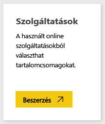
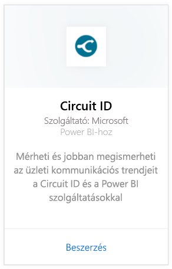
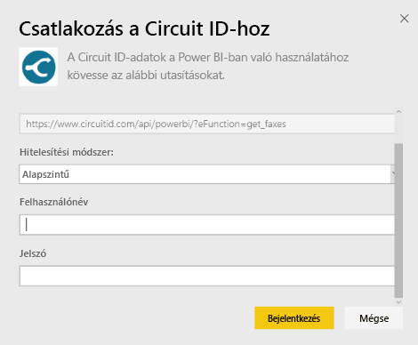
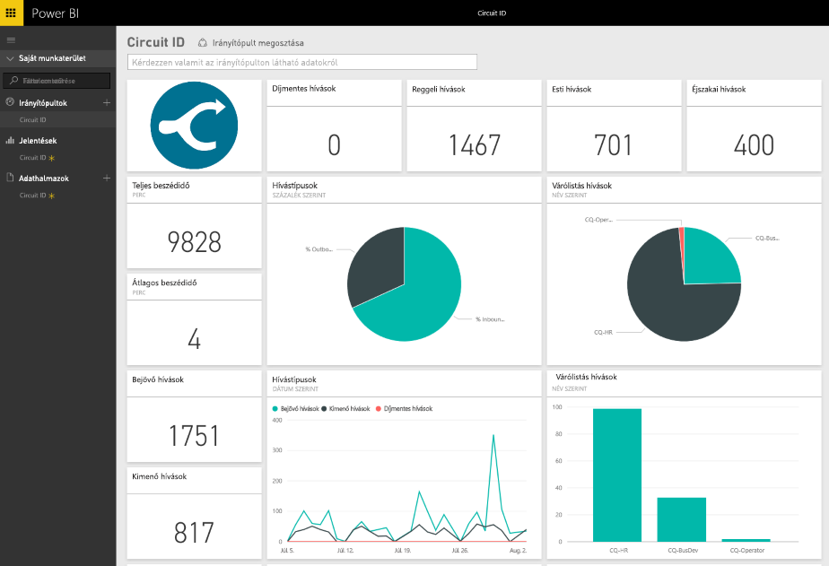

# Kapcsolódás a Circuit ID-hoz a Power BI segítségével
A Power BI megkönnyíti a Circuit ID-ról származó kommunikációs adatok elemzését. A Power BI a lekért adatok alapján összeállít egy alapértelmezett irányítópultot, és jelentéseket hoz létre az adatokból. A kapcsolat létrehozása után elemezheti az adatokat, és testre szabhatja az irányítópultot a saját igényei szerint. Az adatok naponta automatikusan frissülnek.

Kapcsolódjon a Power BI-hoz készült [Circuit ID-tartalomcsomaghoz](https://app.powerbi.com/getdata/services/circuitid).

## A kapcsolódás menete
1. A bal oldali navigációs ablaktábla alján kattintson az **Adatok lekérése** elemre.
   
    
2. A **Szolgáltatások** mezőben válasza a **Beolvasás** elemet.
   
    
3. Kattintson a **Circuit ID** \> **Beolvasás** elemre.
   
    
4. Hitelesítési módszerként válassza a Alapszintű elemet, majd adja meg a felhasználónevét és a jelszavát. Kattintson a Bejelentkezés gombra.
   
    
5. Miután a Power BI importálta az adatokat, a bal oldali navigációs panelen megjelenik az új irányítópult és adatkészlet. Az új elemeket sárga csillag jelzi.
   
    

**Hogyan tovább?**

* [Kérdéseket tehet fel a Q&A mezőben](power-bi-q-and-a.md) az irányítópult tetején.
* [Módosíthatja az irányítópult csempéit](service-dashboard-edit-tile.md).
* [Kiválaszthatja valamelyik csempét](service-dashboard-tiles.md) a mögöttes jelentés megnyitásához.
* Az adatkészlet az ütemezés szerint naponta frissül, de módosíthatja a frissítési ütemezést, vagy igény szerint bármikor frissíthet az **Azonnali frissítés** elemre kattintva

## Következő lépések
[Mi az a Power BI?](power-bi-overview.md)

[Power BI – Adatok lekérése](service-get-data.md)

