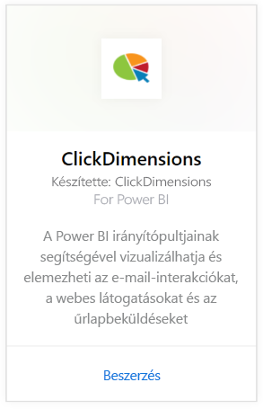
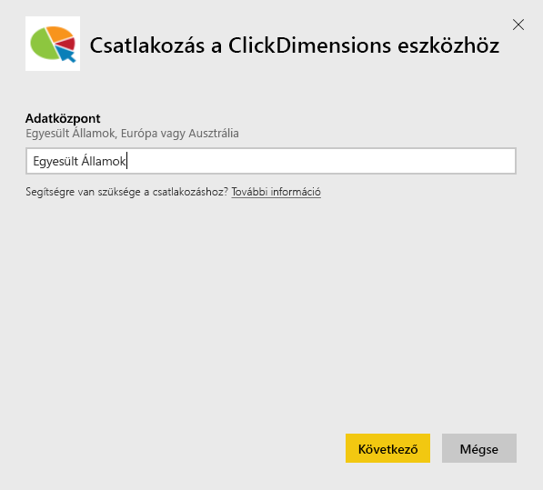
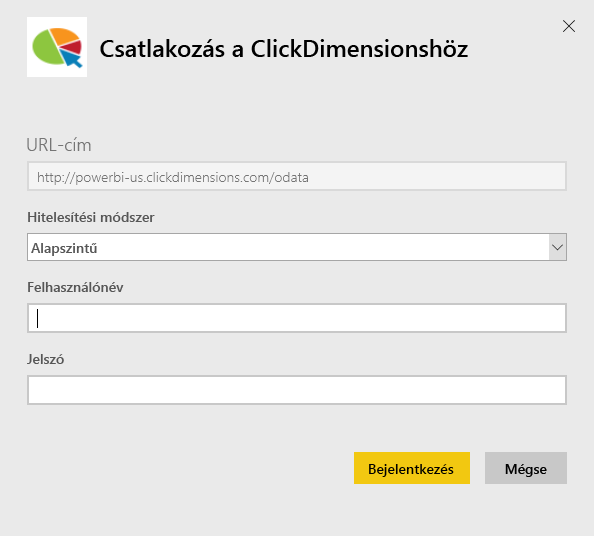
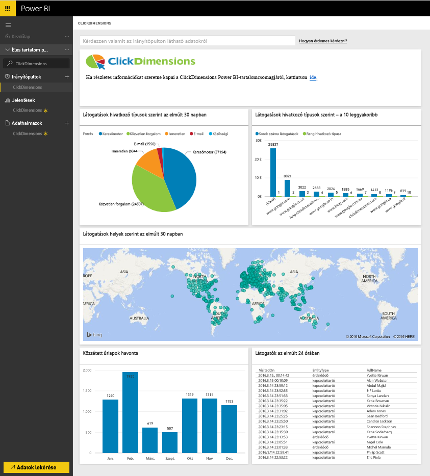
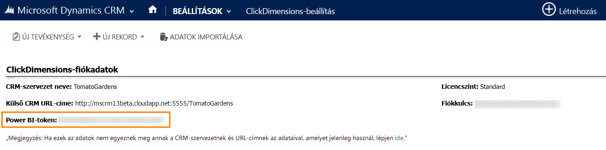

# Csatlakozás a ClickDimensions eszközhöz a Power BI-ban
A Power BI-hoz készült ClickDimensions tartalomcsomag lehetővé teszi, hogy a felhasználók a ClickDimensions marketingadataival dolgozhassanak a Power BI-ban, és további elemzéseket nyújt a vezetői csoportoknak a marketingmunka és az értékesítések elemzéséhez. A Power BI irányítópultjainak és jelentéseinek segítségével vizualizálhatja és elemezheti az e-mail-interakciókat, a webes látogatásokat és az űrlapbeküldéseket.

Csatlakozzon a Power BI-hoz készült [ClickDimensions tartalomcsomaghoz](https://app.powerbi.com/getdata/services/click-dimensions).

## A csatlakozás menete
1. A bal oldali navigációs ablaktábla alján kattintson az **Adatok lekérése** elemre.
   
   
2. A **Szolgáltatások** mezőben kattintson a **Beolvasás** elemre.
   
   
3. Kattintson a **ClickDimensions** \> **Beolvasás** elemre.
   
   
4. Adja meg az adatközpontja helyét (Egyesült Államok, Európa vagy Ausztrália), és kattintson a **Tovább** elemre.
   
   
5. A **Hitelesítési módszer** beállításánál kattintson az **Alapszintű** \> **Bejelentkezés** elemre. Amikor a rendszer kéri, adja meg a ClickDimensions eszközben használt hitelesítő adatait. A [paraméterek megkereséséről](#FindingParams) alább olvashat részletesebben
   
    
6. A jóváhagyás után automatikusan megkezdődik az importálás. Ha befejeződött, a navigációs panelen megjelenik egy új irányítópult, jelentés és modell. Válassza ki az irányítópultot az importált adatok megtekintéséhez.
   
     

**Mi a következő lépés?**

* [Kérdéseket tehet fel a Q&A mezőben](power-bi-q-and-a.md) az irányítópult tetején.
* [Módosíthatja az irányítópult csempéit](service-dashboard-edit-tile.md).
* [Kiválaszthatja valamelyik csempét](service-dashboard-tiles.md) a mögöttes jelentés megnyitásához.
* Noha az adatkészlet napi frissítésre van ütemezve, módosíthatja a frissítési ütemezést, vagy igény szerint frissíthet az **Azonnali frissítés** gombbal.

## Rendszerkövetelmények
A Power BI-hoz történő csatlakozáshoz meg kell adnia a fiókjához tartozó adatközpontot, és be kell jelentkeznie a ClickDimensions-fiókjával. Ha nem tudja pontosan, hogy melyik adatközpontot kell megadnia, forduljon a rendszergazdához.

## Paraméterek keresése
A fiókkulcs a CRM Beállítások \> ClickDimensions Beállítások helyen található. Másolja ki a fiókkulcsot a ClickDimensions Beállítások helyről, és illessze be a Felhasználónév mezőbe.  

  

Másolja ki a Power BI-jogkivonatot a ClickDimensions Beállítások helyről, és illessze be a Jelszó mezőbe. A Power BI-jogkivonat a CRM Beállítások \> ClickDimensions Beállítások helyen található.  

  

## Következő lépések
[Első lépések a Power BI-ban](service-get-started.md)

[Adatok lekérése a Power BI-ban](service-get-data.md)

