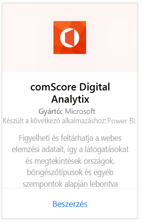
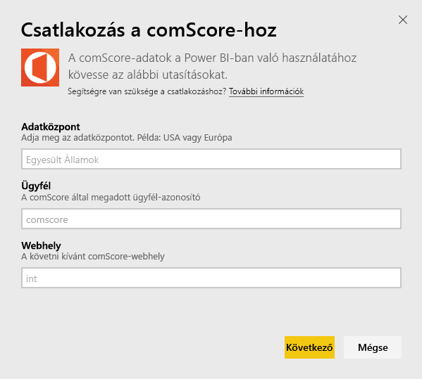
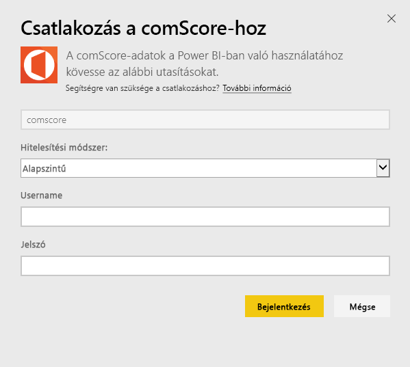
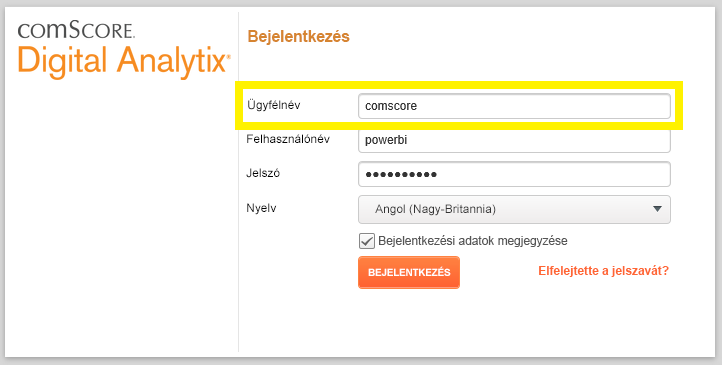
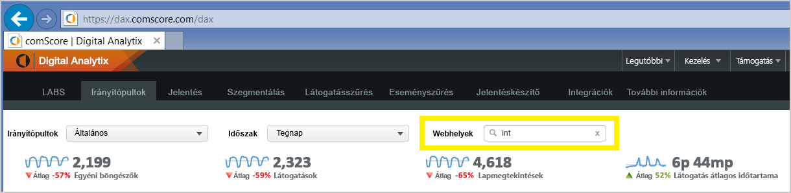

# Csatlakozás a comScore Digital Analytix eszközhöz a Power BI használatával
A Power BI-tartalomcsomag segítségével a Power BI-ban jelenítheti meg és elemezheti a comScore Digital Analytix adatait. Az adatok naponta egyszer automatikusan frissülnek.

Csatlakozzon a [Power BI-hoz készült comScore-tartalomcsomaghoz.](https://app.powerbi.com/getdata/services/comscore)

>[!NOTE]
>A tartalomcsomaghoz történő csatlakozáshoz szüksége van egy comScore DAx felhasználói fiókra, valamint hozzáféréssel kell rendelkeznie a comScore API-hoz. A [részleteket](#Requirements) alább találja.

## A csatlakozás menete
1. Válassza az Adatok lekérése elemet a bal oldalon lévő navigációs ablaktábla alján.
   
   
2. A **Szolgáltatások** mezőben válasza a **Beolvasás** elemet.
   
   
3. Kattintson a **comScore Digital Analytix** \> **Get** elemre.
   
   
4. Adja meg az adatközpontot, a comScore ügyfél-azonosítót és azt a webhelyet, amelyhez kapcsolódni szeretne. A felsorolt adatok megtalálásáról lejjebb, a [comScore-paraméterek keresése](#FindingParams) részben tájékozódhat.
   
   
5. A csatlakozáshoz adja meg comScore-felhasználónevét és -jelszavát. Az adat megtalálásáról lejjebb tájékozódhat.
   
   
6. Az importálási folyamat automatikusan elindul. Ha befejeződött, a navigációs panelen megjelenik egy új irányítópult, jelentés és modell. Válassza ki az irányítópultot az importált adatok megtekintéséhez.

**Mi a következő lépés?**

* [Kérdéseket tehet fel a Q&A mezőben](power-bi-q-and-a.md) az irányítópult tetején.
* [Módosíthatja az irányítópult csempéit](service-dashboard-edit-tile.md).
* [Kiválaszthatja valamelyik csempét](service-dashboard-tiles.md) a mögöttes jelentés megnyitásához.
* Noha az adatkészlet napi frissítésre van ütemezve, módosíthatja a frissítési ütemezést, vagy igény szerint frissíthet az **Azonnali frissítés** gombbal.

## Rendszerkövetelmények
A kapcsolódáshoz comScore DAx felhasználói fiókkal és comScore DAx API-hoz való hozzáféréssel kell rendelkeznie. Kérjük, forduljon a comScore DAx-rendszergazdához a fiók megerősítéséhez.

## Paraméterek keresése
Az alábbiakban olvashatók a comScore-paraméterek megkereséséhez szükséges információk.

**Adatközpont**

A csatlakoztatott adatközpontot a comScore-ból elért URL-cím határozza meg.

Ha a https://dax.comscore.com címet használja, az „US”, ha a https://dax.comscore.eu címet használja, az „EU” értéket kell megadnia.

 

**Ügyfél**

Az Ügyfél ugyanaz, mint amit a comScore DAx szolgáltatásba történő bejelentkezéskor ad meg.

 

**Webhely**

A comScore-webhely azt határozza meg, hogy melyik webhelyről érkező adatokat kívánja megtekinteni. A comScore-fiókból elérheti a webhelyek listáját.

## További lépések
[Első lépések a Power BI-ban](service-get-started.md)

[Adatok lekérése a Power BI-ban](service-get-data.md)

