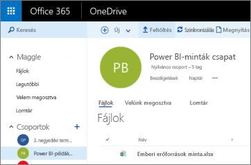
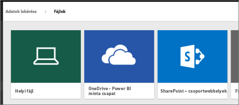
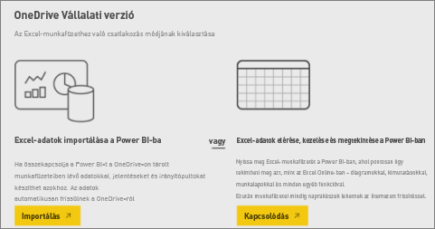
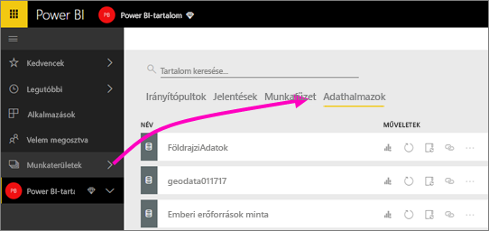
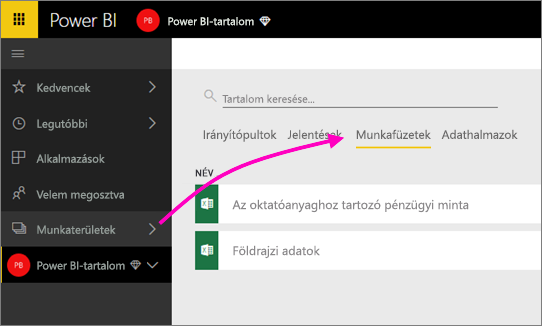

# Csatlakozás a Power BI alkalmazás munkaterületéhez tartozó OneDrive-ban tárolt fájlokhoz
Miután [létrehozott egy alkalmazás-munkaterületet a Power BI-ban](consumer/end-user-create-apps.md), a Power BI alkalmazás-munkaterülethez tartozó OneDrive Vállalati verzióban tárolhatja az Excel-, CSV-, és Power BI Desktop-fájlokat. A OneDrive-ban tárolt fájlokat továbbra is frissítheti, a frissítések pedig automatikusan megjelennek a fájlokon alapuló Power BI-jelentésekben és irányítópultokon. 

> [!NOTE]
> Az új munkaterületi felhasználói felület előzetes verziójában megváltozik a Power BI-munkaterületek és az Office 365-csoportok közötti kapcsolat. A rendszer nem fog automatikusan létrehozni Office 365-csoportokat minden alkalommal, amikor egy új munkaterület jön létre. További információ az [új munkaterületek létrehozásáról (előzetes verzió)](service-create-the-new-workspaces.md)

A fájlokat két lépésben adhatja hozzá az alkalmazás-munkaterülethez: 

1. Az első lépésben [töltse fel a fájlokat a OneDrive Vállalati verzióba](service-connect-to-files-in-app-workspace-onedrive-for-business.md#1-upload-files-to-the-onedrive-for-business-for-your-app-workspace) az alkalmazás-munkaterület számára.
2. A második lépésben [csatlakozzon a fájlokhoz a Power BI-ból](service-connect-to-files-in-app-workspace-onedrive-for-business.md#2-import-excel-files-as-datasets-or-as-excel-online-workbooks).

> [!NOTE]
> Az alkalmazás-munkaterületek csak a [Power BI Proban](service-free-vs-pro.md) érhetők el.
> 
> 

## 1 Fájlok feltöltése az alkalmazás-munkaterülethez tartozó OneDrive Vállalati verzióba
1. A Power BI szolgáltatásban kattintson a Munkaterületek melletti nyílra > kattintson a három pontra (**…**) a munkaterület neve mellett. 
   
   
2. Kattintson a **Fájlok** elemre az alkalmazás-munkaterülethez tartozó OneDrive Vállalati verzió megnyitásához az Office 365-ben.
   
   > [!NOTE]
   > Ha az alkalmazás-munkaterület menüben nem látja a **Fájlok** lehetőséget, az alkalmazás-munkaterülethez tartozó OneDrive Vállalati verzió megnyitásához kattintson a **Tagok** lehetőségre. Itt kattintson a **Fájlok** elemre. Az Office 365 beállít egy OneDrive-tárhelyet az alkalmazás csoportos munkaterületének fájljai számára. Ez a folyamat hosszabb időbe telhet. 
   > 
   > 
3. Itt feltöltheti a fájlokat az alkalmazás-munkaterülethez tartozó OneDrive Vállalati verzióba. Kattintson a **Feltöltés** elemre, és keresse meg a fájlokat.
   
   

## 2 Excel-fájlok importálása adatkészletek vagy Excel Online-munkafüzetek formájában
Miután a fájlok bekerültek a alkalmazás-munkaterülethez tartozó OneDrive Vállalati verzióba, kétféle választása van. A következőket teheti: 

* [Adatkészletként importálhatja az adatokat az Excel-munkafüzetből](service-get-data-from-files.md), és használatukkal jelentéseket és irányítópultokat hozhat létre, amelyeket webböngészőben vagy mobileszközökön tekinthet meg.
* Vagy [csatlakozhat egy teljes Excel-munkafüzethez a Power BI-ban](service-excel-workbook-files.md), és pontosan olyan formában jelenítheti meg, ahogy az Excel Online-ban látható.

### Fájlok importálása vagy csatlakozás hozzájuk az alkalmazás-munkaterületen
1. A Power BI-ban váltson az alkalmazás-munkaterületre; ekkor az alkalmazás-munkaterület neve a bal felső sarokban jelenik meg. 
2. Kattintson az **Adatok lekérése** elemre a bal oldalon lévő navigációs ablaktábla alján. 
   
   
3. A **Fájlok** mezőben kattintson a **Beolvasás** elemre.
   
   
4. Válassza a **OneDrive** - *Alkalmazás-munkaterület neve* lehetőséget.
   
    
5. Válassza ki a kívánt fájlt > **Csatlakozás**.
   
    Itt döntheti el, hogy [importálja az adatokat az Excel-munkafüzetből](service-get-data-from-files.md), vagy [teljes Excel-munkafüzetekhez csatlakozik](service-excel-workbook-files.md).
6. Válassza az **Importálás** vagy a **Csatlakozás** lehetőséget.
   
    
7. Ha az **Importálás** lehetőséget választja, akkor a munkafüzet az **Adatkészletek** lapon jelenik meg. 
   
    
   
    Ha a **Csatlakozás** lehetőséget választja, akkor a munkafüzet a **Munkafüzetek** lapon jelenik meg.
   
    

## További lépések
* [Alkalmazások és alkalmazás-munkaterületek létrehozása a Power BI-ban](consumer/end-user-create-apps.md)
* [Adatok importálása Excel-munkafüzetekből](service-get-data-from-files.md)
* [Csatlakozás teljes Excel-munkafüzetekhez](service-excel-workbook-files.md)
* További kérdései vannak? [Kérdezze a Power BI-közösséget!](http://community.powerbi.com/)
* Visszajelzést szeretne küldeni? Keresse fel a [Power BI Ideas](https://ideas.powerbi.com/forums/265200-power-bi) fórumot.

