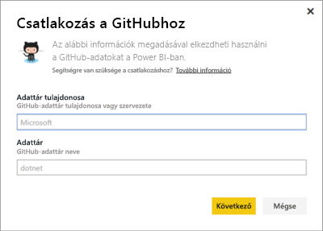
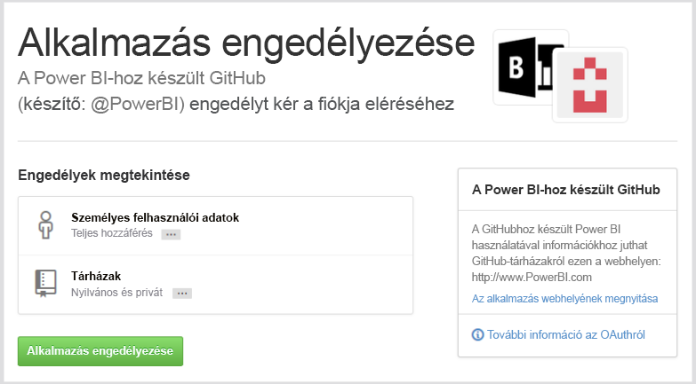
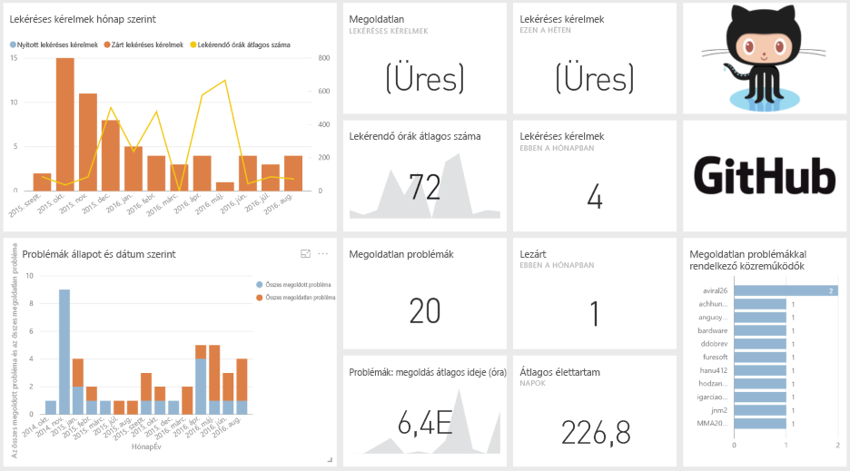
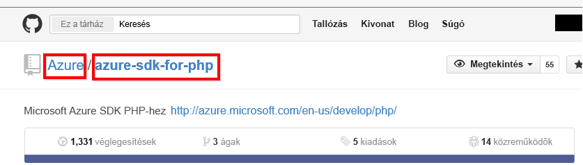

# Csatlakozás a GitHubhoz a Power BI használatával
A Power BI-hoz készült GitHub-tartalomcsomaggal betekintést nyerhet GitHub-adattárakba, amelyek hozzájárulásokra, problémákra, lekéréses kérelmekre és aktív felhasználókra vonatkozó adatokat tartalmaznak.

Csatlakozzon a [GitHub-tartalomcsomaghoz](https://app.powerbi.com/getdata/services/github), vagy olvasson még arról, hogy miképpen jön létre [a GitHub integrációja](https://powerbi.microsoft.com/integrations/github) a Power BI szolgáltatással.

>[!NOTE]
>A tartalomcsomag használatához a GitHub-fióknak hozzá kell férnie az adattárhoz. További információt a követelményekről lent talál.

## A kapcsolódás menete
1. Válassza az **Adatok lekérése** elemet a bal oldalon lévő navigációs ablaktábla alján.
   
    
2. A **Szolgáltatások** mezőben válasza a **Beolvasás** elemet.
   
    
3. Válassza a **GitHub** \> **Beolvasás** lehetőséget.
   
   
4. Adja meg az adattár nevét és tulajdonosát. A [paraméterek megkereséséről](#FindingParams) alább olvashat részletesebben.
   
   
5. Adja meg a GitHub-hitelesítő adatait. (Ha már bejelentkezett a böngészőjében, akkor lehet, hogy ez a lépés kimarad). 
6. A **Hitelesítési módszer** beállításánál válassza az **oAuth2** \> **Bejelentkezés** lehetőséget. 
7. Kövesse a GitHub-hitelesítés lépéseit. Engedélyezze a hozzáférést a Power BI-hoz készült GitHub-tartalomcsomag részére a GitHub-adatokhoz.
   
   
   
   Ezzel összekapcsolja a Power BI-t a GitHubbal, és hozzáférést biztosít a Power BI-nak az adatokhoz.  Az adatok naponta frissülnek.
8. Miután Ön kapcsolódott az adattárhoz, a Power BI importálja az adatokat. Megjelenik egy új [GitHub-irányítópult](https://powerbi.microsoft.com/integrations/github), egy új jelentés és egy új adathalmaz a bal oldali navigációs panelen. Az új elemeket sárga csillag \* jelöli.
   
   

**Hogyan tovább?**

* [Tegyen fel egy kérdést a Q&A mezőben](service-q-and-a.md), amely az irányítópult tetején található.
* [Módosítsa a csempéket](service-dashboard-edit-tile.md) az irányítópulton.
* [Válasszon ki egy csempét](service-dashboard-tiles.md) az alapjául szolgáló jelentés megnyitásához.
* Az adatkészlet naponta frissül, de módosíthatja a frissítési ütemezést, és bármikor frissíthet igény szerint is az **Azonnali frissítés** lehetőséggel.

## A csomag tartalma
A GitHubból az alábbi adatok érhetők el a Power BI szolgáltatásban:     

| Table name (Táblázat neve) | Description (Leírás) |
| --- | --- |
| Contributions (Hozzájárulások) |A hozzájárulások táblázata a hozzájárulóktól származó összes kiegészítést, törlést és véglegesítést tartalmazza heti összesítésben. A táblázatban az első 100 hozzájáruló szerepel. |
| Issues (Problémák) |Listázza a kijelölt adattárban szereplő összes problémát, továbbá olyan adatokat, mint a problémák megoldására fordított összes és átlagos idő, az összes nyitott probléma és az összes megoldott probléma. A táblázat üres, ha nincsenek problémák az adattárban. |
| Pull requests (Lekéréses kérelmek) |Ebben a táblázatban szerepel az adattár összes lekéréses kérelme és a kérelmezők neve. Számított adatokat is tartalmaz, mint például a nyitott és a lezárt lekéréses kérelmek száma, az összes lekéréses kérelem, az egyes kérelmek lekéréséhez szükséges idő és az átlagos kérelemlekérési idő. A táblázat üres, ha nincsenek problémák az adattárban. |
| Users (Felhasználók) |Ez a táblázat azokat a GitHub-felhasználókat és -közreműködőket tartalmazza, akik közreműködtek, vagy lekéréses kérelmeket iktattak vagy oldottak meg a kiválasztott adattárban. |
| Milestones (Mérföldkövek) |A kiválasztott adattár összes mérföldkövét tartalmazza. |
| DateTable (Dátumtáblázat) |Ez a táblázat a mai dátumtól kezdve akár több évre is visszamenőleg tartalmazza a dátumokat, amelyek segítségével dátum szerint elemezheti GitHub-adatait. |
| ContributionPunchCard (Közreműködői pontgyűjtés) |Ez a táblázat közreműködők pontgyűjtésének vezetésére használatható a kijelölt adattárban. A hozzájárulásokat nap és időpont szerint jeleníti meg. Ez a tábla nem kapcsolódik a modell többi táblájához. |
| RepoDetails (Adattár adatai) |Ez a táblázat a kiválasztott adattár adatait tartalmazza. |

## System requirements (Rendszerkövetelmények)
* A GitHub-fiók, amely hozzáfér az adattárhoz.  
* Engedély megadása a GitHubhoz készült Power BI alkalmazásnak az első bejelentkezéskor. Az engedély visszavonásának módját alább találja.  
* Elegendő API-hívás az adatok lekéréséhez és frissítéséhez.  

### A Power BI engedélyének visszavonása
Ha vissza szeretné vonni a Power BI-nak a GitHub-adattár elérésére kiadott engedélyt, ezt a GitHubban teheti meg. További információt ebben a [GitHub súgótémakörben](https://help.github.com/articles/keeping-your-ssh-keys-and-application-access-tokens-safe/#reviewing-your-authorized-applications-oauth) talál.

## Paraméterek keresése
A tulajdonos és az adattár közvetlenül az adattárból állapítható meg a GitHubban:

Az első rész, az „Azure” a tulajdonos, a második rész, az „azure-sdk-for-php” pedig maga az adattár.  Ugyanez a két elem megtalálható az adattár URL-jében is:

    <https://github.com/Azure/azure-sdk-for-php> .

## Hibaelhárítás
Ha szükséges, ellenőrizheti a GitHub-hitelesítő adatait.  

1. Egy másik böngészőablakban navigáljon a GitHub weboldalára, és jelentkezzen be. Ha bejelentkezett, azt a GitHub oldalának jobb felső sarkában láthatja.    
2. A GitHub webhelyen navigáljon annak az adattárnak az URL-címére, amelyet el kíván érni a Power BI-ból. Például: https://github.com/dotnet/corefx.  
3. A Power BI-ba visszatérve próbáljon csatlakozni a GitHubhoz. A GitHub beállítása párbeszédpanelen adja meg a szóban forgó adattár nevét és tulajdonosát.  

## Következő lépések
* [Első lépések a Power BI-ban](service-get-started.md)
* [Adatok lekérése](service-get-data.md)

