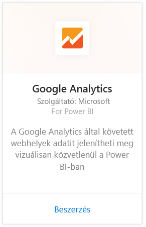
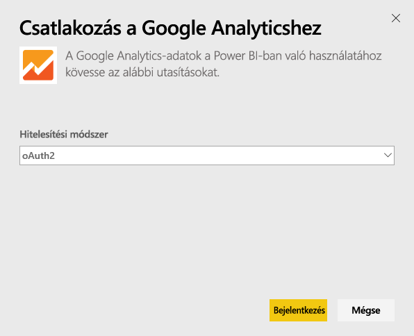
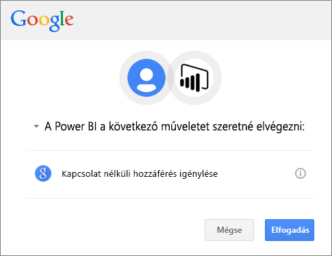
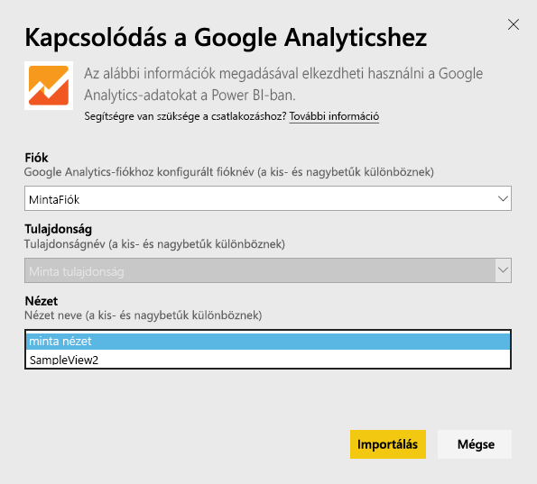
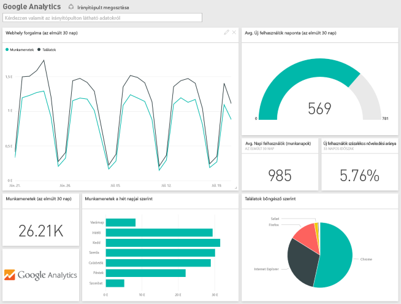
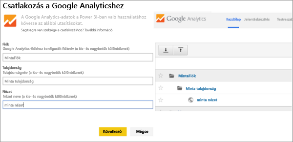

# Kapcsolódás a Google Analytics szolgáltatáshoz a Power BI használatával
Ha kapcsolódni szeretne a Google Analytics szolgáltatáshoz a Power BI-on keresztül, először lépjen be a Google Analytics-fiókjába. Ezután megjelenik egy Power BI-irányítópult és bizonyos Power BI-jelentések, amelyek a webhelye forgalmára és felhasználóira vonatkozó adatokat tartalmaznak. Az irányítópultot és a jelentéseket használhatja és megtekintheti, de a változtatásokat nem mentheti. Az adatok naponta egyszer automatikusan frissülnek.

Kapcsolódjon a [Google Analytics](https://app.powerbi.com/getdata/services/google-analytics) szolgáltatáshoz a Power BI használatával. További információ a Power BI és a [Google Analytics integrációjáról](https://powerbi.microsoft.com/integrations/google-analytics).

Személyre szabott irányítópultokat és jelentéseket hozhat létre a Power BI Desktop [Google Analytics-összekötőjének](service-google-analytics-connector.md) segítségével. Egyszerűen kapcsolódjon a Google Analytics-fiókjával, és hozzon létre személyre szabott jelentéseket, amelyeket aztán közzétehet a Power BI szolgáltatásban.

## A kapcsolódás menete
[!INCLUDE [powerbi-service-apps-get-more-apps](./includes/powerbi-service-apps-get-more-apps.md)]

1. Válassza a **Google Analytics** \> **Beolvasás** lehetőséget.
   
   
2. Amikor a rendszer kéri, adja meg a Google Analytics-fiók hitelesítő adatait. Válassza az **oAuth 2** hitelesítési mechanizmust, és kattintson a **Bejelentkezés** elemre. Haladjon végig a Google-hitelesítés lépésein, amelyek közt szerepelhet a kétlépcsős azonosítás is, ha konfigurálta.
   
   
3. Az **Elfogadás** gombra kattintva engedélyezze a Power BI részére a Google Analytics-adatokhoz való hozzáférést.
   
   
4. A Power BI egy bizonyos Google Analytics-nézethez kapcsolódik. Válassza ki annak a fióknak, tulajdonságnak és nézetnek a nevét, amelyhez kapcsolódni szeretne. Ezek az adatok a Google Analytics-fiókban találhatók: vagy a bal felső részen vagy a **Kezdőlap** lapon. A részleteket alább találja. 
   
   
5. A **Csatlakozás** gombra kattintva indíthatja el az importálási folyamatot. 

## A Google Analytics-irányítópult és -jelentések megtekintése
[!INCLUDE [powerbi-service-apps-open-app](./includes/powerbi-service-apps-open-app.md)]

      

[!INCLUDE [powerbi-service-apps-open-app](./includes/powerbi-service-apps-what-now.md)]

## Rendszerkövetelmények
A Power BI-on keresztüli csatlakozáshoz [Google Analytics](https://www.google.com/analytics/)-fiók szükséges. Ha olyan Google-fiókkal próbál csatlakozni, amelynek nem része a Google Analytics szolgáltatás, hitelesítési hibaüzenetet fog kapni.

## Hibaelhárítás
**Hitelesítő adatok:** Ha több Google-fiókja is van, inkognitó módban vagy privát munkamenetben létesítsen kapcsolatot, hogy biztosan a megfelelő fiókot használja.

Ha érvénytelen hitelesítő adatokról szóló hibaüzenetet kap annak ellenére, hogy sikeresen bejelentkezett a Google-be, akkor győződjön meg arról, hogy van [Google Analytics](https://www.google.com/analytics/)-fiókja.

**Paraméterek:** Jelenleg egyedi neveket kell megadni paraméterként. Ha hibaüzenet kap, amely szerint a kiválasztott érték már használatban van, akkor válasszon másik értéket, vagy a Google Analyticsben módosítva tegye egyedivé a nevet. Folyamatosan dolgozunk azon, hogy ez jobban működjön.

>[!NOTE]
>A paraméterekben különbözőnek számítanak a kis- és a nagybetűk. Pontosan úgy adja meg őket, ahogyan a Google Analytics-fiókjában szerepelnek.

Továbbra is problémákba ütközik? Küldjön támogatási jegyet a Power BI csapatának:

* A Power BI alkalmazásban kattintson a kérdőjel \> **Kapcsolatfelvétel az ügyfélszolgálattal** lehetőségre.
* A Power BI támogatási oldalán (ahol ezt a cikket is olvassa) válassza a **Kapcsolatfelvétel az ügyfélszolgálattal** elemet a lap jobb oldalán.

## Következő lépések
* [Mik a Power BI szolgáltatáson belüli alkalmazások?](consumer/end-user-apps.md)
* [Adatok lekérése a Power BI-ban](service-get-data.md)
* További kérdései vannak? [Kérdezze meg a Power BI közösségét](http://community.powerbi.com/)

