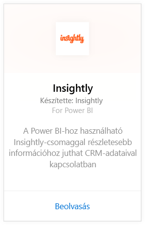
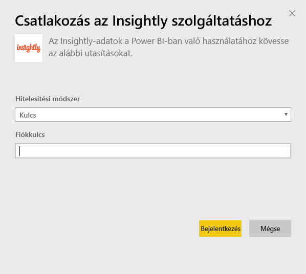
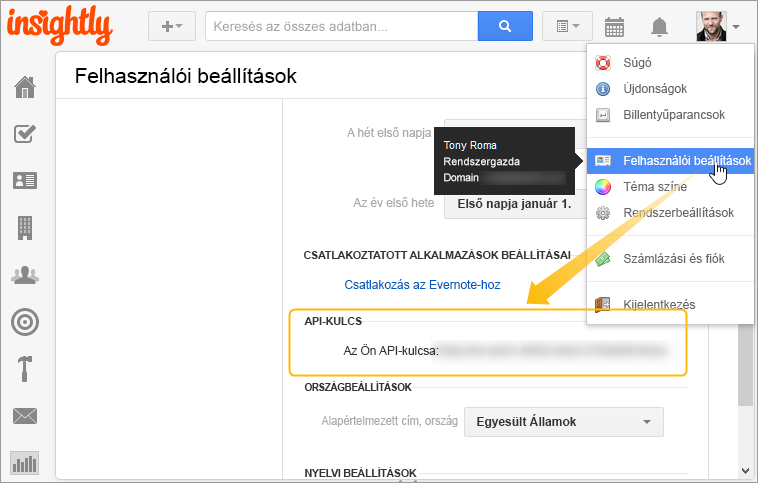

# Csatlakozás az Insightly-hoz a Power BI használatával
Megjelenítheti és megoszthatja Insightly CRM-adatait a Power BI-ban az Insightly tartalomcsomag használatával. Csatlakozzon a Power BI-hoz az Insightly API-kulccsal jelentések és irányítópultok megtekintéséhez és felépítéséhez a CRM-adatokból. A Power BI használatával új módokon elemezheti az adatokat, hatékony gráfokat és diagramokat hozhat létre, valamint térképen jeleníthet meg a kapcsolattartókat, érdeklődőket és cégeket.

Kapcsolódjon a Power BI-hoz készült [Insightly tartalomcsomaghoz](https://app.powerbi.com/getdata/services/insightly).

## Csatlakozás
1. A bal oldali navigációs ablaktábla alján kattintson az **Adatok lekérése** elemre.
   
   
2. A **Szolgáltatások** mezőben kattintson a **Lekérés** elemre.
   
   
3. Válassza az **Insightly** \>  **Lekérés** lehetőséget.
   
   
4. Válassza a **Kulcs** lehetőséget mint hitelesítési típust, adja meg az Insight API-kulcsot, majd válassza a **Bejelentkezés** lehetőséget. [Ennek megkeresésének](#FindingParams) részleteit alább találja.
   
   
5. A jóváhagyás után automatikusan megkezdődik az importálási folyamat. Ha befejeződött, a navigációs panelen megjelenik egy új irányítópult, jelentés és modell. Válassza ki az irányítópultot az importált adatok megtekintéséhez.
   
     

**Mi a következő lépés?**

* [Kérdéseket tehet fel a Q&A mezőben](power-bi-q-and-a.md) az irányítópult tetején.
* [Módosíthatja az irányítópult csempéit](service-dashboard-edit-tile.md).
* [Kiválaszthatja valamelyik csempét](service-dashboard-tiles.md) a mögöttes jelentés megnyitásához.
* Noha az adatkészlet napi frissítésre van ütemezve, módosíthatja a frissítési ütemezést, vagy igény szerint frissíthet az **Azonnali frissítés** gombbal.

## Tartalom
A tartalomcsomag a következő táblákat tartalmazza a megfelelő rekordokból származó mezőkkel:

| Táblák |  |  |  |
| --- | --- | --- | --- |
| Kapcsolattartók |Lehetőségek |Folyamat szakaszai |Feladat befejezésének dátuma |
| Egyéni mezők |Lehetőség záró dátuma |Projekt befejezésének dátuma |Feladatok |
| Események |Lehetőség előrejelzett dátuma |Projektek |Csapatok/tagok |
| Érdeklődők |Cégek |Címkék |Felhasználók |

Sok tábla és jelentés egyedi számított mezőket is tartalmaz, például a következőket:  

* „Csoportosított” lehetőség előrejelzett záró dátumai, lehetőség tényleges záró dátumai, projekt befejezési dátumai és feladat befejezési dátumai mezőkkel rendelkező táblák hónap, negyedév vagy év alapján végzett elemzéshez.  
* A lehetőségek súlyozott értékmezője (lehetőség értéke * az elnyerés valószínűsége).  
* Átlagos és teljes időtartam mezők a feladatokhoz, a kezdés és a befejezés dátumai alapján.  
* A lehetőség nyerési aránya (az elnyert lehetőségek száma/az összes lehetőség száma) és a nyerési arány értéke (az elnyert lehetőségek értéke/az összes lehetőség értéke) számított mezőivel rendelkező jelentések.  

## Rendszerkövetelmények
Szükség van egy olyan Insightly-fiókra, amely hozzáféréssel rendelkezik az Insightly API-hoz. A láthatósági engedélyek a Power BI-jal való kapcsolat létesítésére használt API-kulcson alapulnak. Az Ön által látható összes Insightly-rekord a másokkal megosztott Power BI-jelentésekben és -irányítópultokon is látható.

## Paraméterek helye
**API-kulcs**

Ha másolni szeretné az API-kulcsot az Insightly-ból, válassza az Insightly profilmenüjének Felhasználói beállítások elemét, és görgessen lefelé. Ezzel a sztringgel csatlakoztathatja az adatokat a Power BI-hoz.

## Hibaelhárítás
Az adatokat az Insightly API-n keresztül importálja, amelyre az Insightly előfizetési csomag szintjétől függő napi korlát vonatkozik. A korlátok az API-dokumentáció Rate Limiting/Throttling Requests (Sebességkorlátozás/kérelmek szabályozása) című szakaszában szerepelnek: https://api.insight.ly/v2.2/Help#!/Overview/Introduction#ratelimit

A megadott jelentések az Insightly alapértelmezett mezőit használják, így előfordulhat, hogy nem tartalmazzák a testreszabásait. Szerkessze a jelentést az összes elérhető mező megtekintéséhez.

## Következő lépések
[Első lépések a Power BI-ban](service-get-started.md)

[Adatok lekérése a Power BI-ban](service-get-data.md)

