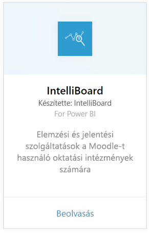
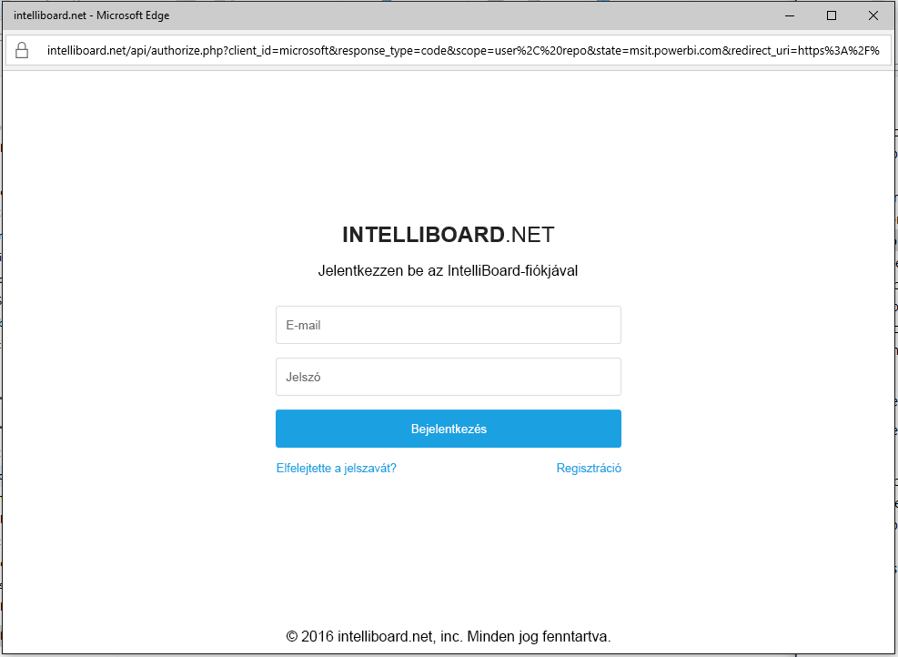
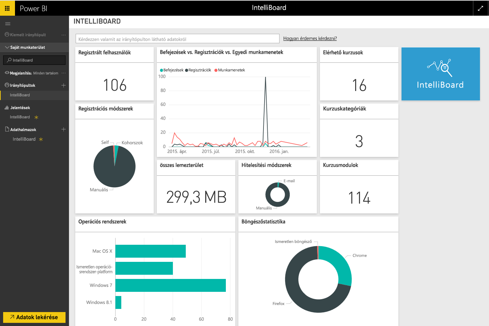

# Kapcsolódás az IntelliBoardhoz a Power BI-jal
Az IntelliBoard jelentéskészítő szolgáltatások használatával biztosít egyszerűbb hozzáférést a Moodle tanuláskezelő rendszer adataihoz. A Power BI-hoz készült IntelliBoard-tartalomcsomag további elemzési lehetőségeket tartalmaz, köztük a tanfolyamok, a regisztrált felhasználók, az általános teljesítmény és az LMS-tevékenység metrikáit.

Kapcsolódjon a Power BI-hoz készült [IntelliBoard-tartalomcsomaghoz](https://app.powerbi.com/getdata/services/intelliboard).

## A kapcsolódás menete
1. A bal oldali navigációs ablaktábla alján kattintson az **Adatok lekérése** elemre.  
   
    
2. A **Szolgáltatások** mezőben kattintson a **Beolvasás** gombra.  
   
    
3. Válassza az **IntelliBoard**, majd a **Beolvasás** lehetőséget.  
   
    
4. Válassza ki az **OAuth 2**, majd a **Bejelentkezés** lehetőséget. Amikor a rendszer kéri, adja meg az IntelliBoard-fiókja hitelesítő adatait.
   
    
   
    
5. A kapcsolódás után automatikusan betöltődik egy irányítópult, egy jelentés és egy adatkészlet. A befejezést követően a csempék frissülni fognak az Ön IntelliBoard-fiókjából származó adatokkal.
   
    

**Hogyan tovább?**

* [Kérdéseket tehet fel a Q&A mezőben](consumer/end-user-q-and-a.md) az irányítópult tetején.
* [Módosíthatja az irányítópult csempéit](service-dashboard-edit-tile.md).
* [Kiválaszthatja valamelyik csempét](consumer/end-user-tiles.md) a mögöttes jelentés megnyitásához.
* Noha az adatkészlet napi frissítésre van ütemezve, módosíthatja a frissítési ütemezést, vagy igény szerint frissíthet az **Azonnali frissítés** gombbal.

## Tartalom
A tartalomcsomag a következő táblák adatait tartalmazza:  

    - Activity (Tevékenység)  
    - Agents (Ügynökök)  
    - Auth (Hitelesítés)  
    - Countries (Országok)  
    - CoursesProgress (Tanfolyamok haladása)  
    - Enrollments (Regisztrációk)
    - Lang (Nyelv)  
    - Platform  
    - Totals (Eredmények)  
    - UsersProgress (Felhasználók haladása)    

## Rendszerkövetelmények
A tartalomcsomag példányának létrehozásához egy olyan IntelliBoard-fiók szükséges, amely rendelkezik engedélyekkel a fenti táblázatokhoz.

## Következő lépések
[Mi az a Power BI?](power-bi-overview.md)

[Power BI – Alapfogalmak](consumer/end-user-basic-concepts.md)

