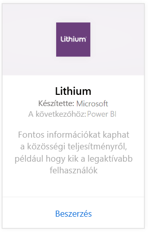
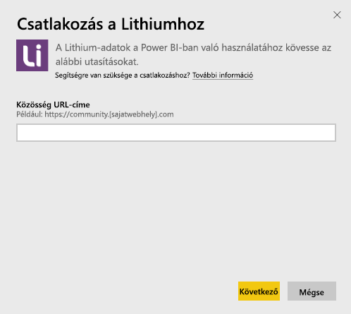
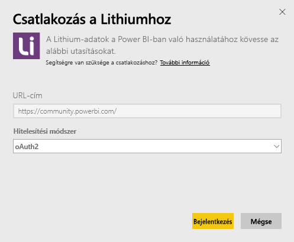
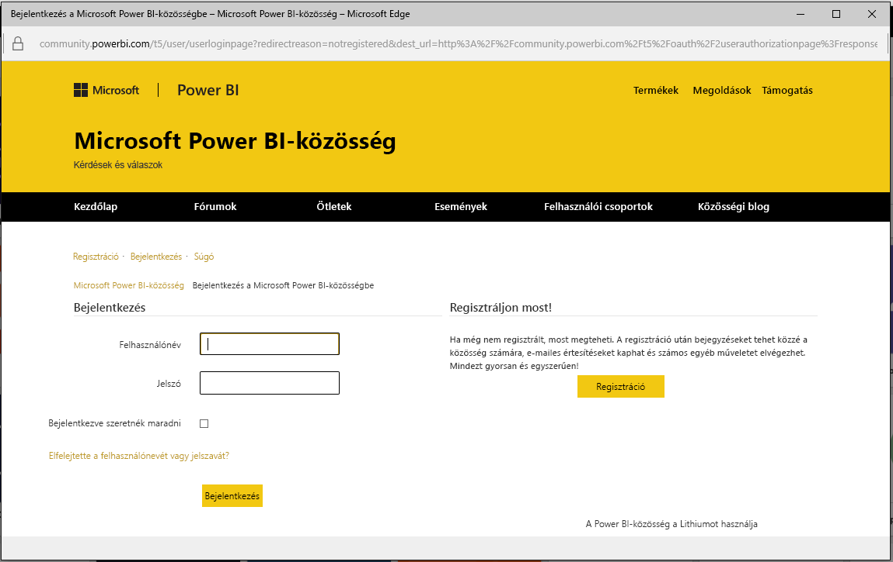
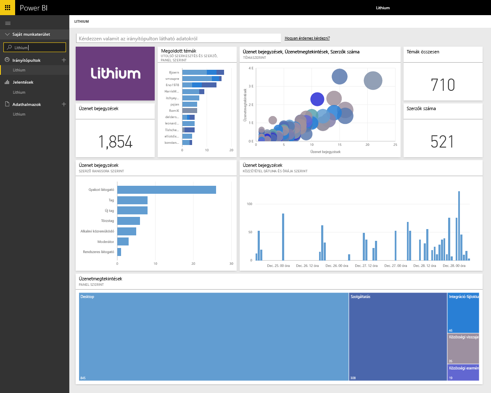

# Kapcsolódás a Power BI-ból a Lithiumhoz
A Lithium megbízható kapcsolatokat épít ki a világ legjobb márkái és az ügyfeleik között, és segít az embereknek választ kapni a kérdéseikre és megosztani a tapasztalataikat. Ha csatlakoztatja a Lithium-tartalomcsomagot a Power BI-hoz, akkor mérni tudja az online közössége legfontosabb metrikáit, így serkentheti az eladásokat, csökkentheti a szolgáltatási díjakat és növelheti ügyfelei hűségét. 

Kapcsolódjon a Power BI-hoz készült [Lithium-tartalomcsomaghoz](https://app.powerbi.com/getdata/services/lithium).

>[!NOTE]
>A Power BI-tartalomcsomag a Lithium API-t használja. A túlzottan sok API-hívás további költségeket vonhat maga után a Lithium oldaláról. Kérjük, egyeztessen a Lithium-rendszergazdájával.

## A kapcsolódás menete
1. Válassza az **Adatok lekérése** elemet a bal oldalon lévő navigációs ablaktábla alján.
   
    
2. A **Szolgáltatások** mezőben válasza a **Beolvasás** elemet.
   
    
3. Válassza a **Lithium** \> **Beolvasás** lehetőséget.
   
   
4. Adja meg a Lithium-közössége URL-címét. Ez *https://community.yoursite.com* formájú lesz.
   
   
5. Amikor a rendszer kéri, adja meg a Lithium-fiókja hitelesítő adatait. Válassza ki az **oAuth 2** hitelesítési mechanizmust, kattintson a **Bejelentkezés** elemre, majd kövesse a Lithium-fiók hitelesítési folyamatát.
   
   
   
   
6. A sikeres bejelentkezési folyamat után megkezdődik az importálási folyamat. Amikor ez befejeződik, a navigációs ablaktáblán megjelenik egy új irányítópult, egy új jelentés és egy új modell. Az importált adatok megtekintéséhez válassza ki az irányítópultot.
   
    

**Hogyan tovább?**

* [Tegyen fel egy kérdést a Q&A mezőben](service-q-and-a.md), amely az irányítópult tetején található.
* [Módosítsa a csempéket](service-dashboard-edit-tile.md) az irányítópulton.
* [Válasszon ki egy csempét](service-dashboard-tiles.md) az alapjául szolgáló jelentés megnyitásához.
* Az adatkészlet naponta frissül, de módosíthatja a frissítési ütemezést, és bármikor frissíthet igény szerint is az **Azonnali frissítés** lehetőséggel.

## Rendszerkövetelmények
A Lithium-tartalomcsomaghoz 15.9-es vagy újabb verziójú Lithium-közösség szükséges. A verzió megerősítéséhez, kérjük, egyeztessen Lithium-rendszergazdájával.

## Következő lépések
[Első lépések a Power BI használatával](service-get-started.md)

[Power BI – Alapfogalmak](service-basic-concepts.md)

