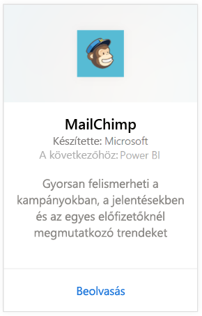
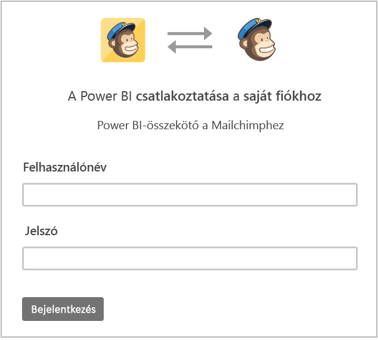
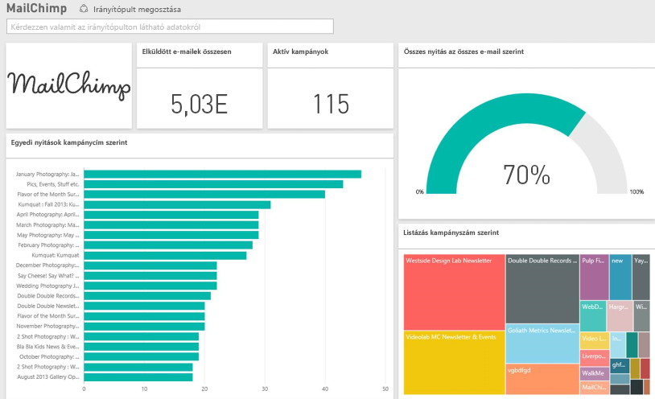

# Kapcsolódás a MailChimphez a Power BI-jal
A Power BI-tartalomcsomag lekéri a MailChimp-fiókban található adatokat, és létrehoz egy irányítópultot, több jelentést, valamint egy adathalmazt, amelyek segítségével megvizsgálhatja az adatokat. Az elemzés révén [MailChimp-irányítópultokat](https://powerbi.microsoft.com/integrations/mailchimp) készíthet, és gyorsan felismerheti a kampányokban, a jelentésekben és az egyes előfizetőknél megmutatkozó trendeket. Az alapértelmezett beállítások szerint az adatok naponta frissülnek, hogy Ön mindig naprakész adatokat ellenőrizhessen.

Kapcsolódjon a Power BI [MailChimp-tartalomcsomagjához](https://app.powerbi.com/getdata/services/mailchimp).

## A kapcsolódás menete
1. A bal oldali navigációs ablaktábla alján kattintson az **Adatok lekérése** elemre.
   
    
2. A **Szolgáltatások** keretben kattintson a **Beolvasás** elemre.
   
   
3. Válassza a **MailChimp** \> **Beolvasás** elemet.
   
   
4. A Hitelesítési módszer beállításnál válassza az **oAuth2** \> beállítást, majd a **Bejelentkezés** elemet.
   
    Amikor a rendszer kéri, adja meg saját MailChimp-beli hitelesítő adatait, majd haladjon végig a hitelesítési folyamaton.
   
    Az első kapcsolódás alkalmával a rendszer kérni fogja, hogy adjon olvasási hozzáférést a Power BI-nak a fiókjához. Indítsa el az importálási folyamatot az **Engedélyezés** elemre kattintva. A művelet a fiókban tárolt adatok mennyiségétől függően több percig is eltarthat.
   
    
5. Miután a Power BI importálta az adatokat, megjelenik egy új irányítópult, egy új jelentés és egy új adathalmaz a bal oldali navigációs panelen. A Power BI ezt az alapértelmezett irányítópultot hozta létre az adatok megjelenítésére. Az irányítópultot módosíthatja, hogy az igényei szerint jelenítse meg az adatokat.
   
   

**Mi a következő lépés?**

* [Kérdéseket tehet fel a Q&A mezőben](power-bi-q-and-a.md) az irányítópult tetején.
* [Módosíthatja az irányítópult csempéit](service-dashboard-edit-tile.md).
* [Kiválaszthatja valamelyik csempét](service-dashboard-tiles.md) a mögöttes jelentés megnyitásához.
* Az adatkészlet az ütemezés szerint naponta frissül, de módosíthatja a frissítési ütemezést, vagy igény szerint bármikor frissíthet az **Azonnali frissítés** elemre kattintva

## További lépések
[Első lépések a Power BI-ban](service-get-started.md)

[Power BI – Alapfogalmak](service-basic-concepts.md)

