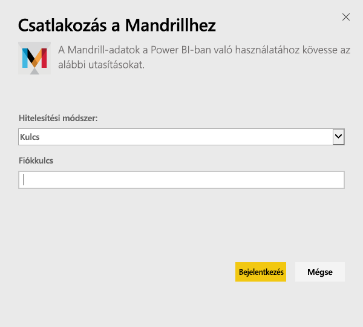
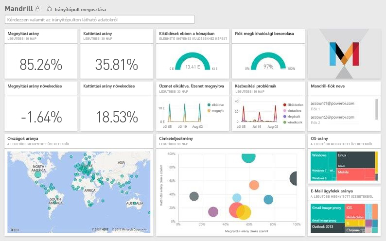

# Kapcsolódás a Mandrillhoz a Power BI használatával
A Power BI-tartalomcsomag lekéri a Mandrill-fiókban található adatokat, és létrehoz egy irányítópultot, több jelentést, valamint egy adathalmazt, amelyek segítségével elemezheti és megismerheti az adatokat. A Mandrill elemzései segítségével gyors betekintést nyerhet hírlevél- vagy marketingkampányába. Az alapértelmezett beállítások szerint az adatok naponta frissülnek, hogy Ön mindig naprakész adatokat ellenőrizhessen.

Kapcsolódás a [Power BI Mandrill-tartalomcsomagjához](http://app.powerbi.com/getdata/services/mandrill)

## A kapcsolódás menete
1. A bal oldali navigációs ablaktábla alján kattintson az **Adatok lekérése** elemre.
   
    
2. A **Szolgáltatások** mezőben kattintson a **Beolvasás** elemre.
   
    
3. Válassza a **Mandrill** > **Beolvasás** elemet.
   
    
4. A **Hitelesítési módszer**, beállításban válassza a **Kulcs** lehetőséget, és adja meg az API-kulcsot. A kulcs a Mandrill irányítópult **Beállítások** lapján található. Indítsa el az importálási folyamatot a **Bejelentkezés** elemre kattintva. A művelet a fiókban tárolt adatok mennyiségétől függően több percig is eltarthat.
   
    
5. Miután a Power BI importálta az adatokat, megjelenik egy új irányítópult, egy jelentés és egy adathalmaz a bal oldali navigációs ablaktáblán. Ez az az alapértelmezett irányítópult, amelyet a Power BI létrehozott az adatok megjelenítésére.
   
    

**Hogyan tovább?**

* [Kérdéseket tehet fel a Q&A mezőben](power-bi-q-and-a.md) az irányítópult tetején.
* [Módosíthatja az irányítópult csempéit](service-dashboard-edit-tile.md).
* [Kiválaszthatja valamelyik csempét](service-dashboard-tiles.md) a mögöttes jelentés megnyitásához.
* Az adatkészlet az ütemezés szerint naponta frissül, de módosíthatja a frissítési ütemezést, vagy igény szerint bármikor frissíthet az **Azonnali frissítés** elemre kattintva

## Következő lépések
[Mi az a Power BI?](power-bi-overview.md)

[Power BI – Alapfogalmak](service-basic-concepts.md)

