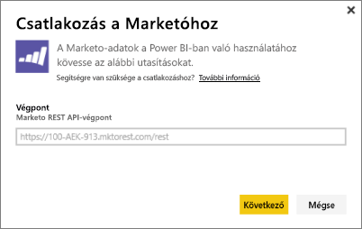
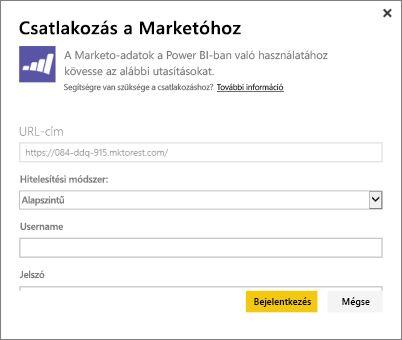
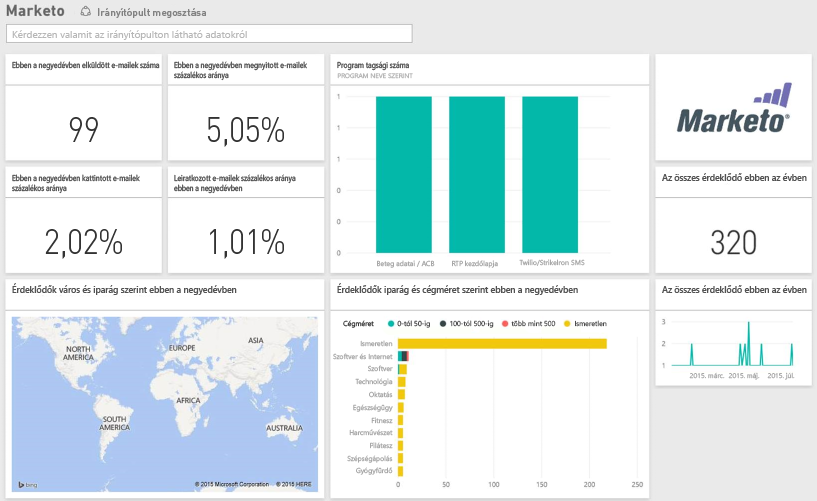

# Kapcsolódás a Marketo eszközhöz a Power BI használatával
A Marketo eszközhöz készült Power BI-tartalomcsomag az érdeklődőkhöz és tevékenységeikhez kapcsolódó adatokkal segíti a Marketo-fiók elemzését. A kapcsolat lekéri az adatokat, és automatikusan a rendelkezésére bocsátja a rájuk épülő irányítópultot, valamint a kapcsolódó jelentéseket.

Kapcsolódás a Power BI-hoz készült [Marketo tartalomcsomaghoz](https://app.powerbi.com/getdata/services/marketo).

## A kapcsolódás menete
1. A bal oldali navigációs ablaktábla alján kattintson az **Adatok lekérése** elemre.
   
   
2. A **Szolgáltatások** mezőben kattintson a **Beolvasás** gombra.
   
    
3. Kattintson a **Marketo** \> **Beolvasás** elemre.
   
   
4. Írja be a Marketo vagy a Marketo-rendszergazda által megadott REST végpontot, és kattintson a Tovább gombra.
   
   
   
   További információk a Marketo REST-végpontról: [http://developers.marketo.com/documentation/rest/endpoint-url/ ](http://developers.marketo.com/documentation/rest/endpoint-url/).
5. Használja az **Alapszintű** hitelesítési módot, és **Felhasználónévként**adja meg az ügyfél-azonosítóját, **Jelszóként** pedig a titkos ügyfélkulcsot. Ügyfélazonosító és titkos ügyfélkód a Marketóban vagy a Marketo-rendszergazdánál ([http://developers.marketo.com/documentation/rest/custom-service/](http://developers.marketo.com/documentation/rest/custom-service/)) érhető el. 
   
   
   
   Ez hozzáférést biztosít a *Power BI-hoz készült Marketo* tartalomcsomag számára a [Marketo-elemzések](https://powerbi.microsoft.com/integrations/marketo) adataihoz, és lehetővé teszi az adatok Power BI-beli elemzését. Az adatok naponta egyszer frissülnek.
6. Miután csatlakozott a Marketo-fiókhoz, betöltődik egy irányítópult az összes adattal:
   
   

**Hogyan tovább?**

* [Kérdéseket tehet fel a Q&A mezőben](power-bi-q-and-a.md) az irányítópult tetején.
* [Módosíthatja az irányítópult csempéit](service-dashboard-edit-tile.md).
* [Kiválaszthatja valamelyik csempét](service-dashboard-tiles.md) a mögöttes jelentés megnyitásához.
* Noha az adatkészlet napi frissítésre van ütemezve, módosíthatja a frissítési ütemezést, vagy igény szerint frissíthet az **Azonnali frissítés** gombbal.

## A csomag tartalma
A Power BI-ban a következő tevékenységadatok érhetők el a Marketo rendszeréből a mai naptól egy évre visszamenőleg:

| Táblázat neve | Leírás |
| --- | --- |
| EmailActivities (E-mail-tevékenység) |Érdeklődők/kapcsolatok számára küldött e-mailek adatai, beleértve az eszközöket, a kategóriákat, a visszapattanások számát és százalékát, a kattintások számát és százalékát, a megnyitások számát és százalékát, valamint a program nevét. A Power BI-ban megjelenített e-mail-tevékenység az e-mailek kézbesítési eredményességéről készült abszolút jelentés, amely nem alkalmaz további logikát az adatokra. Ezért a Marketo-ügyfél és a Power BI néha eltérő eredményeket adhat. |
| ProgramActivities (Programtevékenység) |Adatok olyan programokról, amelyeknek az állapotában változás állt be. Ide tartozik az ok, a sikeresség, a programbeszerzések száma és százaléka, valamint a sikeres programfuttatások száma és százaléka. |
| WebPageActivities (Weblap-aktivitás) |Felhasználói weblaplátogatások adatai, beleértve a keresési ügynököt, a felhasználói ügynököt, a weblapot és az aktivitás időpontját (óra). |
| DateTable (Dátumtáblázat) |Dátumok a mai naptól egy évre visszamenőleg.  Lehetőséget ad a Marketo adatainak időpont szerinti elemzésére. |
| Érdeklődők |Érdeklődőkre vonatkozó információ, például cég, jövedelem nagysága, alkalmazottak száma, ... ország, iparág, érdeklődői pontszám, érdeklődői állapot. Az érdeklődők lekérése az e-mailek, a programok, és a weblapaktivitás adataiban lévő jelenlétük alapján történik. |

Minden időpont UTC-ben van megadva. Az időpontok a fiók időzónájától függően változhatnak (ahogy a Marketo-ügyfél esetében is látható)

## Rendszerkövetelmények
* A kapcsolódáshoz használt Marketo-fiók engedélyezett hozzáférése az érdeklődőkhöz és a tevékenységekhez.
* Elegendő mennyiségű elérhető API-hívás az adatokhoz történő kapcsolódáshoz  API minden Marketo-beli fiókhoz.  Ha eléri a korlátot, nem lesz lehetősége adatokat letölteni a Power BI-ba. 

**Részletes információ az API-korlátokról**

A Marketo-ból történő adatimportálás folyamata Marketo-API-kat használ. A Marketo minden ügyfele számára naponta maximum 10 000 API-hívást engedélyez, amelyek megoszlanak a Marketo API-t használó összes alkalmazás között. Az API-kat egyaránt használhatja a Power BI-jal történő és az egyéb integrációkhoz. Az API-król további információt itt talál: <http://developers.marketo.com/documentation/rest/>.

A Power BI-ból a Marketo eszközhöz indított API-hívások száma a Marketo-fiókban lévő adatok mennyiségétől függ. A Power BI az elmúlt év összes érdeklődőjét és tevékenységét importálja. Az alábbiakban megtekinthet néhány Marketo-adatot és a Power BI által az adatok importálásához használt API-hívások számát:  

| Adattípus | Sorok száma | API-hívások |
| --- | --- | --- |
| Érdeklődőkre vonatkozó információ |15 000 |50 |
| Posta-tevékenységek |150 000 |1000 |
| Programtevékenységek |15 000 |100 |
| Webes tevékenységek |150 000 |1000 |
| Programváltozások |7500 |50 |
| **Összes API-hívás** | |**2200** |

## Következő lépések
[Mi az a Power BI?](power-bi-overview.md)

[Power BI – Adatok lekérése](service-get-data.md)

[Power BI-blog: A Marketo adatainak figyelése és elemzése a Power BI-ban](http://blogs.msdn.com/b/powerbi/archive/2015/03/19/monitor-and-analyze-your-marketo-data-with-power-bi.aspx)

