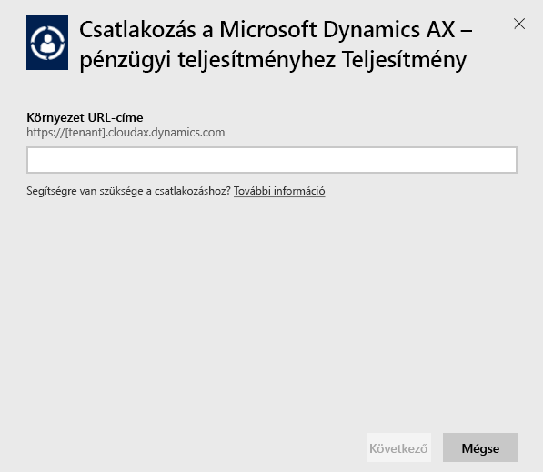
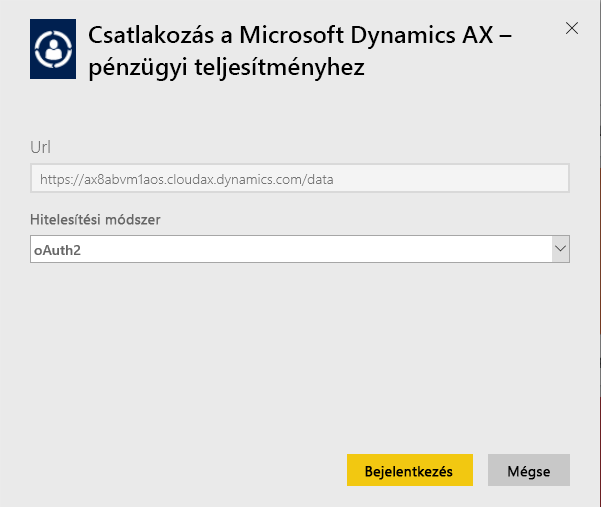
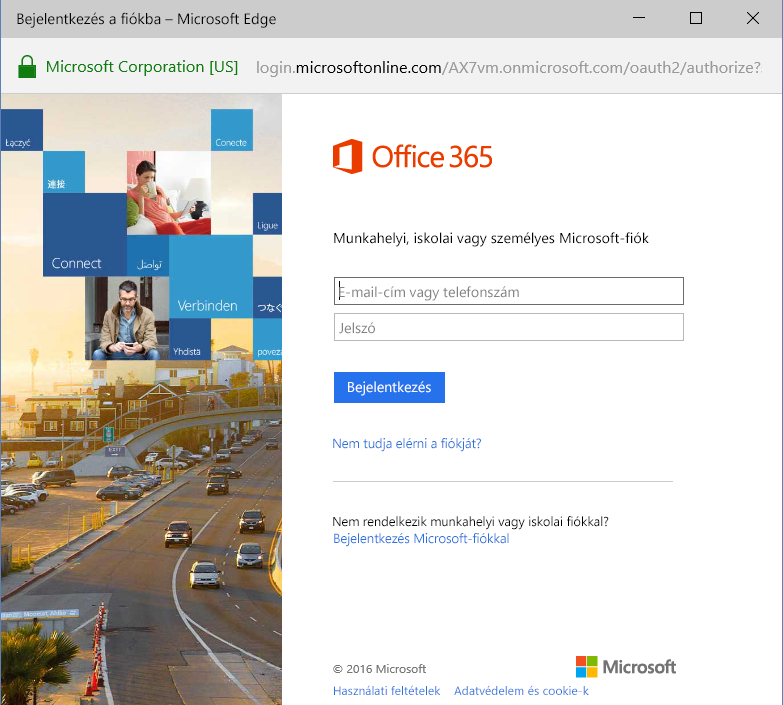
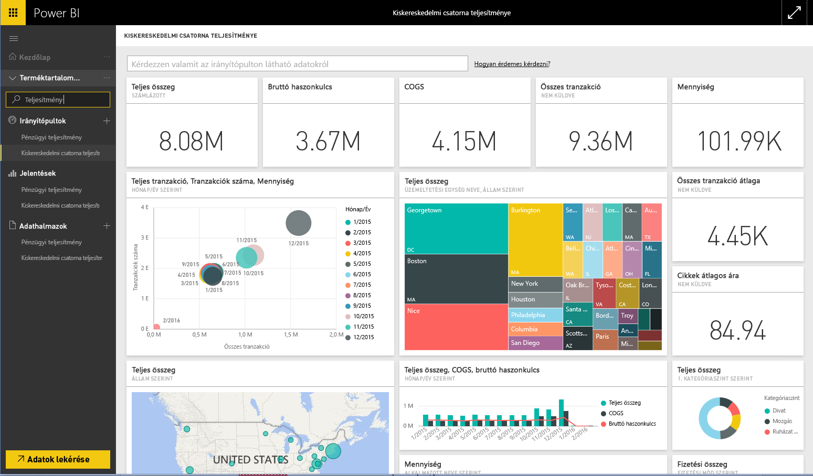

# Csatlakozás a Power BI-ból a Microsoft Dynamics AX tartalomcsomaghoz
A Microsoft Dynamics AX három Power BI-hez készült tartalomcsomaggal rendelkezik, különböző üzleti felhasználók számára. A Financial Performance tartalomcsomag, amely kifejezetten pénzügyi vezetőknek lett kifejlesztve, a szervezet pénzügyi teljesítményébe enged betekintést. A csatornafelelősök számára kialakított Retail Channel Performance tartalomcsomag az eladási teljesítményre összpontosítva, a kiskereskedelmi és kereskedelmi adatok elemzésével értékes információkat nyújt és segít előrejelezni a trendeket. A vezérigazgatók és pénzügyi vezetők számára kialakított Cost Management tartalomcsomag a műveleti teljesítményről szolgáltat részletes adatokat.

Kapcsolódjon a Power BI-kompatibilis Microsoft Dynamics AX-tartalomcsomagok egyikéhez: a [Retail Channel Performance](https://app.powerbi.com/getdata/services/dynamics-ax-retail-channel-performance), a [Financial Performance](https://app.powerbi.com/getdata/services/dynamics-ax-financial-performance) vagy a [Cost Management](https://app.powerbi.com/getdata/services/dynamics-ax-cost-management) tartalomcsomaghoz.

## A kapcsolódás menete
1. Válassza az **Adatok lekérése** elemet a bal oldalon lévő navigációs ablaktábla alján.
   
   
2. A **Szolgáltatások** mezőben kattintson a **Beolvasás** elemre.
   
   
3. Válasszon egy Dynamics AX-tartalomcsomagot, és kattintson a **Beolvasás** elemre.
   
   
4. Adja meg a Dynamics AX 7-környezet URL-címét. A [paraméterek megkereséséről](#FindingParams) alább olvashat részletesebben.
   
   
5. A **Hitelesítési módszer** beállításánál válassza az **oAuth2** \> **Bejelentkezés** lehetőséget. Amikor a rendszer kéri, adja meg a Dynamics AX-fiók hitelesítő adatait.
   
    
   
    
6. A jóváhagyás után automatikusan megkezdődik az importálás. Amikor befejeződik, a navigációs ablaktáblán megjelenik az új irányítópult, jelentés és modell. Az importált adatok megtekintéséhez kattintson az irányítópultra.
   
     

**Hogyan tovább?**

* [Tegyen fel egy kérdést a Q&A mezőben](service-q-and-a.md), amely az irányítópult tetején található
* [Módosítsa a csempéket](service-dashboard-edit-tile.md) az irányítópulton.
* [Kattintson egy csempére](service-dashboard-tiles.md) az alapjául szolgáló jelentés megnyitásához.
* Az adatkészlet naponta frissül, de módosíthatja a frissítési ütemezést, és bármikor frissíthet igény szerint is az **Azonnali frissítés** lehetőséggel

## A csomag tartalma
A tartalomcsomag a Dynamics AX 7 OData-csatornájából importálja a Retail Channel, a Financial, vagy a Cost Management tartalomcsomag adatait.

## Rendszerkövetelmények
A tartalomcsomaghoz egy Dynamics AX 7-környezet URL-címe szükséges, valamint felhasználói hozzáférés az OData-csatornához.

## Paraméretek keresése

A Dynamics AX 7-környezet URL-címe a böngészőben található a felhasználó bejelentkezése után. Csak másolja be a Dynamics AX-gyökérkörnyezet URL-címét a Power BI párbeszédpanelébe.

## Hibaelhárítás
Az adatok betöltése a példány méretétől függően időbe telhet. Ha a Power BI szolgáltatásban üres jelentéseket lát, ellenőrizze, hogy hozzáfér-e a jelentésekhez szükséges OData-táblázatokhoz.

## Következő lépések
[Első lépések a Power BI-ban](service-get-started.md)

[Adatok beolvasása a Power BI-ban](service-get-data.md)

