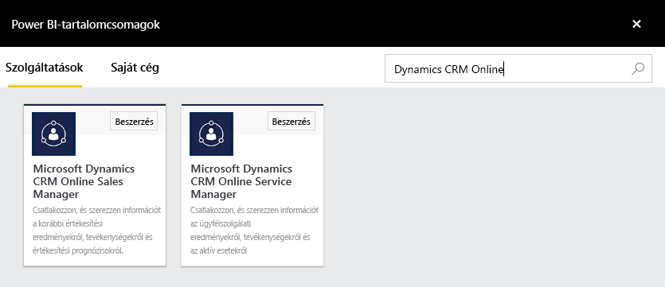
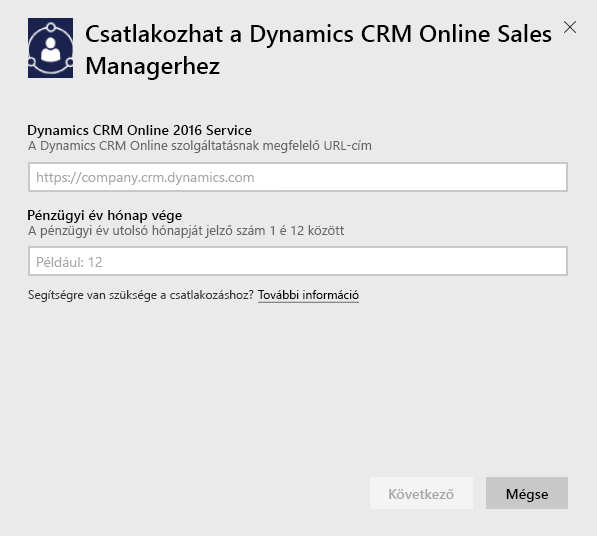
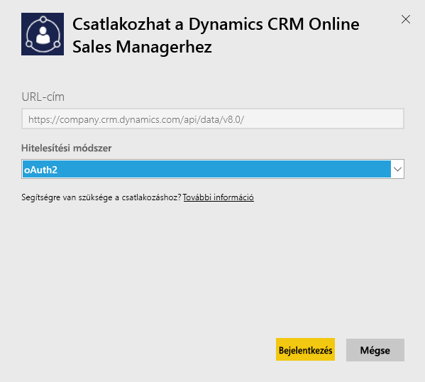
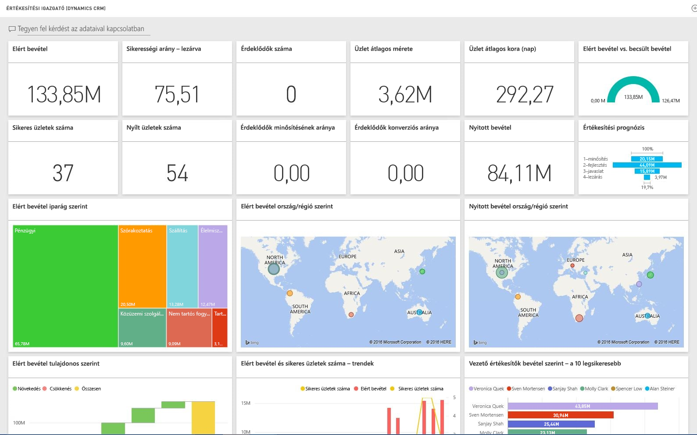

# Csatlakozás a Microsoft Dynamics CRM-hez a Power BI használatával
A Power BI-hoz készült Microsoft Dynamics CRM Online lehetővé teszi az adatok könnyű elérését és elemzését. A Power BI az OData-adatcsatorna használatával hoz létre leíró modelleket, beleértve az összes szükséges entitást és mértéket (pl.: Fiókok, Tevékenységek, Lehetőségek, Termék, Érdeklődők, Felhasználók stb.). Az alkalmazás telepítése után az irányítópultot és a jelentéseket a Power BI szolgáltatásban ([https://powerbi.com](https://powerbi.com)) és a Power BI-mobilalkalmazásokban is megtekintheti. 

Csatlakozhat a Dynamics CRM Online [Sales Managerhez](https://msit.powerbi.com/groups/me/getdata/services/dynamics-crm-sales-manager) vagy [Service Managerhez](https://msit.powerbi.com/groups/me/getdata/services/dynamics-crm-customer-service). További információ a [Dynamics CRM Online és a Power BI integrációjáról](https://powerbi.microsoft.com/integrations/microsoft-dynamicscrm).

Ehhez a kapcsolathoz **Microsoft Dynamics CRM Online 2016-os vagy újabb verzió** szükséges. A [követelményekkel](#Requirements) kapcsolatos további információkat lásd alább.

## Csatlakozás
[!INCLUDE [powerbi-service-apps-get-more-apps](./includes/powerbi-service-apps-get-more-apps.md)]

1. Válassza a **Microsoft Dynamics CRM Sales Manager** vagy **Microsoft Dynamics CRM Service Manager** lehetőséget, majd kattintson a **Csatlakozás** gombra.
   
   
2. Adja meg a fiókjához társított szolgáltatási URL-címet.  Ez az alábbi formátumban lesz: `https://company.crm.dynamics.com`. További részleteket az [alábbiakban](#FindingParams) olvashat.
   
   
3. Amikor a rendszer felkéri, adja meg a hitelesítő adatait (erre a lépésre lehet, hogy nem lesz szükség, ha már bejelentkezett a böngészőjében). Hitelesítési módszernek adja meg az **oAuth2** értéket, és kattintson a **Bejelentkezés** lehetőségre:
   
   
4. Csatlakozás után egy Sales Manager- vagy Service Manager-specifikus irányítópultot fog látni, amely a saját adataival lesz feltöltve.
   
   

## A Microsoft Dynamics CRM-irányítópult és -jelentések megtekintése
[!INCLUDE [powerbi-service-apps-open-app](./includes/powerbi-service-apps-open-app.md)]

[!INCLUDE [powerbi-service-apps-open-app](./includes/powerbi-service-apps-what-now.md)]

## Tartalom
Az alábbi szakaszok azt ismertetik, hogy mit tartalmaz a [Sales Manager](#Sales) és a [Service Manager](#Service) szerepkör.

Vegye figyelembe, hogy az adatokat továbbá a Dynamics CRM Online-felhasználóhoz hozzárendelt biztonsági szerepkör is korlátozza.

Az irányítópult és a jelentések célja, hogy működési jelentéseket biztosítsanak a rövid távú adatokról egyetlen csapatra vagy csoportra összpontosítva. Lekérdezésenként legfeljebb 100 ezer rekord kérhető le a Dynamics CRM Online-ból. Ha meghaladja a korlátot a cégben található adatok nagy mennyisége miatt, az üzembe helyezés sikertelen lesz, mert a Dynamics CRM Online adatfrissítése megszakad. Ha a fiókja túl nagy, fontolja meg a Power BI Desktopon keresztüli csatlakozást, és egy egyedi megoldás kiépítését.

### Sales Manager
Az irányítópult és a jelentések többek között az alábbi kulcsfontosságú mértékeket tartalmazzák:  

* Elért bevétel   
* Nyerési arány   
* Nyitott bevétel   
* Elveszített bevétel   
* Várt bevétel  
* Átlagos üzlet mérete stb.  

Emellett többek között az alábbi kulcsfontosságú diagramokat is tartalmazza:  

* Elért és elveszített bevétel tendenciája, Elért bevétel és becsült bevétel tendenciája  
* Elért bevétel különféle szempontok alapján, mint például: Iparág, Régió, Terület   
* Vezető értékesítők az alábbiak szerint: Bevétel, Tevékenységek,   
* Legfontosabb ügyfelek, Legfontosabb megnyert/elveszített ajánlatok,    
* Új érdeklődők tendenciája, Értékesítési folyamat stb.   

Ezek a mértékek és diagramok segítenek az értékesítési üzlet teljesítményének megértésében, valamint az értékesítési folyamat az egész értékesítési csapatra vonatkozó elemzésében.

Az alábbi táblázat a jelen szolgáltatás esetében elérhető CRM-entitásokat sorolja fel, illetve az egyes entitásrekordokon alkalmazott szűrőkről nyújt további információt.

| CRM-entitás | Alkalmazott szűrők |
| --- | --- |
| Fiók |Minden fiók, amely rendelkezik az elmúlt 365 nap során módosított lehetőséggel. |
| Tevékenység |Az elmúlt 90 nap során módosított összes tevékenység   [modifiedon] > ma – 90 nap |
| Vállalati egység |Az összes le nem tiltott vállalati egység   [isdisabled] = hamis |
| Érdeklődő |Az elmúlt 180 nap során módosított összes érdeklődő   [modifiedon] > ma – 180 nap |
| Lehetőség |Az elmúlt 365 nap során módosított összes lehetőség   [modifiedon] > ma – 365 nap |
| Lehetőség terméke |A lehetőségként kínált, az elmúlt 365 nap során módosított összes termék   [modifiedon] > ma – 365 nap |
| Termék |Minden aktív termék   [statecode] <> 1 |
| Terület |Minden terület |
| Felhasználó |Minden felhasználó és nem delegált rendszergazda    [isdisabled] = hamis és [accessmode] <> 4 |

### Service Manager
Ez az irányítópult és a jelentések többek között az alábbi kulcsfontosságú mértékeket tartalmazzák:  

* CSAT-százalék   
* Teljesített SLA százalékos értéke   
* Eszkalált esetek százalékos értéke   
* Átlagos kezelési idő   
* Megoldott esetek összesen  
* Aktív esetek összesen  
* Tudásbáziscikk használatának száma esetek során stb.    

Emellett többek között az alábbi kulcsfontosságú diagramokat is tartalmazzák:   

* Esetek mennyiségi tendenciája Beérkező esetek, Megoldott esetek, Eszkalált esetek esetén   
* Esetek mennyisége különféle szempontok alapján, mint például: Forrás, Hely, Prioritás, Típus  
* Vezetők CSAT-százalékos érték, Teljesített SLA százalékos érték, Tevékenységek, Megoldott esetek alapján  
* Legtöbbet használt és Legtöbbet megtekintett tudásbáziscikkek stb.  
    Ezek a mértékek és diagramok segítenek az ügyféltámogatási üzlet teljesítményének megértésében, valamint az aktív esetek munkaterhelésének a szolgáltatói csapatra és szolgáltatási várakozási sorokra vonatkozó elemzésében.

Az alábbi táblázat a jelen szolgáltatás esetében elérhető CRM-entitásokat sorolja fel, illetve az egyes entitásrekordokon alkalmazott szűrőkről nyújt további információt.

| CRM-entitás | Alkalmazott szűrők |
| --- | --- |
| Fiók |Minden fiók, amely rendelkezik az elmúlt 90 nap során módosított hozzárendelt esettel. |
| Tevékenység |Az elmúlt 90 nap során módosított összes tevékenység   [modifiedon] > ma – 90 nap |
| Eset |Az elmúlt 90 nap során módosított összes eset   [modifiedon] > ma – 90 nap |
| Esetmegoldási tevékenység |Az elmúlt 90 nap során módosított összes esetmegoldási tevékenység   [modifiedon] > ma – 90 nap |
| Kapcsolattartó |Minden kapcsolattartó, aki rendelkezik az elmúlt 90 nap során módosított hozzárendelt esettel. |
| Tudásbáziscikk |Az összes tudásbáziscikk legújabb verziója    [islatestversion] = igaz |
| Tudásbáziscikk-incidens |Az elmúlt 90 nap során módosított összes tudásbáziscikk-incidens   [modifiedon] > ma – 90 nap |
| Várólista |Minden aktív várólista    [statecode] = 0 |
| Várólistaelem |Az elmúlt 365 nap során létrehozott összes, az esethez kapcsolódó várólistaelem    [createdon] > ma – 365 nap és   [objecttypecode] = 112 |
| Felhasználó |Minden aktív felhasználó    [isdisabled] = hamis |

## Rendszerkövetelmények
* Egy érvényes Dynamics CRM Online 2016-os vagy újabb példány (a Power BI nem működik helyszíni CRM-verziókkal). Ha nem rendelkezik a 2016-os vagy újabb verzióval:
* Egy rendszergazdának engedélyeznie kell az OData-végpontot a webhelybeállításokban.
* Egy fiók, amely egyik táblában sem rendelkezik 100 ezernél több rekorddal. Vegye figyelembe, hogy ha a fiók több mint 100 ezer rekordhoz fér hozzá, az importálás sikertelen lesz.

## Paraméterek helye
A példány címe a böngésző URL-címsávjában található. Általában a következő formátumban van: `https://[instance_name].crm.dynamics.com`.

A Power BI csak a Dynamics CRM 2016 verziójú végpontokat támogatja. A kapcsolat nem fog létrejönni a CRM Online korábbi verzióival. Power BI Desktop használatával közvetlenül a fiókjához kapcsolódhat.

## Hibaelhárítás
Ha problémába ütközik a csatlakozás közben, ellenőrizze, hogy:  

* a megfelelő példány URL-címét adja-e meg (ellenőriztesse a rendszergazdával);  
* a példány CRM Online 2016-os verziójú-e;  
* engedélyezve van-e az OData-végpont.  

Illetve próbáljon meg közvetlenül a Power BI Desktopban csatlakozni az alábbi OData URL-címmel: `https://[instance_name].crm.dynamics.com/api/data/v8.0/`.

Ha meggyőződött arról, hogy a Dynamics CRM Online 2016-os verziójával rendelkezik, de továbbra is csatlakozási hibákba ütközik, lépjen kapcsolatba CRM-rendszergazdájával, és ellenőriztesse, hogy minden elérhető frissítéssel rendelkezik-e.

Ha nem rendelkezik a CRM Online 2016-os vagy újabb verziójával, a Power BI Desktop használatával kapcsolódhat közvetlenül a fiókjához.

Ha „Az adatok frissítése sikertelen volt, mert a lekérdezés meghaladta a rekordok maximális, 100 000-es korlátját” hibaüzenetet látja, fontolja meg a közvetlenül a Power BI Desktopból történő csatlakozást, vagy egy CRM-megoldássablon használatát.

## Következő lépések
* [Mik a Power BI szolgáltatáson belüli alkalmazások?](service-install-use-apps.md)
* [Adatok lekérése a Power BI-ban](service-get-data.md)
* További kérdései vannak? [Kérdezze meg a Power BI közösségét](http://community.powerbi.com/)

