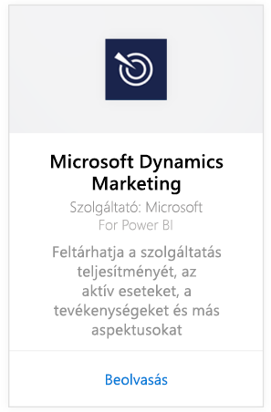
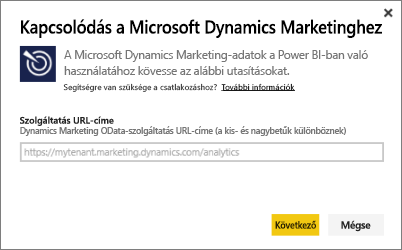
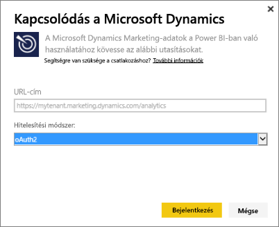
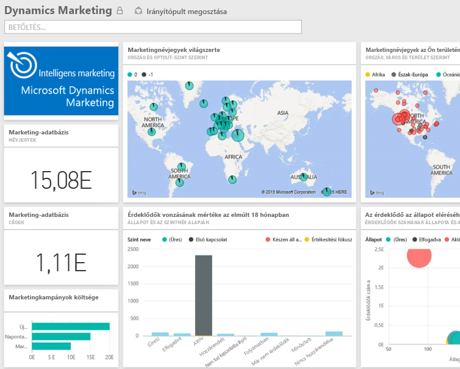

# Kapcsolódás a Power BI-ból a Microsoft Dynamics Marketinghez
A Power BI-hoz készült Microsoft Dynamics Marketing-programcsomag segítségével könnyedén hozzáférhet a Dynamics Marketingből származó adatokhoz és egyszerűen elemezheti őket. A teljesítménycsomag egy, az OData-csatornára épülő leíró modellt használ, és az összes szükséges entitást és mértéket tartalmazza, többek között programokat, kampányokat, marketingkapcsolatokat és -vállalatokat, érdeklődőket, érdeklődő-interakciókat és érdeklődőpontozást, e-mailes marketingüzeneteket és weboldalakat, viselkedésmegfigyeléseket, költségvetéseket, pénzügyi tranzakciókat és teljesítmény KPI-ket. 

Kapcsolódjon a Power BI-hoz készült [Dynamics Marketing-tartalomcsomaghoz](https://app.powerbi.com/getdata/services/microsoft-dynamics-marketing).

>[!NOTE]
>A Dynamics Marketing-példányhoz egy érvényes OData URL-címet kell megadnia (a tartalomcsomag egy helyszíni CRM-verzióval nem fog működni). Az alábbiakban megtekintheti a további követelményeket.

## A kapcsolódás menete
1. Válassza az Adatok lekérése elemet a bal oldalon lévő navigációs ablaktábla alján.
   
    
2. A **Szolgáltatások** mezőben válassza a **Beolvasás** elemet.
   
    
3. Válassza a **Microsoft Dynamics Marketing** \> **Beolvasás** lehetőséget.
   
   
4. Adja meg a fiókjához társított OData URL-címét.  Ez „https://[instance\_name].marketing.dynamics.com/analytics” formájú lesz.
   
   
5. Amikor a rendszer erre kéri, adja meg a hitelesítő adatait (ha már bejelentkezett a böngészőjében, akkor lehet, hogy ez a lépés kimarad). A Hitelesítési módszer beállításnál válassza az **oAuth2** elemet, majd kattintson a **Bejelentkezés** gombra:
   
   
6. A kapcsolódás után látni fogja a Dynamics Marketing-irányítópultot, amely a saját adataival lesz feltöltve. A bal oldali navigációs ablaktáblán sárga csillagok jelzik az új elemeket.
   
   

**Hogyan tovább?**

* [Tegyen fel egy kérdést a Q&A mezőben](service-q-and-a.md), amely az irányítópult tetején található.
* [Módosítsa a csempéket](service-dashboard-edit-tile.md) az irányítópulton.
* [Válasszon ki egy csempét](service-dashboard-tiles.md) az alapjául szolgáló jelentés megnyitásához.
* Az adatkészlet naponta frissül, de módosíthatja a frissítési ütemezést, és bármikor frissíthet igény szerint is az **Azonnali frissítés** lehetőséggel.

## Rendszerkövetelmények
* A Dynamics Marketing-példányhoz egy érvényes OData URL-címet kell megadnia (a tartalomcsomag egy helyszíni CRM-verzióval nem fog működni).  
* A rendszergazdának engedélyeznie kell az OData-végpontot a webhelybeállítások között. Az OData-végpont címe a **Kezdőlap \> Beállítások \> Webhelybeállítások** lehetőséget megnyitva a **Szervezeti Adatszolgáltatás** részen található meg.  Az OData URL-címe az alábbi formátumú:  https://[instance\_name].marketing.dynamics.com/analytics  
* A Microsoft Dynamics Marketinghez használt felhasználói fióknak/identitásnak ugyanannak kell lennie, mint amelyet a Power BI regisztrációjához használt. Amikor bejelentkezik a Microsoft Dynamics Marketingbe, a rendszer automatikusan belépteti ugyanazzal az identitással, amelyet a Power BI-hoz használ. Ha egy másik fiókkal szeretne bejelentkezni a Microsoft Dynamics Marketingbe, akkor regisztráljon ezzel a másik fiókkal Power BI-felhasználóként. Reméljük, ezt a problémát egy közelgő kiadásban meg fogjuk oldani.   

## Hibaelhárítás
Ha a „Sikertelen bejelentkezés” üzenetet látja, amikor Dynamics CRM-fiókjához próbál kapcsolódni, ellenőrizze, hogy ugyanazzal a fiókkal van bejelentkezve a Power BI-ba, amelyet a CRM Online OData-csatornához is használna. Próbáljon meg bejelentkezni a csatornára egy böngészőből is, hogy ott is tesztelje a bejelentkezést.

Kérje meg a rendszergazdáját, hogy erősítse meg, megfelelő-e az OData URL-címe, és hogy az OData-végpont engedélyezve van-e.

Ellenőrizze, hogy melyik verziójú Dynamics Marketinget használja – a 18.0-ás és 18.1-es verziók további javításokat tartalmaznak, így ha problémákat tapasztal, de még egy régebbi verziót használ, érdemes lehet frissíteni.

Ha továbbra is problémákat tapasztal, küldjön támogatási jegyet a Power BI csapatának:

* A Power BI alkalmazásban válassza a kérdőjel \> **Kapcsolatfelvétel az ügyfélszolgálattal** lehetőséget.
* A Power BI támogatási oldalán (ahol ezt a cikket is olvassa) válassza a **Kapcsolatfelvétel az ügyfélszolgálattal** elemet a lap jobb oldalán.

## Következő lépések
[Adatbeolvasás a Power BI-ban](service-get-data.md)

[Első lépések a Power BI használatával](service-get-started.md)

