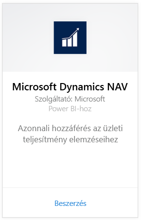
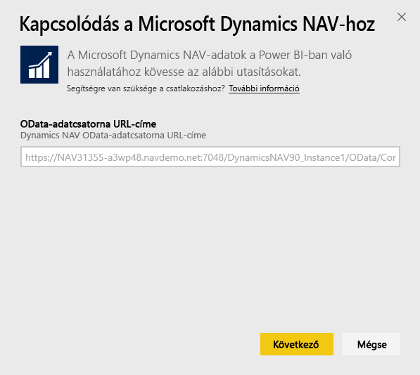
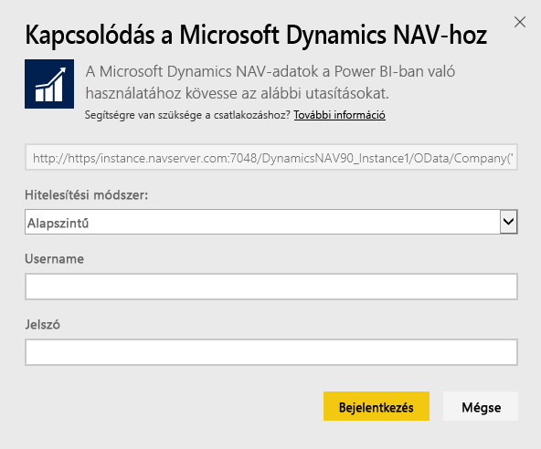
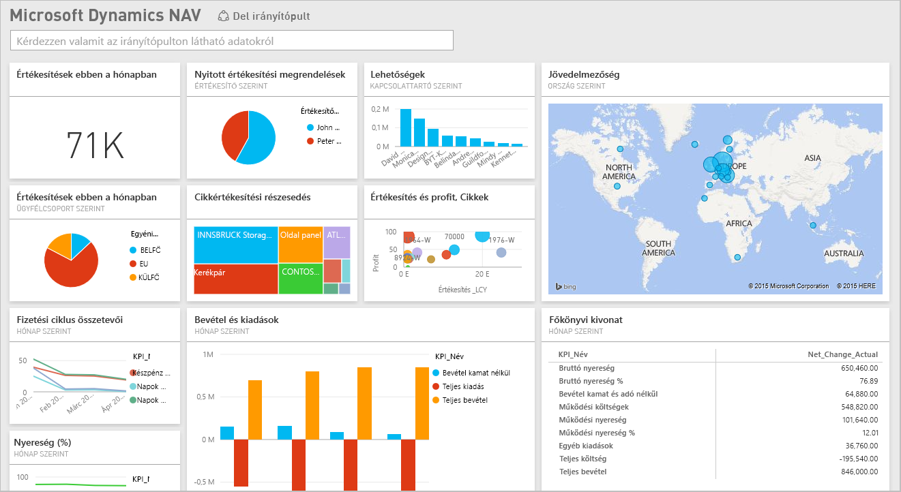

# Kapcsolódás a Microsoft Dynamics NAV-hoz a Power BI-jal
A Power BI használatával egyszerűen elemezheti Microsoft Dynamics NAV-adatait. A Power BI lekéri az értékesítési és a pénzügyi adatokat is, majd irányítópultot és jelentést is magában foglaló alkalmazást készít az adatok alapján. A Power BI-nak szüksége van az Ön engedélyeire az adatokat tartalmazó táblákhoz, ebben az esetben az értékesítési és pénzügyi adatokhoz. A követelményekről alább talál további információkat. Az alkalmazás telepítése után az irányítópultot és a jelentéseket a Power BI szolgáltatásban ([https://powerbi.com](https://powerbi.com)) és a Power BI-mobilalkalmazásokban is megtekintheti. 

[Kapcsolódjon a Microsoft Dynamics NAV-hoz a Power BI-jal](https://app.powerbi.com/getdata/services/microsoft-dynamics-nav), vagy tájékozódjon tovább a [Dynamics NAV integrációjáról](https://powerbi.microsoft.com/integrations/microsoft-dynamics-nav) a Power BI-jal.

## A kapcsolódás menete
[!INCLUDE [powerbi-service-apps-get-more-apps](./includes/powerbi-service-apps-get-more-apps.md)]

1. Válassza a **Microsoft Dynamics NAV**, majd a **Beolvasás** lehetőséget.  
   
2. Amikor a rendszer kéri, adja meg Microsoft Dynamics NAV OData URL-címét. Az URL-címnek a következő mintának kell megfelelnie:
   
    `https//instance.navserver.com:7048/DynamicsNAV90_Instance1/OData/Company('CRONUS%20International%20Ltd.')`
   
   * „instance.navserver.com”, az Ön NAV-kiszolgálójának nevével
   * „DynamicsNAV90\_Instance1” a saját NAV-kiszolgálópéldány nevével
   * „Company('CRONUS%20International%20Ltd.')” az Ön vállalatának NAV-beli nevével
     
     Ez az URL-cím egyszerűen kinyerhető úgy, hogy a Dynamics NAV webes szolgáltatásainak megnyitása után megkeresi a powerbifinance webszolgáltatást, és kimásolja az OData URL-címet, de lehagyja az URL-sztringből a „/powerbifinance” végződést.  
     
3. Válassza az **Alapszintű** lehetőséget és adja meg Microsoft Dynamics NAV hitelesítő adatait.
   
    A Microsoft Dynamics NAV-fióknak rendszergazdai jogosultsággal (vagy legalább az értékesítési és a pénzügyi adatokhoz való engedélyekkel) kell rendelkeznie.  Jelenleg csak az alapszintű (felhasználónév és jelszó) hitelesítés támogatott.
   
    
4. A Power BI betölti a Microsoft Dynamics NAV-adatokat, és használatra kész irányítópultot és jelentést hoz létre.   
   

## Az irányítópult és a jelentések megtekintése
[!INCLUDE [powerbi-service-apps-open-app](./includes/powerbi-service-apps-open-app.md)]

[!INCLUDE [powerbi-service-apps-open-app](./includes/powerbi-service-apps-what-now.md)]

## A csomag tartalma
Az irányítópult és a jelentések az alábbi táblákból származó adatokat tartalmaznak:  

* ItemSalesAndProfit  
* ItemSalesByCustomer  
* powerbifinance  
* SalesDashboard  
* SalesOpportunities  
* SalesOrdersBySalesPerson  
* TopCustomerOverview  

## Rendszerkövetelmények
A Microsoft Dynamics NAV-adatok Power BI-ba történő importálásához engedélyekkel kell rendelkeznie azokhoz a fent felsorolt táblákhoz, amelyekből az értékesítési és pénzügyi adatok beolvasódnak. A tábláknak adatokat is kell tartalmazniuk, az üres táblák importálása egyelőre hibát okoz.

## Hibaelhárítás
A Power BI a Microsoft Dynamics NAV webes szolgáltatásával olvassa be az adatokat. Ha nagy mennyiségű adatot tárol a Microsoft Dynamics NAV-példányában, akkor ajánlott igény szerint módosítani a frissítés gyakoriságát, hogy minimalizálja a webes szolgáltatás terhelését. Javasolt továbbá egy rendszergazdával létrehozatni és megosztatni az alkalmazást ahelyett, hogy minden rendszergazda sajátot hozna létre.

**„Nem sikerült érvényesíteni a paramétereket. Győződjön meg arról, hogy minden paraméter érvényes.”**  
Ha ezt a hibaüzenetet kapja a Microsoft Dynamics NAV URL-címének begépelése után, akkor győződjön meg a következő követelmények teljesüléséről:

* Az URL-cím pontosan megfelel a következő mintának:
  
    `https//instance.navserver.com:7048/DynamicsNAV90_Instance1/OData/Company('CRONUS%20International%20Ltd.')`
  
  * „instance.navserver.com”, az Ön NAV-kiszolgálójának nevével
  * „DynamicsNAV90\_Instance1” a saját NAV-kiszolgálópéldány nevével
  * „Company('CRONUS%20International%20Ltd.')” az Ön vállalatának NAV-beli nevével
* Minden betű kisbetű.  
* Az URL-cím sémája 'https'.  
* Az URL-cím vége nincs perjellel lezárva.

**„A bejelentkezés sikertelen volt”**  
Ha a Microsoft Dynamics NAV hitelesítő adatok megadása után a „bejelentkezés sikertelen volt” hibaüzenetet kapja, akkor a következő problémák egyike állhat fenn:

* A használt fióknak nincs engedélye a Microsoft Dynamics NAV-adatok beolvasására az Ön fiókjából. Győződjön meg arról, hogy rendszergazdai fiókot használ, és próbálkozzon újra.
* A Dynamics NAV-példány, amelyhez kapcsolódni próbál, nem rendelkezik érvényes SSL-tanúsítvánnyal. Ebben az esetben részletesebb hibaüzenetet kap („unable to establish trusted SSL relationship” – nem sikerült létrehozni megbízható SSL-kapcsolatot). Vegye figyelembe, hogy a saját aláírású tanúsítványok használata nem támogatott.

**„Hoppá!”**  
Ha a hitelesítő párbeszédablak után a „Hoppá!” hibaüzenet jelenik meg, akkor a Power BI az adatok beolvasása során ütközött problémába.

* Ellenőrizze, hogy az URL-cím megfelel-e a fent megadott sémának. Gyakori hiba, hogy csak az alábbi részt adják meg:
  
    `https//instance.navserver.com:7048/DynamicsNAV90\_Instance1/OData`
  
    Meg kell adni a „Company('CRONUS%20International%20Ltd.')” részt is, a saját NAV-beli vállalatnévvel kitöltve:
  
    `https//instance.navserver.com:7048/DynamicsNAV90\_Instance1/OData/Company('CRONUS%20International%20Ltd.')`

## További lépések
* [Mik a Power BI szolgáltatáson belüli alkalmazások?](consumer/end-user-apps.md)
* [Adatok lekérése a Power BI-ban](service-get-data.md)
* További kérdései vannak? [Kérdezze meg a Power BI közösségét](http://community.powerbi.com/)

