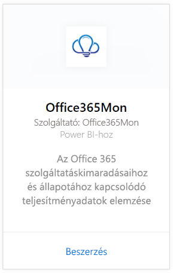
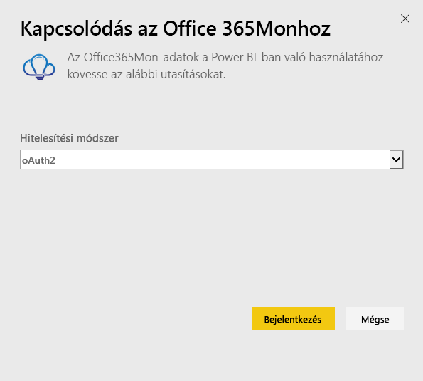
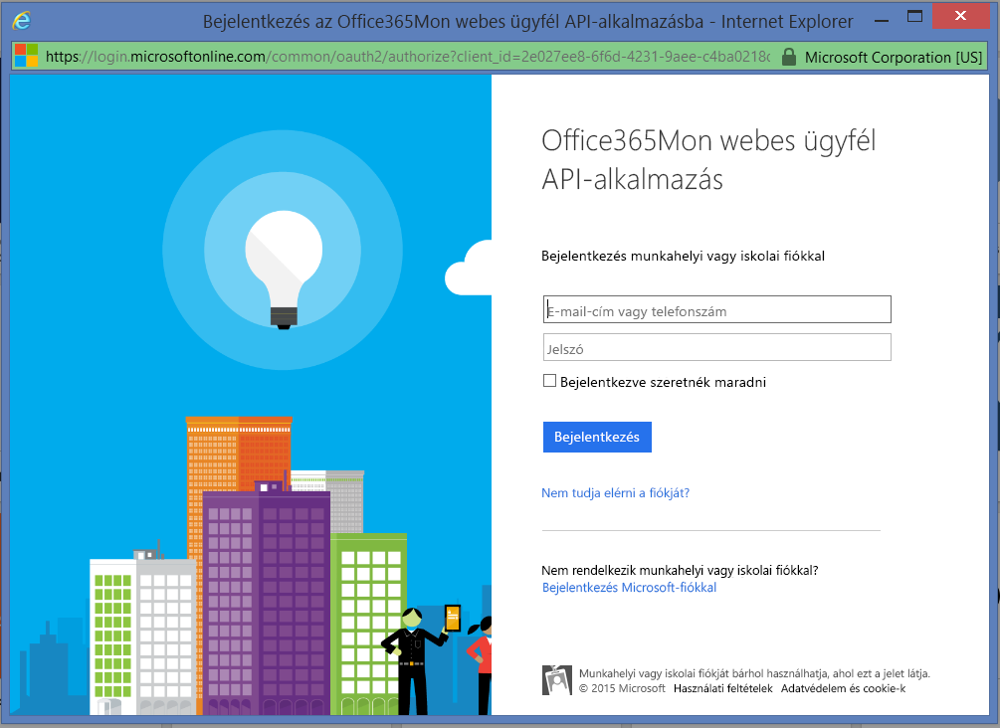
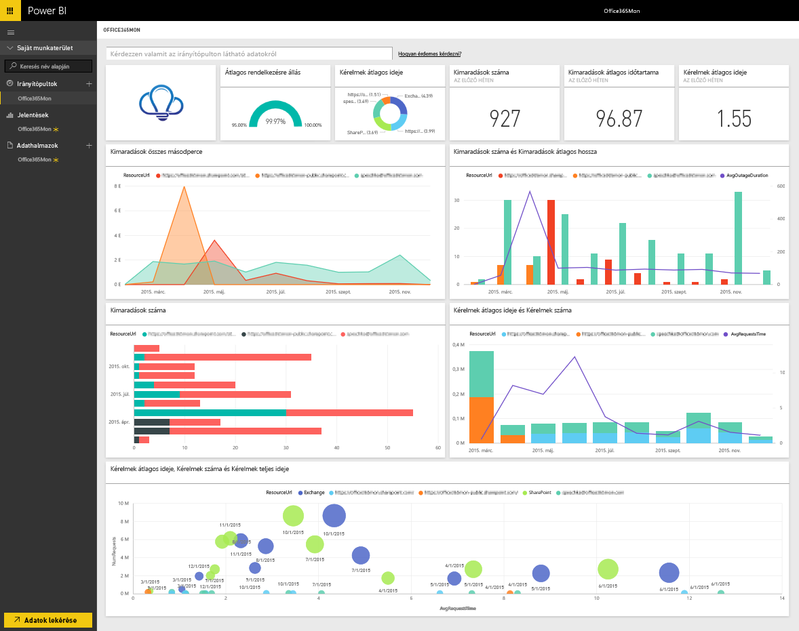

# Kapcsolódás az Office365Mon tartalomcsomaghoz a Power BI-jal
Az Office 365 leállásainak és az állapot teljesítményadatainak elemzése egyszerű a Power BI-jal és az Office365Mon tartalomcsomaggal. A Power BI lekéri az adatokat, többek között a leállásokat és az állapotmintákat, majd ezeken az adatokon alapuló, használatra kész irányítópultot és jelentéseket hoz létre.

Csatlakozzon a Power BI-hoz készült [Office365Mon tartalomcsomaghoz](https://app.powerbi.com/groups/me/getdata/services/office365mon).

>[!NOTE]
>A Power BI-tartalomcsomag betöltéséhez Office365Mon rendszergazdai fiók szükséges.

## A csatlakozás menete
1. Kattintson az **Adatok lekérése** elemre a bal oldalon lévő navigációs ablaktábla alján.
   
   
2. A **Szolgáltatások** mezőben kattintson a **Beolvasás** gombra.
   
    
3. Kattintson az **Office365Mon** \> **Get** (Beolvasás) gombra.
   
   
4. Az Authentication Method (Hitelesítési módszer) beállításnál válassza az **oAuth2** \> beállítást, majd a **Sign In** (Bejelentkezés) elemet.
   
   Amikor a rendszer kéri, adja meg az Office365Mon rendszergazdai hitelesítő adatait, majd haladjon végig a hitelesítési folyamaton.
   
   
   
   
5. Miután a Power BI importálta az adatokat, megjelenik egy új irányítópult, egy jelentés és egy adathalmaz a bal oldali navigációs ablaktáblán. Az új elemeket egy sárga csillag jelöli \*, válassza ki az Office365Mon bejegyzést.
   
   

**Hogyan tovább?**

* [Tegyen fel egy kérdést a Q&A mezőben](service-q-and-a.md), amely az irányítópult tetején található.
* [Módosítsa a csempéket](service-dashboard-edit-tile.md) az irányítópulton.
* [Kattintson az egyik csempére](service-dashboard-tiles.md) az alapjául szolgáló jelentés megnyitásához.
* Az adatkészlet az ütemezés szerint naponta frissül, de módosíthatja is a frissítési ütemezést, vagy igény szerint frissíthet bármikor, az **Azonnali frissítés** lehetőségre kattintva.

## Hibaelhárítás
Ha **„Sikertelen bejelentkezés”** hibaüzenetet kap az Office365Mont hitelesítő adatai megadása után, akkor a használt fióknak nincs jogosultsága az Office365Mon-adatokat lekérni az Ön fiókjából. Ellenőrizze, hogy rendszergazdai fiókot használ-e, és próbálkozzon újra.

## Következő lépések
[Első lépések a Power BI-ban](service-get-started.md)

[Adatbeolvasás a Power BI-ban](service-get-data.md)

