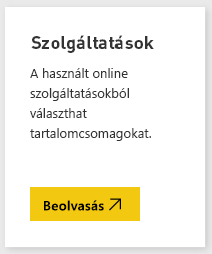
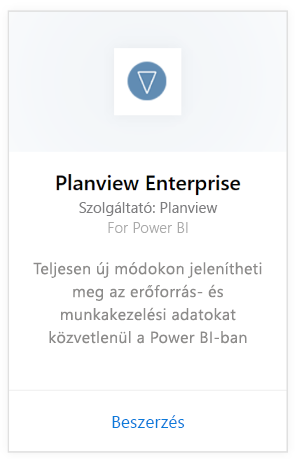
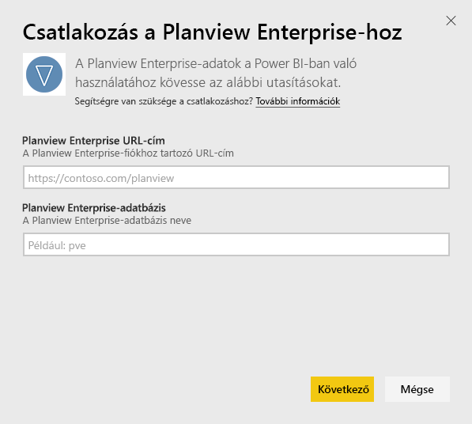
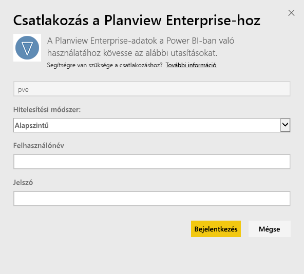
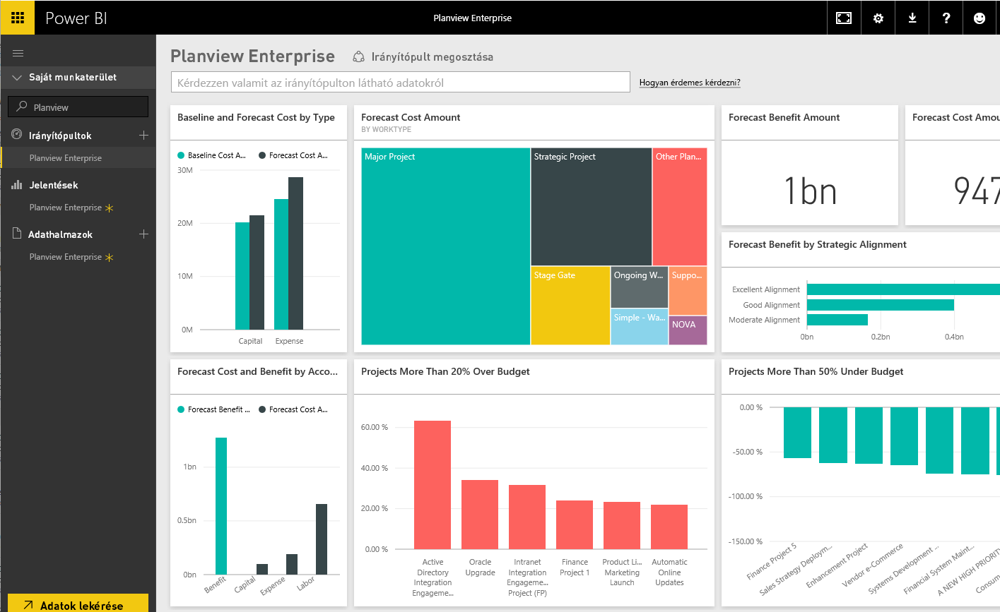

# Kapcsolódás a Microsoft Dynamics szolgáltatáshoz a Power BI segítségével
A Planview Enterprise tartalomcsomaggal teljesen új módokon jelenítheti meg az erőforrás- és munkakezelési adatokat közvetlenül a Power BI-ban. A Planview Enterprise bejelentkezési hitelesítő adatainak használatával interaktívan tekintheti meg a portfólióbefektetési kiadásokat, megtekintheti, hogy mely tételek lépték túl a költségvetést, és melyek vannak azon belül, továbbá megismerheti, hogy hogyan illeszkednek a projektek a vállalat stratégai prioritásaihoz. Az alapértelmezett irányítópultot és jelentéseket emellett kibővítheti az Ön számára legfontosabb elemzésekkel.

Csatlakozás a [Planview Enterprise tartalomcsomaghoz a Power BI-ban](https://app.powerbi.com/getdata/services/planview-enterprise)

>[!NOTE]
>A Planview Enterprise adatok Power BI-ba importálásához Planview Enterprise-felhasználónak kell lennie, akinek a szerepkörén engedélyezve van a Reporting Portal Viewer szolgáltatás. A további követelményeket alább találja.

## Csatlakozás
1. A bal oldali navigációs ablaktábla alján kattintson az **Adatok lekérése** elemre.
   
    
2. A **Szolgáltatások** mezőben kattintson a **Lekérés** elemre.
   
    
3. A Power BI oldalán válassza a **Planview Enterprise**, majd a **Beolvasás** lehetőséget:  
    
4. A Planview Enterprise URL-cím szövegmezőjében adja meg a használni kívánt Planview Enterprise-kiszolgáló URL-címét. A Planview Enterprise-adatbázis szövegmezőjében adja meg a Planview Enterprise-adatbázis nevét, majd kattintson a Tovább lehetőségre.  
    
5. A Hitelesítési módszer listáról válassza az **Alapszintű** lehetőséget, ha még nincs bejelölve. Adja meg a fiókjához tartozó **Felhasználónevet** és **Jelszót**, és válassza a **Bejelentkezés** lehetőséget.  
   
6. A bal oldali panelen válassza a Planview Enterprise-t az irányítópultok listájáról.  
     A Power BI importálja a Planview Enterprise adatokat az irányítópultra. Vegye figyelembe, hogy az adatok betöltése eltarthat egy darabig.  
    

**Mi a következő lépés?**

* [Kérdéseket tehet fel a Q&A mezőben](power-bi-q-and-a.md) az irányítópult tetején.
* [Módosíthatja az irányítópult csempéit](service-dashboard-edit-tile.md).
* [Kiválaszthatja valamelyik csempét](service-dashboard-tiles.md) a mögöttes jelentés megnyitásához.
* Noha az adatkészlet napi frissítésre van ütemezve, módosíthatja a frissítési ütemezést, vagy igény szerint frissíthet az **Azonnali frissítés** gombbal.

## Rendszerkövetelmények
A Planview Enterprise adatok Power BI-ba importálásához Planview Enterprise-felhasználónak kell lennie, akinek a szerepkörén engedélyezve van a Reporting Portal Viewer szolgáltatás. A további követelményeket alább találja.

Ez az eljárás feltételezi, hogy már bejelentkezett a Microsoft Power BI kezdőlapjára egy Power BI-fiókkal. Ha nincs még Power BI-fiókja, hozzon létre egyet ingyen a Power BI kezdőlapján, majd kattintson az Adatok lekérése lehetőségre.

## Következő lépések:

[Első lépések a Power BI-ban](service-get-started.md)

[Power BI – Adatok lekérése](service-get-data.md)