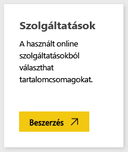
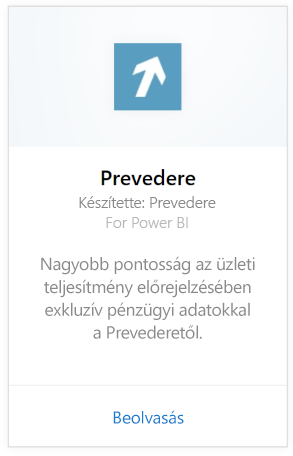
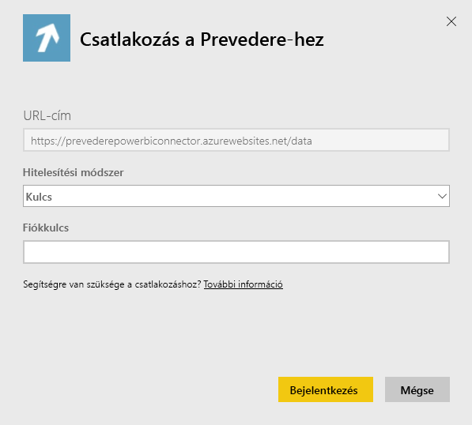
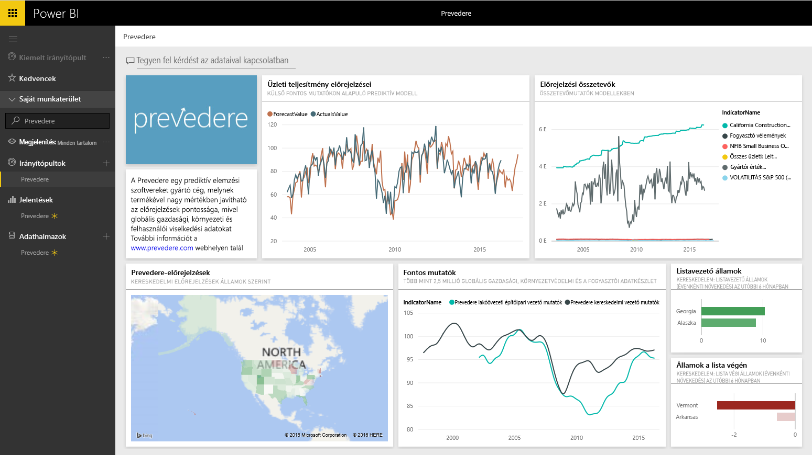

# Kapcsolódás a Prevedere eszközhöz a Power BI-ban
Exkluzív és kritikus fontosságú pénzügyi információkhoz juthat, amelyekkel magabiztosan és kezdeményezően fejlesztheti üzletét.

Csatlakozzon a Power BI-hoz készült [Prevedere tartalomcsomaghoz](https://app.powerbi.com/getdata/services/prevedere).

>[!NOTE]
>Ha Ön nem Prevedere-felhasználó, a kipróbáláshoz használja a [mintakulcsot](https://prevederepowerbiconnector.azurewebsites.net/static/learnmore.html).

## A csatlakozás menete
1. A bal oldali navigációs ablaktábla alján kattintson az **Adatok lekérése** elemre.
   
   
2. A **Szolgáltatások** mezőben kattintson a **Beolvasás** elemre.
   
   
3. Kattintson a **Prevedere**, majd a **Beolvasás** elemre.
   
   
4. A **Hitelesítési módszer** beállításban kattintson a **Kulcs** lehetőségre, majd adja meg a Prevedere API-kulcsát.
   
    
5. A **Bejelentkezés** elemre kattintva kezdje el az importálási folyamatot. Amikor a folyamat befejeződik, a navigációs ablaktáblán új irányítópult, jelentés és modell jelenik meg. Válassza ki az irányítópultot az importált adatok megtekintéséhez.
   
     

**Mi a következő lépés?**

* [Kérdéseket tehet fel a Q&A mezőben](power-bi-q-and-a.md) az irányítópult tetején.
* [Módosíthatja az irányítópult csempéit](service-dashboard-edit-tile.md).
* [Kiválaszthatja valamelyik csempét](service-dashboard-tiles.md) a mögöttes jelentés megnyitásához.
* Noha az adatkészlet napi frissítésre van ütemezve, módosíthatja a frissítési ütemezést, vagy igény szerint frissíthet az **Azonnali frissítés** gombbal.

## Tartalom
A tartalomcsomag elemzési adatokat nyújt többek között a kiskereskedelmi előrejelzésekről, az előrejelzési modellekről, és a fő mutatókról.

## Rendszerkövetelmények
A tartalomcsomag megköveteli a hozzáférést egy Prevedere API-kulcshoz vagy a mintakulcshoz (lásd alább).

## Paraméterek keresése

A meglévő ügyfelek a saját API-kulcs segítségével férhetnek hozzá az adataikhoz. Ha Ön még nem ügyfél, a [mintakulcs](https://prevederepowerbiconnector.azurewebsites.net/static/learnmore.html) használatával tekintheti meg az adat- és az elemzési mintákat.

## Hibaelhárítás
Az adatok betöltése a példány méretétől függően időbe telhet.

## Következő lépések
[Első lépések a Power BI-ban](service-get-started.md)

[Adatok lekérése a Power BI-ban](service-get-data.md)

