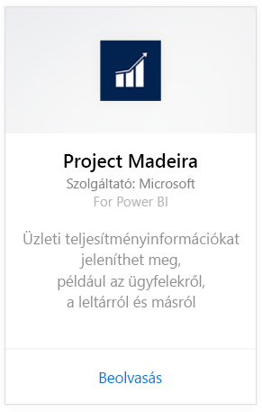
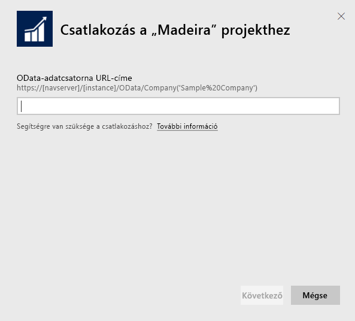
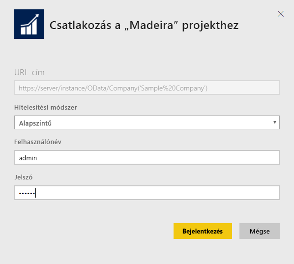
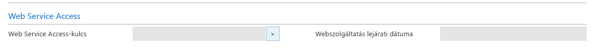
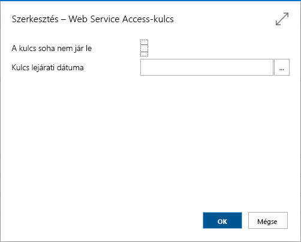
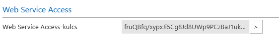

# Csatlakozás a „Madeira” projekthez a Power BI használatával
A Power BI és a „Madeira” projekt tartalomcsomag segítségével egyszerűen elemezheti a „Madeira” projekt adatait. A Power BI begyűjti az adatait (beleértve a Sales, azaz értékesítési és a Financial, azaz pénzügyi adatokat), majd összeállít egy használatra kész irányítópultot, és jelentést készít az adatok alapján.
Kapcsolódjon a Power BI-hoz készült „Madeira” projekthez, vagy ismerje meg a „Madeira” projekt és a Power BI integrációjával kapcsolatos további információkat.

>[!NOTE]
>A tartalomcsomag használatához megfelelő jogosultság szükséges az adatok forrásaként szolgáló táblákhoz, azaz esetünkben az értékesítési és pénzügyi adatokat tartalmazó táblákhoz. A követelményekkel kapcsolatos további információkat lásd [alább](#Requirements).

Kapcsolódjon a Power BI-hoz készült [„Madeira” projekt elemzési tartalomcsomaghoz](https://app.powerbi.com/getdata/services/project-madeira).

## Csatlakozás
1. A bal oldali navigációs ablaktábla alján kattintson az **Adatok lekérése** elemre.  
    
2. A **Szolgáltatások** mezőben kattintson a **Lekérés** elemre.  
    
3. Válassza a **„Madeira” projekt** elemet, majd kattintson a **Lekérés** elemre.  
    
4. Amikor a rendszer erre kéri, adja meg a „Madeira” projekt URL-címét. Az URL-címnek pontosan ezt a mintát kell követnie: https://mycronusus.projectmadeira.com:7048/NAV/OData/Company('CRONUS%20US') a saját „Madeira” projekt vállalatának nevével. Ügyeljen arra, hogy az URL-cím nem perjelre végződik, és a kapcsolatnak https-kapcsolatnak kell lennie. Az URL-cím megkeresésének részleteit [alább](#FindingParams) találja.  
   
    
5. Amikor a rendszer erre kéri, válassza az Alapszintű Hitelesítés módszert, felhasználónévként adja meg a „Madeira” projekthez tartozó e-mail-címét, jelszóként pedig a „Madeira” projekthez tartozó fiókja webszolgáltatás-hozzáférési kulcsát. Amennyiben böngészőben már bejelentkezett a „Madeira” projektbe, elképzelhető, hogy nem kell ismét megadnia a hitelesítő adatait. A hozzáférési kulcs létrehozásának részleteit lásd [alább](#FindingParams).  
   
    >[!NOTE]
    >A „Madeira” projektben felügyelői jogosultságokkal kell rendelkeznie.
   
    
6. Amint csatlakozott, a rendszer automatikusan betölt egy irányítópultot, egy jelentést és egy adatkészletet. Miután végzett, a csempék frissülnek a fiókja adataival.  
   
    

**Mi a következő lépés?**

* [Kérdéseket tehet fel a Q&A mezőben](service-q-and-a.md) az irányítópult tetején.
* [Módosíthatja az irányítópult csempéit](service-dashboard-edit-tile.md).
* [Kiválaszthatja valamelyik csempét](service-dashboard-tiles.md) a mögöttes jelentés megnyitásához.
* Noha az adatkészlet napi frissítésre van ütemezve, módosíthatja a frissítési ütemezést, vagy igény szerint frissíthet az **Azonnali frissítés** gombbal.

## Rendszerkövetelmények
A „Madeira” projekt adatainak a Power BI-ba való importálásához megfelelő jogosultság szükséges az adatok forrásaként szolgáló, értékesítési és pénzügyi adatokat tartalmazó táblákhoz. A tartalomcsomag használatához szükséges táblák (a névben megkülönböztetendők a kis- és nagybetűk) az alábbiak:  

    - ItemSalesAndProfit  
    - ItemSalesByCustomer  
    - powerbifinance  
    - SalesDashboard  
    - SalesOpportunities  
    - SalesOrdersBySalesPerson  
    - TopCustomerOverview  

## Paraméterek helye
**A megfelelő URL-cím beszerzése** Ez az URL-cím a „Madeira” projektben könnyen beszerezhető a Webszolgáltatások felületen: keresse meg a powerbifinance webszolgáltatást, és másolja ki az Odata URL-címét (válassza Parancsikon másolása parancsot a helyi menüből) az URL-karakterlánc „/powerbifinance…” része nélkül.

**Webszolgáltatás-hozzáférési kulcsok** A „Madeira” projekt adatainak használatához létre kell hoznia egy webszolgáltatás-hozzáférési kulcsot a felhasználó fiókjához. A „Madeira” projektben keresse meg a „Felhasználók” lapot, majd nyissa meg a felhasználói fiókja kártyáját. Itt létrehozhat egy új webszolgáltatás-hozzáférési kulcsot, majd bemásolhatja a Power BI kapcsolódási oldalán a Jelszó mezőbe.

Ha elkezd használni egy webszolgáltatás-hozzáférési kulcsot, a továbbiakban is azt kell majd használnia, ezért kattintson az OK gombra a felugró üzenetben.
A kulcs létrehozásakor beállíthatja, hogy elévüljön-e egy adott dátumon.

Az OK gombra kattintva létrejön a kulcs, és bemásolhatja a Power BI kapcsolódási oldalán a Jelszó mezőbe.

## Hibaelhárítás
A Power BI irányítópult a fent felsorolt közzétett webszolgáltatásokat használja, és a bemutató vállalat adatait jeleníti meg, illetve a saját vállalata adatait is, ha importálja őket az aktuális pénzügyi megoldásából. Ha azonban valamilyen hiba lépne fel, ebben a szakaszban talál kerülő megoldásokat a leggyakoribb problémákra.

**„A paraméterek érvényesítése meghiúsult, ellenőrizze, hogy minden paraméter érvényes-e” ** Ha a „Madeira” projekt URL-címének megadása után ez a hibaüzenet jelenik meg, ellenőrizze, hogy az alábbi követelmények teljesülnek-e:  

    - Az URL-cím pontosan ezt a mintát követi: https://*mycronusus*.projectmadeira.com:7048/NAV/OData/Company('*CRONUS%20US*')  
    - Törölje a vállalat neve utáni zárójeles szövegeket.  
    - Ellenőrizze, hogy az URL-cím nem perjellel záródik-e.  
    - Ellenőrizze, hogy az URL-cím biztonságos kapcsolatot használ-e – ezt a cím előtt a https előtag jelzi.  

**„Sikertelen bejelentkezés”** Ha a „Madeira” projekthez tartozó hitelesítő adataival az irányítópultra való bejelentkezés során „sikertelen bejelentkezés” hibaüzenet jelenik meg, ezt a következő hibák okozhatják:  

    - A használt fiók nem rendelkezik a szükséges jogosultsággal, hogy a beolvassa a „Madeira” projekt adatait a fiókból. Ellenőrizze a felhasználói fiókját a „Madeira” projektben, és győződjön meg róla, hogy a megfelelő webszolgáltatás-hozzáférési kulcsot állította be jelszóként, majd próbálkozzon újra.  
    - A „Madeira” projekt példánya, amelyhez csatlakozni próbál, nem rendelkezik érvényes a SSL-tanúsítvánnyal. Ebben az esetben egy részletesebb hibaüzenet jelenik meg („nem sikerült megbízható SSL-kapcsolatot kiépíteni”). Vegye figyelembe, hogy az önaláírt tanúsítványok nem támogatottak.  

**„Hoppá!”** Ha „Hoppá!” kezdetű hibaüzenet jelenik meg a hitelesítési párbeszédablak bezárása után, ezt leggyakrabban a tartalomcsomag adataihoz való kapcsolódással kapcsolatos hibák okozzák. Ellenőrizze, hogy az URL-cím a fent bemutatott mintát követi-e:  
    https://*mycronusus*.projectmadeira.com:7048/NAV/OData/Company('*CRONUS%20US*')

Gyakori hiba a webszolgáltatás teljes URL-címének megadása:  
    https://*mycronusus*.projectmadeira.com:7048/NAV/OData/Company('*CRONUS%20US*')/powerbifinance

Illetve az is hiba, ha lemarad a vállalat neve:   
    https://*mycronusus*.projectmadeira.com:7048/NAV/OData/

## Következő lépések
[Első lépések a Power BI-ban](service-get-started.md)

[Power BI – Alapfogalmak](service-basic-concepts.md)

