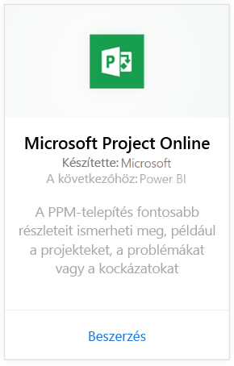
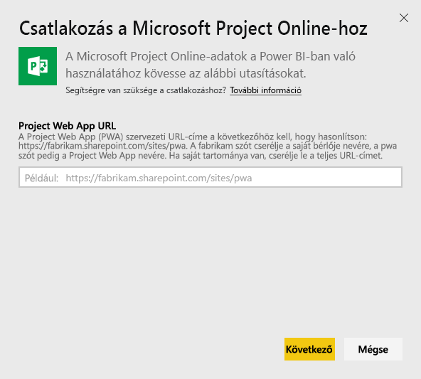
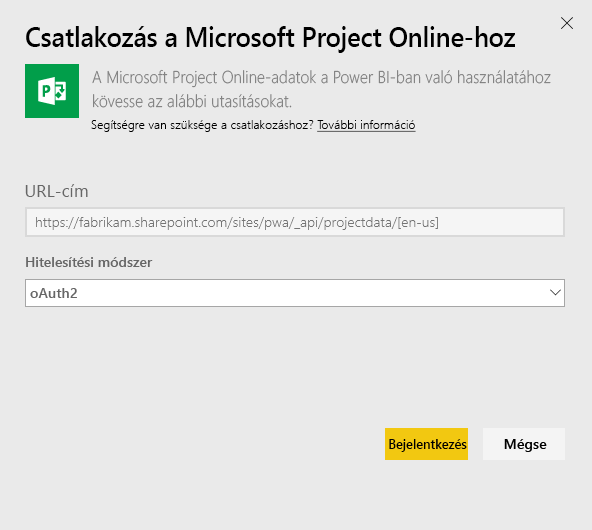
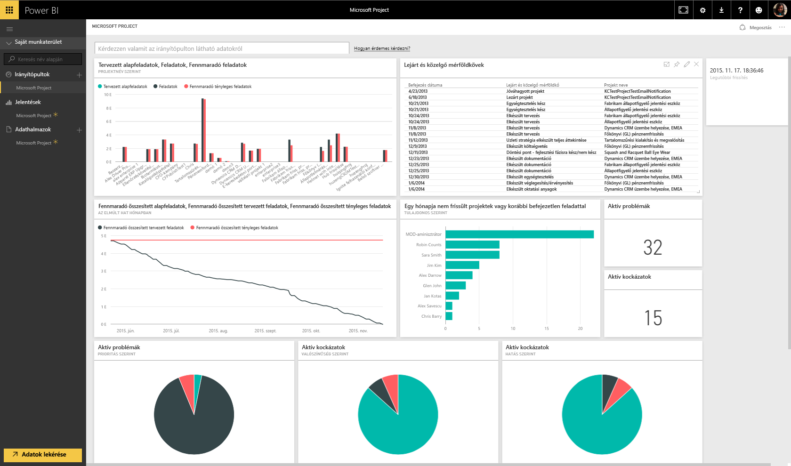

# Csatlakozás a Project Online-hoz a Power BI használatával
A Microsoft Project Online a projektportfólió-kezeléshez (PPM) és a mindennapi munkához nyújt rugalmas online megoldást. A Project Online lehetővé teszi a cég számára, hogy megtegye az előkészületeket, rangsorolja a projektporfólió-befektetéseket, és elérje a tervezett üzleti eredményt. A Power BI-hoz készült Project Online-tartalomcsomag segítségével olyan előregyártott mérőszámokkal elemezheti a projektadatokat, mint a portfólióállapot és a projektmegfelelőség.

Kapcsolódjon a Power BI-hoz készült [Project Online-tartalomcsomaghoz](https://app.powerbi.com/getdata/services/project-online).

## A csatlakozás menete
1. Kattintson az **Adatok lekérése** elemre a bal oldalon lévő navigációs ablaktábla alján.
   
    
2. A **Szolgáltatások** mezőben válasza a **Beolvasás** elemet.
   
   
3. Válassza a **Microsoft Project Online** \> **Get** lehetőséget.
   
   
4. A **Project Web App URL** (Projekt Web App URL-címe) szövegdobozba írja be a csatlakoztatni kívánt Project Web App URL-címét, majd kattintson a **Következő** elemre. Vegye figyelembe, hogy ez az adat egyedi tartomány esetén eltérhet a példától.
   
    
5. A Hitelesítési módszer beállításánál válassza az **oAuth2** \> **Sign In** lehetőséget. Amikor a rendszer kéri, adja meg a saját Projekt Online hitelesítő adatait, majd haladjon végig a hitelesítési folyamaton.
   
    
6. Egy értesítés jelzi, hogy az adatok betöltése folyamatban van. A fiók méretétől függően ez eltarthat egy ideig. Miután a Power BI importálta az adatokat, a bal oldali navigációs ablaktáblán egy új irányítópult, jelentés és adatkészlet jelenik meg. A Power BI ezt az alapértelmezett irányítópultot hozta létre az adatok megjelenítésére. Az irányítópultot módosíthatja, hogy az igényei szerint jelenítse meg az adatokat.
   
   

**Hogyan tovább?**

* [Tegyen fel egy kérdést a Q&A mezőben](service-q-and-a.md), amely az irányítópult tetején található
* [Módosítsa a csempéket](service-dashboard-edit-tile.md) az irányítópulton.
* [Kattintson egy csempére](service-dashboard-tiles.md) a mögöttes jelentés megnyitásához.
* Az adatkészlet az ütemezés szerint naponta frissül, de módosíthatja is a frissítési ütemezést, vagy igény szerint frissíthet bármikor, az **Azonnali frissítés** lehetőségre kattintva.

## További lépések
[Első lépések a Power BI-ban](service-get-started.md)

[Adatok beolvasása a Power BI-ban](service-get-data.md)

